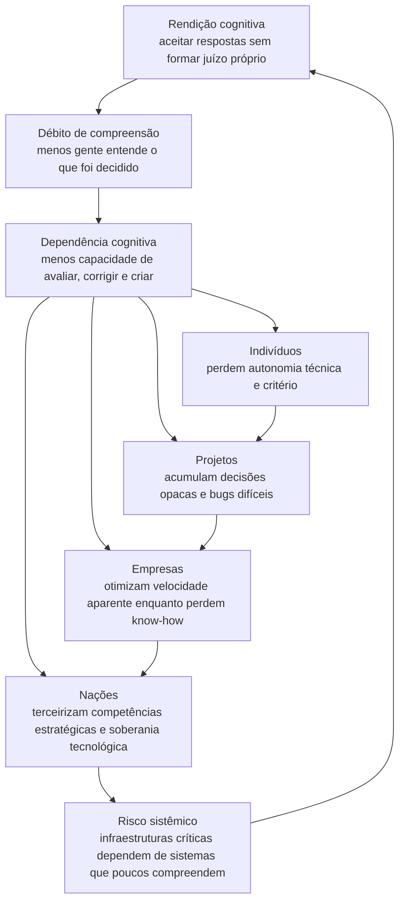

# Cognitive Surrender — Addy Osmani

## TL;DR

Addy Osmani argumenta que o risco central no uso de IA por engenheiros não é delegar tarefas, mas deixar que a resposta da IA substitua a formação de uma visão própria. A diferença entre "cognitive offloading" e "cognitive surrender" aparece na postura: usar a IA para pensar melhor preserva entendimento; aceitar suas respostas sem calibragem acumula dívida cognitiva e dívida de compreensão.

## Pontos-chave

- "Cognitive offloading" é delegar parte do trabalho à IA mantendo responsabilidade crítica sobre o resultado; "cognitive surrender" é quando a saída da IA vira a própria resposta do engenheiro sem uma visão independente para comparação.
- Osmani conecta o conceito a estudos sobre confiança excessiva em IA: quando a IA está disponível, usuários tendem a aceitar respostas erradas com mais confiança do que teriam sozinhos.
- Em engenharia de software, a rendição aparece em revisões superficiais de diffs grandes, correções de bugs não compreendidas, decisões arquiteturais adotadas pela justificativa do modelo e aprendizado passivo por geração de código.
- O mecanismo se acumula como "comprehension debt": patches, testes e decisões entram no sistema sem que alguém consiga reconstruir plenamente o raciocínio por trás deles.
- O autor defende que ferramentas de IA não são o problema; a postura de uso determina se elas ampliam o raciocínio do engenheiro ou substituem a parte do trabalho que deveria fortalecer seu modelo mental.
- Heurísticas práticas incluem formar uma expectativa antes de ler a saída da IA, revisar diffs como qualquer outro PR, pedir contra-argumentos ao modelo, perceber fadiga e rastrear de onde vem a confiança numa decisão.
- Movimentos estruturais contra a rendição incluem critérios de saída baseados em evidência, PRs menores, fricção deliberada, investigação conceitual antes da geração e períodos regulares de programação sem agente.

## Citações

> "still owning the answer"

> "Surface correctness is not systemic correctness"

> "The posture is what differs."

## Meu comentário

- Artigo interessante sobre a dicotomia *descarga cognitiva* x *rendição cognitiva*.  Mostra como a rendição cognitiva é insidiosa e como devemos evitá-la, pois ela é o mecanismo por trás do *débito de compreensão*.
- Atualmente, acredito que essa é uma das principais armadilhas do uso de agentes de IA. 
- Achei interessante a ideia de usar fricção propositalmente como ferramenta de resistência para interromper a aceitação heurística.
- IA deve ser usada como ferramenta de **ampliação mútua**, não como delegação.

### Conclusões IPTK

## Ver também

- https://www.anthropic.com/research/AI-assistance-coding-skills
- https://addyosmani.com/blog/comprehension-debt/
- https://addyosmani.com/blog/agent-harness-engineering/
- https://addyosmani.com/blog/agent-skills/
- https://www.media.mit.edu/publications/your-brain-on-chatgpt/
