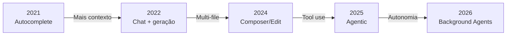

# De autocomplete a agentes autônomos

> [!abstract] TL;DR
> Em cinco anos (2021-2026), ferramentas de IA para código passaram de autocomplete de uma linha (Copilot v1) para agentes autônomos que planejam, executam, testam e iteram sobre codebases inteiros (Claude Code, Devin). A evolução se deu em quatro estágios: sugestão → assistência → copiloto → agente. Cada estágio mudou o papel do engenheiro — de escritor de código para arquiteto e revisor de mudanças geradas por IA.

## O que é

A evolução das ferramentas de IA para código é uma progressão de autonomia:

| Estágio         | Período   | O que faz                                          | Exemplo                            |
| --------------- | --------- | -------------------------------------------------- | ---------------------------------- |
| **Sugestão**    | 2021-2022 | Completa a linha atual                             | Copilot v1, TabNine                |
| **Assistência** | 2022-2023 | Responde perguntas, gera blocos                    | ChatGPT, Copilot Chat              |
| **Copiloto**    | 2023-2025 | Edita múltiplos arquivos sob supervisão            | Cursor Composer, Copilot Workspace |
| **Agente**      | 2025-2026 | Planeja e executa tarefas multi-step autonomamente | Claude Code, Devin, Cursor Agent   |

## Por que importa

Entender essa evolução é necessário para:

- Saber o que esperar (e não esperar) de cada tipo de ferramenta
- Escolher a ferramenta certa para cada fase do trabalho
- Não tratar agentes como autocomplete (subutilização) nem autocomplete como agente (frustração)

## Como funciona

### A progressão da autonomia

**O que mudou em cada transição:**

1. **Sugestão → Assistência:** O modelo ganhou contexto conversacional. Em vez de completar uma linha, podia receber uma pergunta e gerar blocos de código.
2. **Assistência → Copiloto:** O modelo ganhou acesso a múltiplos arquivos e capacidade de editar diretamente o código-fonte com diffs reviewáveis.
3. **Copiloto → Agente:** O modelo ganhou **tool use** — pode executar comandos no terminal, ler arquivos, rodar testes, e iterar baseado nos resultados.
4. **Agente → Background Agent:** O agente pode trabalhar de forma assíncrona enquanto o humano faz outra coisa, reportando resultados quando pronto.

### Categorias de ferramentas em 2026

| Categoria                    | Interface          | Autonomia   | Exemplos                     |
| ---------------------------- | ------------------ | ----------- | ---------------------------- |
| **IDE-integrated assistant** | Dentro do editor   | Baixa-média | Copilot inline, Cursor Tab   |
| **AI-native IDE**            | Editor customizado | Média-alta  | Cursor, Windsurf             |
| **Terminal agent**           | CLI/TUI            | Alta        | Claude Code, OpenCode, Aider |
| **Autonomous agent**         | Cloud sandbox      | Muito alta  | Devin, Copilot Agents        |
| **Open-source harness**      | CLI                | Variável    | OpenCode, Cline, Aider       |

### O que cada categoria faz bem

| Tarefa                       | IDE assistant | AI IDE | Terminal agent | Autonomous |
| ---------------------------- | ------------- | ------ | -------------- | ---------- |
| Autocomplete rápido          | ★★★★★         | ★★★★   | ★★             | ★          |
| Edição de 1 arquivo          | ★★★★          | ★★★★★  | ★★★★           | ★★★        |
| Refactoring multi-file       | ★★            | ★★★★★  | ★★★★           | ★★★★       |
| Feature do zero              | ★             | ★★★★   | ★★★★           | ★★★★★      |
| Debugging complexo           | ★★            | ★★★★   | ★★★★★          | ★★★        |
| Tarefas repetitivas em massa | ★             | ★★★    | ★★★            | ★★★★★      |

## Histórico

| Ano  | Marco                      | Impacto                                                       |
| ---- | -------------------------- | ------------------------------------------------------------- |
| 2021 | GitHub Copilot (preview)   | Primeiro autocomplete AI mainstream                           |
| 2022 | ChatGPT lançado            | Demonstra que LLMs geram código via chat                      |
| 2023 | GPT-4 + Cursor v1          | Multi-file editing se torna viável                            |
| 2024 | Claude 3.5 + Agentic tools | Tool use e iteração autônoma                                  |
| 2025 | Devin, Claude Code         | Agentes autônomos entram em produção                          |
| 2026 | Background agents, MCP     | Agentes trabalham assíncronamente, ferramentas standardizadas |

## Armadilhas

- **Tratar agentes como autocomplete** — pedir para um Claude Code "completar essa linha" é como usar um caminhão para ir à padaria. Use a ferramenta certa para a escala do problema.
- **Tratar autocomplete como agente** — esperar que Copilot inline resolva um bug cross-file é frustração garantida.
- **"A ferramenta mais nova é sempre melhor"** — para autocomplete rápido, Copilot inline ainda é imbatível. Agentes adicionam latência e custo que não fazem sentido para tarefas simples.
- **Ignorar a curva de aprendizado** — cada ferramenta tem configurações e padrões que multiplicam sua eficácia. Usar Claude Code sem CLAUDE.md ou Cursor sem .cursorrules é operar a 20% da capacidade.

## Veja também

- [[02 - Vibe coding vs engenharia disciplinada]] — o gap entre capacidade e maturidade
- [[04 - Cursor — AI-native IDE]] — a ferramenta que liderou a era do copiloto
- [[05 - Claude Code — terminal-first agent]] — o líder na era dos agentes

## Referências

- **GitHub** — *The State of AI in Software Development* (2026). Pesquisa anual sobre adoção.
- **Stack Overflow** — *Developer Survey 2026*. Dados de uso de ferramentas AI.
- **Plus8Soft** — *AI-Assisted Software Engineering Best Practices* (2026). Framework de maturidade.
