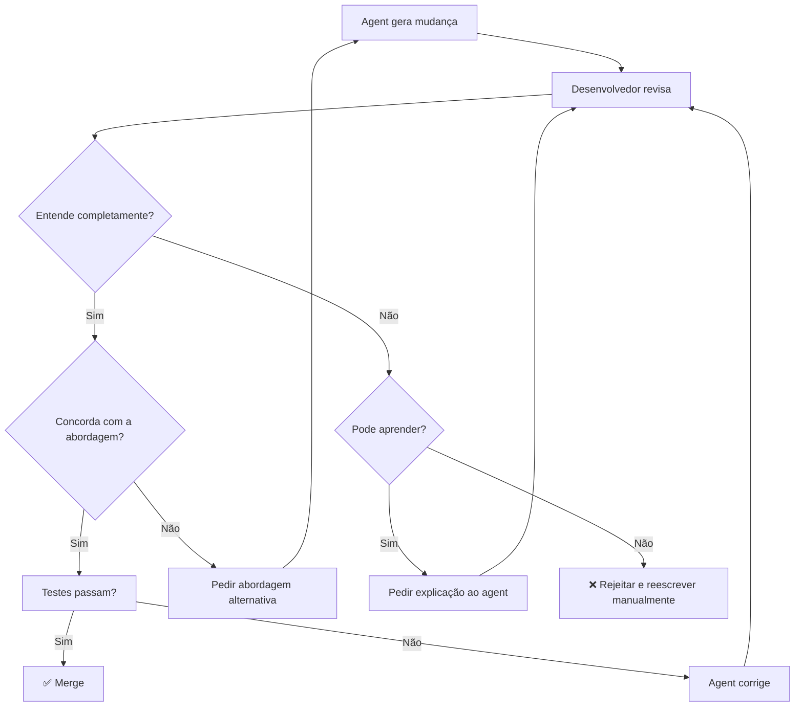

# O comprehension gate

> [!abstract] TL;DR
> O comprehension gate é a regra de ouro do desenvolvimento assistido por IA: se você não consegue explicar por que uma mudança foi feita, ela não deve ser mergeada. Não importa se o código passa nos testes, se o agente confia na mudança, ou se parece funcionar. Se o humano não compreende o "porquê" de cada alteração, o codebase acumula código fantasma — funcional mas incompreensível — que eventualmente se torna impossível de manter.

## O que é

O **comprehension gate** é um padrão de code review que estabelece:

> Nenhuma mudança gerada por IA entra no codebase sem que o desenvolvedor responsável consiga explicar, em suas próprias palavras, o que mudou e por quê.

É a barreira mais importante entre desenvolvimento assistido por IA e desenvolvimento dependente de IA.

## Por que importa

Sem o comprehension gate:
- **Código fantasma** se acumula — funciona mas ninguém sabe por quê
- **Debugging vira pesadelo** — quando algo quebra, ninguém entende o que estava tentando fazer
- **Segurança degrada** — mudanças não compreendidas podem conter vulnerabilidades silenciosas
- **Skills atrofiam** — desenvolvedores param de aprender porque aceitam tudo sem questionar

Com o comprehension gate:
- O humano permanece como **arquiteto**, não como rubber stamp
- Cada mudança é **rastreável** a uma intenção clara
- O time mantém **ownership** intelectual do codebase
- Bugs são mais fáceis de diagnosticar porque a lógica é compreendida

## Como funciona

### O processo

### Checklist de comprehension

Para cada mudança gerada por IA, responda:

- [ ] Sei o que esse código faz?
- [ ] Sei POR QUE essa abordagem foi escolhida?
- [ ] Consigo identificar edge cases que não foram cobertos?
- [ ] Entendo como reverter isso se quebrar?
- [ ] Sei quais outros arquivos/módulos são afetados?

Se algum item falha → **não merge**.

### Níveis de risco e rigor

| Tipo de mudança                 | Rigor do gate                                                    |
| ------------------------------- | ---------------------------------------------------------------- |
| Documentação, comentários       | Leve — ler e confirmar                                           |
| Testes novos                    | Moderado — entender o que testa e por quê                        |
| Lógica de negócio               | Alto — entender cada branch e edge case                          |
| Autenticação, pagamento, crypto | Máximo — review linha por linha, preferencialmente por 2 pessoas |
| Infraestrutura, CI/CD           | Máximo — mudanças podem afetar produção                          |

## Na prática

### Como pedir explicação ao agente

Bons prompts de comprehension:
- *"Explique por que você escolheu essa abordagem em vez de [alternativa]"*
- *"Quais edge cases essa implementação não cobre?"*
- *"O que acontece se [cenário de falha]?"*
- *"Essa mudança afeta algum outro módulo?"*

### Sinais de alerta (red flags)

| Red flag                              | O que indica                                     |
| ------------------------------------- | ------------------------------------------------ |
| Mudança muito grande (>500 linhas)    | Provavelmente inclui coisas desnecessárias       |
| Mudança em arquivo que você não pediu | Agent agindo fora do escopo                      |
| Testes reescritos junto com o código  | Testes podem estar sendo "ajustados" para passar |
| Import de dependência nova            | Potencial slopsquatting ou dependency bloat      |
| Código duplicado do que já existe     | Agent não encontrou a implementação existente    |

## Armadilhas

- **"Os testes passam, então está OK"** — testes verificam comportamento, não intenção. Código pode fazer a coisa certa pelo motivo errado.
- **"O agent é melhor que eu nisso"** — provavelmente é mais rápido. Mas se você não entende, não pode manter. E o agent não estará lá quando quebrar em produção às 3h da manhã.
- **"Review demora muito"** — demora menos do que debugar código fantasma 3 meses depois. O investimento em compreensão se paga exponencialmente.
- **"Comprehension gate mata a produtividade"** — em código de baixo risco (boilerplate, docs), o gate pode ser leve. O rigor se concentra no código que importa.
- **Approval fatigue** — revisar 50 mudanças seguidas leva a "rubber stamping". Faça em lotes menores, com pausas.

## Veja também
- [[02 - Vibe coding vs engenharia disciplinada]] — o contexto que torna o gate necessário
- [[14 - agents.md e configuração de projeto]] — como configurar o agente para gerar mudanças reviewáveis
- [[18 - Benchmarks e avaliação — SWE-bench e além]] — métricas de qualidade além de "funciona"

## Referências
- **Plus8Soft** — *AI-Assisted Software Engineering — The Comprehension Gate* (2026). O artigo que formalizou o conceito.
- **Medium** — *Treat AI-Generated Code with Higher Scrutiny* (2026). Práticas de code review para AI.
