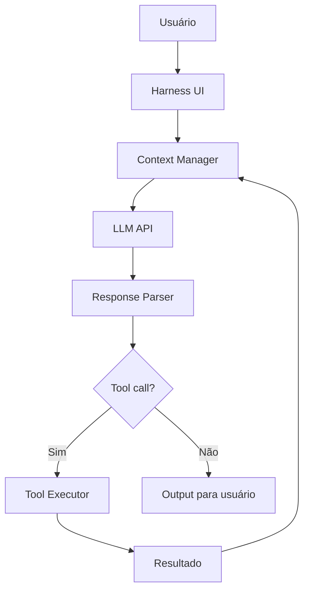

# OpenCode — o harness open source

> [!abstract] TL;DR
> "Harnesses open source" são ferramentas que fornecem o scaffolding agentic (file I/O, tool use, contexto, UI) mas permitem que você traga qualquer modelo — da API ou local. OpenCode e Cline lideram essa categoria em 2026. A proposta é: a inteligência está no modelo, o harness dá as ferramentas e o fluxo de trabalho. Isso permite combinar modelos baratos chineses com um harness de qualidade, ou trocar de provider sem trocar de ferramenta.

## O que é

Um **harness de codificação** é o "esqueleto" em volta do LLM que providencia:

- **Tool use** — ler/escrever arquivos, executar comandos, buscar na web
- **Context management** — decidir quais arquivos incluir, sumarizar histórico
- **UI** — interface de terminal ou web para interação
- **Guardrails** — permissões, confirmações, hooks

O modelo é plugável — você escolhe qual LLM usar por baixo.

## Por que importa

- **Liberdade de modelo** — use DeepSeek V4, Qwen 3.6, ou modelos locais via Ollama
- **Custo controlado** — combine harness gratuito com modelo barato
- **Sem vendor lock-in** — troque de provider sem trocar de ferramenta
- **Transparência** — código aberto, auditável

## Como funciona

### Players principais

| Ferramenta    | Interface         | Licença     | Diferencial                       |
| ------------- | ----------------- | ----------- | --------------------------------- |
| **OpenCode**  | Terminal (TUI)    | Open source | Leve, rápido, model-agnostic      |
| **Cline**     | VS Code extension | Apache 2.0  | Agentic dentro do VS Code         |
| **Continue**  | VS Code extension | Apache 2.0  | Autocomplete + chat, configurável |
| **SWE-Agent** | CLI/Cloud         | MIT         | Focado em resolver benchmarks     |

### OpenCode

```bash
# Instalar
curl -fsSL https://opencode.ai/install.sh | sh

# Usar com Claude
ANTHROPIC_API_KEY=sk-ant-... opencode

# Usar com modelo local
OLLAMA_BASE_URL=http://localhost:11434 opencode --model ollama/qwen2.5:14b

# Usar com DeepSeek via API
DEEPSEEK_API_KEY=... opencode --model deepseek/deepseek-coder-v4
```

### Cline (VS Code)

Extensão VS Code que transforma o editor em ambiente agentic:

- Suporta Claude, GPT, Gemini, DeepSeek, modelos locais
- Edição multi-file com diff preview
- Execução de terminal
- MCP support

### Arquitetura de um harness



O harness gerencia o loop:

1. Recebe input do usuário
2. Monta contexto (arquivos, histórico, tools)
3. Envia para o LLM
4. Parseia a resposta (texto ou tool call)
5. Executa tools e retroalimenta o loop

## Comparativo com ferramentas proprietárias

| Aspecto                  | OpenCode/Cline | Claude Code          | Cursor     |
| ------------------------ | -------------- | -------------------- | ---------- |
| **Custo da ferramenta**  | Grátis         | Grátis (paga tokens) | $20/mês    |
| **Choice de modelo**     | ★★★★★          | ★★ (Claude only)     | ★★★★       |
| **Qualidade do harness** | ★★★            | ★★★★★                | ★★★★★      |
| **Comunidade**           | Crescendo      | Grande               | Grande     |
| **Estabilidade**         | ⚠️ Variável     | ✅ Produção           | ✅ Produção |

## Quando usar

- **Orçamento limitado** — harness grátis + modelo barato (DeepSeek, Qwen)
- **Soberania** — tudo open source, sem dependência de vendor
- **Experimentação** — testar diferentes modelos na mesma tarefa
- **Customização profunda** — fork e adapte para seu workflow

## Armadilhas

- **"Open source = mesma qualidade"** — o harness pode ser bom mas o modelo barato pode não ter o reasoning necessário para tarefas complexas.
- **Estabilidade variável** — ferramentas open source têm ciclos de release mais rápidos, com mais bugs.
- **Menos guardrails** — ferramentas proprietárias têm mais proteções built-in. Com open source, você precisa implementar os seus.

## Veja também

- [[09 - Aider — o pair programmer de terminal]] — outro open-source com foco Git
- [[05 - Claude Code — terminal-first agent]] — alternativa proprietária com melhor reasoning
- [[15 - MCP — o protocolo universal]] — protocolo que conecta harnesses com ferramentas

## Referências

- **OpenCode** — *GitHub Repository* (2026). Código-fonte e documentação.
- **Cline** — *VS Code Marketplace* (2026). Extensão e documentação.
- **Continue** — *GitHub Repository* (2026). Plataforma open-source para AI coding.
