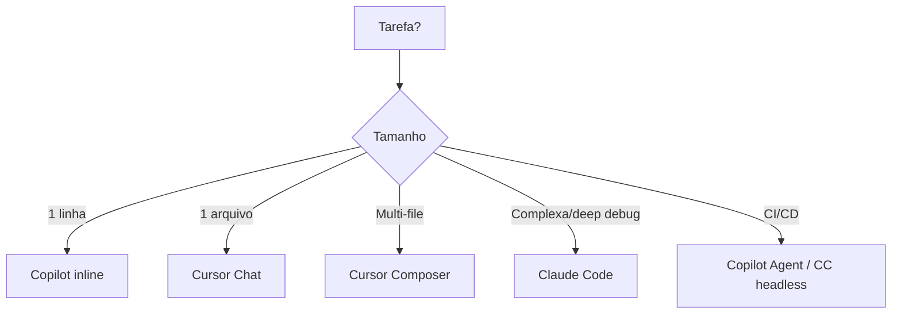

# Comparativo — qual ferramenta para qual tarefa

> [!abstract] TL;DR
> Não existe "melhor ferramenta" — existe a ferramenta certa para a tarefa, o orçamento, e o workflow. Para autocomplete: Copilot. Para coding em IDE: Cursor. Para reasoning profundo: Claude Code. Para custo-zero: OpenCode + modelo local. Para CI/CD: Copilot Agents ou Claude Code headless. A stack ideal combina 2-3 ferramentas para cobrir todos os cenários.

## O que é

Um guia de decisão prático para escolher a ferramenta AI de codificação certa, baseado em tarefas reais de desenvolvimento.

## O mega-comparativo

### Por capacidade

| Capacidade                | 🥇 Melhor           | 🥈 Segundo            | 🥉 Terceiro   |
| ------------------------- | ------------------ | -------------------- | ------------ |
| **Autocomplete inline**   | Copilot            | Cursor Tab           | Continue     |
| **Chat sobre código**     | Claude Code        | Cursor Chat          | Copilot Chat |
| **Edição multi-file**     | Cursor Composer    | Claude Code          | Aider        |
| **Reasoning/debugging**   | Claude Code (Opus) | Cursor (Opus)        | Gemini CLI   |
| **CI/CD automation**      | Copilot Agents     | Claude Code headless | —            |
| **Model choice**          | OpenCode/Aider     | Cursor               | Gemini CLI   |
| **Git integration**       | Aider              | Copilot              | Claude Code  |
| **Enterprise/compliance** | Copilot Enterprise | Cursor Business      | —            |
| **Custo-zero**            | OpenCode + Ollama  | Aider + Ollama       | Continue     |
| **Multimodal (imagens)**  | Gemini CLI         | Claude Code          | Cursor       |

### Por perfil de desenvolvedor

| Perfil                            | Stack recomendada                               |
| --------------------------------- | ----------------------------------------------- |
| **Dev junior, aprendendo**        | Copilot (free) + Cursor (free tier)             |
| **Dev pleno, produtividade**      | Cursor (paid) + Claude Code (sessões complexas) |
| **Dev senior, controle**          | Claude Code + Aider (git-centric)               |
| **Dev indie, orçamento limitado** | OpenCode + DeepSeek/Qwen via API + Ollama       |
| **Tech lead, enterprise**         | Copilot Enterprise + Cursor Business            |
| **DevOps/CI-CD**                  | Copilot Agents + Claude Code headless           |

### Por tipo de tarefa

| Tarefa                           | Ferramenta                    | Por quê                          |
| -------------------------------- | ----------------------------- | -------------------------------- |
| Completar código enquanto digita | Copilot / Cursor Tab          | Menor latência, melhor UX inline |
| Bug simples em 1 arquivo         | Cursor Chat                   | Preview visual do fix            |
| Refactoring em 5+ arquivos       | Cursor Composer               | Diffs visuais coordenados        |
| Debugging de race condition      | Claude Code (Opus + thinking) | Melhor reasoning                 |
| Feature do zero com specs        | Claude Code + CLAUDE.md       | Plan mode + autonomia            |
| Resolver issue no GitHub         | Copilot Agent                 | Workflow nativo issue→PR         |
| Migração de dados em massa       | Aider + script                | Git audit trail                  |
| Análise de screenshot/UI         | Gemini CLI                    | Multimodal nativo                |
| Experimentar modelo novo         | OpenCode                      | Troca de modelo trivial          |
| Code review de PR                | Claude Code + Cursor          | Reasoning + visual               |

### Por custo mensal (estimativa para uso full-time)

| Ferramenta           | Custo da ferramenta | Custo de tokens (estimativa) | Total               |
| -------------------- | ------------------- | ---------------------------- | ------------------- |
| Copilot Individual   | $10/mês             | Incluído                     | **$10/mês**         |
| Cursor Pro           | $20/mês             | ~$30-100/mês*                | **$50-120/mês**     |
| Claude Code          | $0                  | ~$50-200/mês (Sonnet)        | **$50-200/mês**     |
| Aider + DeepSeek API | $0                  | ~$5-20/mês                   | **$5-20/mês**       |
| OpenCode + Ollama    | $0                  | $0 (hardware local)          | **$0 (+ hardware)** |

*\*Cursor consome tokens do seu provider para Composer/Agent mode.*

## Stack recomendada para engenheiro AI-first

A combinação que maximiza produtividade em 2026:

## Armadilhas

- **"Preciso de apenas uma ferramenta"** — cada ferramenta tem sweet spots diferentes. A stack ideal combina 2-3.
- **Escolher por hype** — escolha por workflow e necessidade real, não pelo que é tendência no Twitter.
- **Ignorar custo acumulado** — $20/mês em ferramenta + $100/mês em tokens escala rápido para times.
- **Trocar de ferramenta constantemente** — o custo de reaprender cancela os ganhos. Escolha, configure bem, e domine.

## Veja também

- [[04 - Cursor — AI-native IDE]] → [[05 - Claude Code — terminal-first agent]] → [[06 - GitHub Copilot e Copilot Agents]] — notas detalhadas de cada ferramenta
- [[14 - agents.md e configuração de projeto]] — configuração que funciona cross-tool

## Referências

- **Artificial Analysis** — *AI Coding Tool Comparison* (2026). Benchmarks independentes.
- **Stack Overflow** — *Developer Survey 2026 — AI Tools*. Dados de adoção.
