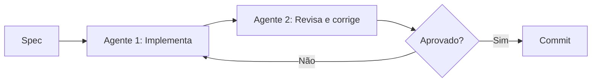
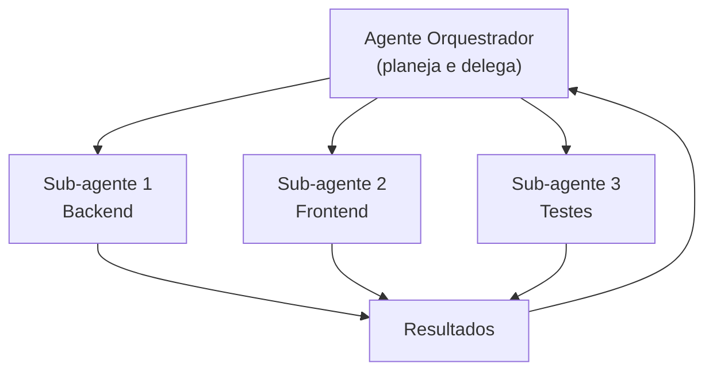

# Multi-agent — workflows com múltiplos agentes

> [!abstract] TL;DR
> Multi-agent é o padrão de usar dois ou mais agentes AI trabalhando em paralelo ou em pipeline na mesma codebase. Exemplos: Claude Code no backend + Cursor no frontend, ou um agente gerando código e outro revisando. Em 2026, isso é prática emergente mas não madura — problemas de conflito de edição, merge inconsistente, e custo multiplicado são reais. O padrão mais estável é "agente implementa + agente revisa" (pipeline), não "dois agentes editando ao mesmo tempo" (paralelo).

## O que é

**Multi-agent** refere-se a workflows onde múltiplos agentes AI operam sobre o mesmo codebase, seja:

1. **Pipeline** — um agente gera, outro revisa/corrige
2. **Paralelo** — agentes trabalham em partes diferentes simultaneamente
3. **Hierárquico** — um "orquestrador" delega para sub-agentes especializados

## Por que importa

- Potencial de multiplicar produtividade delegando tarefas paralelas
- Padrão "implementa + revisa" melhora qualidade sem review humano a cada step
- Agentes especializados (ex: security scanner + code generator) cobrem mais ângulos

## Como funciona

### Padrão 1: Pipeline (mais estável)



Exemplo prático:

```bash
# Agente 1: Claude Code gera a feature
claude "Implement user registration endpoint per spec.md"

# Agente 2: Outro Claude Code revisa o output
claude "Review the changes in the last commit. Check for security issues, missing tests, and code style violations."
```

### Padrão 2: Paralelo (arriscado)

```bash
# Terminal 1: Backend
tmux new -s backend "claude 'implement the auth API'"

# Terminal 2: Frontend  
tmux new -s frontend "claude 'create the login page component'"

# Terminal 3: Tests
tmux new -s tests "claude 'write integration tests for auth flow'"
```

> [!warning] Conflitos de edição
> Agentes paralelos podem editar o mesmo arquivo simultaneamente, causando conflitos. Use branches separadas ou certifique-se de que os agentes trabalham em diretórios/módulos distintos.

### Padrão 3: Hierárquico



Ferramentas como Kimi K2.6 e Devin são otimizadas para orquestração hierárquica.

## Quando usar / quando evitar

| Cenário                                      | Recomendação                                |
| -------------------------------------------- | ------------------------------------------- |
| Feature com backend + frontend independentes | ✅ Paralelo (módulos separados)              |
| Implementar + revisar                        | ✅ Pipeline                                  |
| Dois agentes no mesmo arquivo                | ❌ Conflito garantido                        |
| Geração de testes em paralelo com código     | ⚠️ Arriscado se os testes dependem do código |
| Prova de conceito / exploração               | ✅ Paralelo (descartável)                    |

## Armadilhas

- **Conflitos de edição** — dois agentes editando o mesmo arquivo é receita para corrupção. Use branches ou módulos separados.
- **Custo multiplicado** — 3 agentes paralelos = 3x o custo de tokens. Certifique-se de que o ganho de produtividade justifica.
- **Coerência comprometida** — agentes paralelos não compartilham contexto. O agente do frontend pode tomar decisões inconsistentes com o backend.
- **"Mais agentes = mais rápido"** — só é verdade se as tarefas são verdadeiramente independentes. Dependências serializantes neutralizam o ganho.

## Veja também

- [[05 - Claude Code — terminal-first agent]] — sessões paralelas com tmux
- [[06 - GitHub Copilot e Copilot Agents]] — agentes em pipeline no GitHub
- [[16 - O loop agentic — plan, act, observe]] — o ciclo interno de cada agente

## Referências

- **Anthropic** — *Multi-agent Orchestration Patterns* (2026). Guia de padrões.
- **LangGraph** — *Multi-Agent Architectures* (2026). Framework para orquestração.
