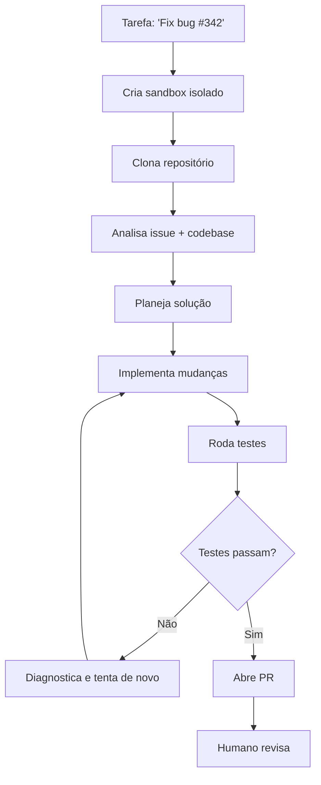

# Devin e agentes autônomos cloud

> [!abstract] TL;DR
> Devin (Cognition Labs) e seus competidores representam a categoria de agentes autônomos cloud — rodam em sandbox isolado, recebem uma tarefa, e entregam código pronto. Diferem de ferramentas interativas (Cursor, Claude Code) porque operam sem interação humana durante a execução. Em 2026, são úteis para tarefas bem-definidas e repetitivas (fix de bugs em lote, migrações), mas ainda frágeis para work criativo ou arquitetural. O hype de "substituir o programador" se moderou — são mais "estagiário diligente" que "engenheiro senior".

## O que é

**Agentes autônomos cloud** são sistemas que:

1. Recebem uma tarefa (issue, spec, instrução)
2. Criam um ambiente isolado (container/VM)
3. Planejam e executam sem interação humana
4. Entregam resultado (PR, artefato, relatório)

Devin da Cognition Labs foi o primeiro a ganhar atenção massiva em 2024. Desde então, GitHub Copilot Agents, Factory AI, e outros entraram no espaço.

## Por que importa

- **Assincronicidade** — delega e vai fazer outra coisa
- **Escala** — pode rodar 10 instâncias em paralelo
- **Tarefas bem definidas** — bug triage, migrações, atualizações de dependência

## Como funciona

### Fluxo típico

### Onde funciona bem

| Tarefa                           | Resultado típico                       |
| -------------------------------- | -------------------------------------- |
| Fix de bug com stack trace clara | ✅ Resolve 60-70%                       |
| Atualização de dependência       | ✅ Mecânica e verificável               |
| Migração de API (v1 → v2)        | ⚠️ Funciona com boa documentação        |
| Feature do zero                  | ❌ Qualidade insuficiente para produção |
| Refactoring arquitetural         | ❌ Sem julgamento de design             |

### Limitações reais

| Expectativa                     | Realidade                                  |
| ------------------------------- | ------------------------------------------ |
| "Substitui o programador"       | Resolve ~20% das issues sem supervisão     |
| "Funciona sempre"               | Taxa de sucesso em SWE-bench: 30-50%       |
| "Qualidade de produção"         | PR precisa de review cuidadoso             |
| "Entende o contexto do projeto" | Entende o código, não as razões de negócio |

## Quando usar

- Triage de bugs simples (stack trace → fix)
- Batch de migrações repetitivas
- Geração de boilerplate a partir de specs
- **NÃO** para decisões de design ou trabalho criativo

## Armadilhas

- **Confiar sem revisar** — PRs de agentes autônomos precisam de review com o DOBRO do rigor de PRs humanas.
- **"Devin é o futuro, não preciso aprender a programar"** — em 2026, Devin resolve o equivalente a tasks de estagiário. O julgamento de design continua sendo humano.
- **Custo de sandbox** — cada execução cria um ambiente cloud. Em escala, isso soma.
- **Feedback loop lento** — se o agente erra, o ciclo de "esperar, revisar, pedir correção" é mais lento que resolver interativamente.

## Veja também

- [[06 - GitHub Copilot e Copilot Agents]] — Copilot Agents como alternativa integrada
- [[12 - Multi-agent — workflows com múltiplos agentes]] — como orquestrar múltiplos agentes
- [[01 - De autocomplete a agentes autônomos]] — o arco evolutivo completo

## Referências

- **Cognition Labs** — *Devin Documentation* (2026). O primeiro agente autônomo.
- **Jimenez et al.** — *SWE-bench: Can Language Models Resolve Real-World GitHub Issues?* (2024). O benchmark de referência.
