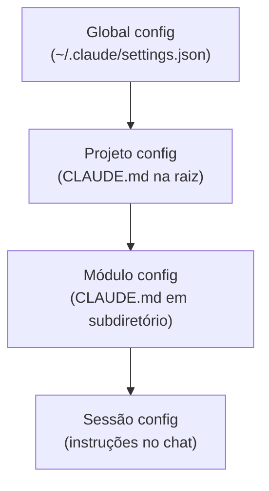

# agents.md e configuração de projeto

> [!abstract] TL;DR
> Arquivos de configuração de agentes (CLAUDE.md, .cursorrules, copilot-instructions.md, GEMINI.md) são a interface mais importante entre o engenheiro e a IA em 2026. Eles definem regras, padrões, proibições e contexto do projeto — transformando um modelo genérico em um especialista do seu codebase. Sem eles, o agente gera código genérico que não segue seus padrões. Com eles, o agente produz código que parece ter sido escrito pelo time.

## O que é

Arquivos de configuração de agentes são **system prompts persistentes** que residem no repositório e são lidos automaticamente pelo agente a cada sessão. Cada ferramenta tem seu formato:

| Ferramenta     | Arquivo                           | Localização     |
| -------------- | --------------------------------- | --------------- |
| Claude Code    | `CLAUDE.md`                       | Raiz do projeto |
| Cursor         | `.cursorrules`                    | Raiz do projeto |
| GitHub Copilot | `.github/copilot-instructions.md` | .github/        |
| Gemini CLI     | `GEMINI.md`                       | Raiz do projeto |
| Genérico       | `agents.md` ou `AGENTS.md`        | Raiz do projeto |

## Por que importa

| Sem configuração                         | Com configuração                       |
| ---------------------------------------- | -------------------------------------- |
| Código em estilo genérico                | Código no padrão do time               |
| Imports e estrutura inconsistentes       | Imports e estrutura padronizados       |
| Agente pode fazer ações perigosas        | Agente tem guardrails explícitos       |
| Re-explicar contexto a cada sessão       | Contexto auto-carregado                |
| Mais iterações de correção (mais tokens) | Acerta mais na primeira (menos tokens) |

## Como funciona

### Estrutura recomendada (universal)

```markdown
# [AGENTS.md / CLAUDE.md / .cursorrules]

## Sobre o projeto
[Descrição breve, stack, propósito]

## Arquitetura
[Camadas, módulos, patterns usados]
[Referência a documentação de arquitetura se existir]

## Regras de código
- [Regra 1: linguagem, estilo]
- [Regra 2: framework-specific]
- [Regra 3: testing patterns]

## Proibições (NUNCA)
- NUNCA [ação perigosa 1]
- NUNCA [ação perigosa 2]

## Comandos úteis
- `npm test` — roda testes
- `npm run lint` — verifica estilo
- `npm run build` — compila

## Convenções de nomenclatura
- Arquivos: kebab-case
- Componentes: PascalCase
- Variáveis: camelCase
```

### Exemplo real: projeto TypeScript + React

```markdown
# CLAUDE.md

## Sobre
EstudeMe é um SaaS de flashcards com spaced repetition.
Stack: Next.js 15 (App Router), TypeScript strict, tRPC, Drizzle ORM, PostgreSQL, Clerk auth.

## Arquitetura
- `/src/app` — Pages e layouts (App Router)
- `/src/server` — Backend tRPC (routers, procedures)
- `/src/shared` — Types, utils, constants compartilhados
- `/src/components` — UI components (shadcn/ui base)
- `/drizzle` — Schemas e migrations

## Regras
- TypeScript strict mode — NUNCA use `any`
- Functional components + hooks SEMPRE
- Server Components por default, 'use client' só quando necessário
- Error handling com Result<T, E> pattern
- Validação com Zod em todas as bordas (API input, form data)
- Testes com Vitest + React Testing Library

## Proibições
- NUNCA modifique testes existentes para fazê-los passar
- NUNCA delete arquivos de configuração ou migrations
- NUNCA instale dependências sem listar no chat
- NUNCA use console.log em produção — use o logger
- NUNCA crie componentes com mais de 200 linhas
- NUNCA faça git push sem pedir confirmação

## Comandos
- `pnpm test` — roda testes
- `pnpm lint` — ESLint + Prettier
- `pnpm build` — compila Next.js
- `pnpm db:push` — push schema para DB
- `pnpm db:generate` — gera migration
```

### Hierarquia de configuração



Configs mais específicas sobrescrevem as mais gerais.

### Cross-tool strategy

Se seu time usa múltiplas ferramentas, mantenha um `AGENTS.md` canônico e derive os outros:

```
AGENTS.md              ← fonte de verdade
├── .cursorrules       ← derivado para Cursor
├── CLAUDE.md          ← derivado para Claude Code  
└── .github/copilot-instructions.md  ← derivado para Copilot
```

## Checklist de configuração

- [ ] Arquivo de configuração criado na raiz do projeto
- [ ] Stack e arquitetura documentados
- [ ] Convenções de código listadas
- [ ] Proibições claras (com NUNCA/NEVER)
- [ ] Comandos de build/test/lint documentados
- [ ] Arquivo commitado no repositório (não apenas local)
- [ ] Revisado e atualizado a cada mudança arquitetural

## Armadilhas

- **Não ter arquivo nenhum** — o agente vai gerar código genérico. Essa é a maior perda de produtividade possível.
- **Arquivo muito longo (>2k tokens)** — regras verbosas demais diluem atenção. Seja conciso e direto.
- **Não committar** — se o arquivo é local, novos membros do time não têm as mesmas regras. Commite no repo.
- **Não atualizar** — arquivo desatualizado causa confusão. Revise quando a stack ou arquitetura mudar.
- **Regras contraditórias** — "use React hooks" + exemplo com classes = confusão para o agente.
- **Esquecer proibições** — as proibições são tão importantes quanto as regras. Diga o que NÃO fazer.

## Veja também

- [[04 - Cursor — AI-native IDE]] — .cursorrules em detalhe
- [[05 - Claude Code — terminal-first agent]] — CLAUDE.md em detalhe
- [[02 - Vibe coding vs engenharia disciplinada]] — por que configuração importa

## Referências

- **Anthropic** — *CLAUDE.md Guide* (2026). Referência oficial.
- **Cursor** — *.cursorrules Documentation* (2026). Referência oficial.
- **Plus8Soft** — *The AI Development Configuration Manifesto* (2026).
