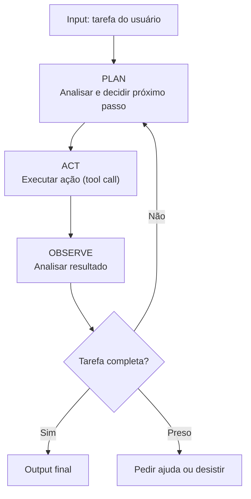

# O loop agentic — plan, act, observe

> [!abstract] TL;DR
> Todo agente de codificação opera com o mesmo loop: **Plan** (analisar a tarefa e decidir o próximo passo), **Act** (executar uma ação via tool), **Observe** (analisar o resultado). Esse ciclo se repete até a tarefa estar completa ou o agente ficar preso. Entender esse loop é essencial para debugar quando o agente erra, para configurar guardrails nos pontos certos, e para estimar custos (cada iteração do loop consome tokens).

## O que é

O **loop agentic** (também chamado de padrão ReAct — Reasoning + Acting) é o ciclo fundamental que todo agente AI executa:



## Por que importa

- **Custo** — cada iteração consome input tokens (contexto acumulado) + output tokens. Mais iterações = mais caro.
- **Debugging** — quando o agente falha, o problema está em um desses três pontos: planejou errado, executou errado, ou interpretou errado o resultado.
- **Guardrails** — os hooks (PreToolUse, PostToolUse) interceptam a fase ACT. A configuração (CLAUDE.md) influencia a fase PLAN.

## Como funciona

### Fases detalhadas

#### 1. PLAN — o "pensamento"

O modelo analisa:

- O objetivo da tarefa
- O contexto atual (arquivos, histórico, resultados anteriores)
- As ferramentas disponíveis
- E decide: qual tool chamar, com quais argumentos?

**Influências na qualidade do planejamento:**

- CLAUDE.md / .cursorrules (regras e contexto)
- Histórico da conversa (o que já tentou)
- Qualidade do modelo (Opus planeja melhor que Nano)
- Thinking budget (reasoning models planejam melhor com mais budget)

#### 2. ACT — a execução

O modelo emite um **tool call** — uma invocação estruturada de ferramenta:

```json
{
  "tool": "write_file",
  "arguments": {
    "path": "src/auth/auth.service.ts",
    "content": "// novo conteúdo..."
  }
}
```

Tools comuns em agentes de coding:

| Tool           | Fase          | Tipo      |
| -------------- | ------------- | --------- |
| `read_file`    | Investigação  | Read-only |
| `list_dir`     | Investigação  | Read-only |
| `grep_search`  | Investigação  | Read-only |
| `write_file`   | Implementação | Write     |
| `replace_file` | Implementação | Write     |
| `bash`         | Verificação   | Execute   |
| `browser`      | Pesquisa      | Read-only |

#### 3. OBSERVE — interpretação

O resultado da tool volta para o modelo como contexto adicional. O modelo analisa:

- O comando teve sucesso?
- O teste passou?
- O erro mudou?
- Preciso tentar algo diferente?

### O custo do loop

Cada iteração acumula contexto:

| Iteração | Input tokens (acumulado) | Output tokens         | Custo incremental (Sonnet) |
| -------- | ------------------------ | --------------------- | -------------------------- |
| 1        | 5k (system + task)       | 1k (plan + tool call) | $0.03                      |
| 2        | 8k (+resultado da tool)  | 1.5k                  | $0.05                      |
| 5        | 20k                      | 2k                    | $0.09                      |
| 10       | 50k                      | 3k                    | $0.20                      |
| 20       | 120k                     | 5k                    | $0.43                      |
| 50       | 300k+                    | 10k                   | $1.05                      |

**Sessões longas explodem em custo** porque cada iteração envia todo o histórico como input.

### Falhas comuns no loop

| Falha                    | Fase    | Sintoma                                          | Correção                    |
| ------------------------ | ------- | ------------------------------------------------ | --------------------------- |
| **Loop infinito**        | Plan    | Agente repete a mesma ação sem progresso         | Configurar max_iterations   |
| **Tool errada**          | Plan    | Usa bash para algo que read_file resolveria      | Melhorar tool descriptions  |
| **Interpretação errada** | Observe | "O teste passou" quando na verdade falhou        | Verificar parsing de output |
| **Contexto perdido**     | Plan    | Esquece o que já fez em turns anteriores         | Compactação de contexto     |
| **Scope creep**          | Plan    | Começa a "melhorar" coisas que não foram pedidas | Proibições no CLAUDE.md     |

## Na prática: otimizando o loop

| Técnica                  | Redução de iterações | Como                                               |
| ------------------------ | -------------------- | -------------------------------------------------- |
| **Spec clara**           | 40-60%               | Menos ambiguidade = menos tentativa e erro         |
| **Context files**        | 20-30%               | Agente não precisa "descobrir" padrões             |
| **Plan mode antes**      | 30-50%               | Planejar antes de executar reduz retries           |
| **Testes como feedback** | 20-40%               | "Rode os testes" em vez de "verifique se funciona" |

## Armadilhas

- **Não limitar iterações** — sem max_iterations, um agente preso pode gastar $20+ em loops infinitos.
- **"O agente vai descobrir sozinho"** — quanto mais contexto e direção você dá upfront, menos iterações ele precisa.
- **Ignorar o custo acumulado** — a iteração 50 custa 10x mais que a iteração 1 porque o histórico inteiro é reenviado.
- **Não usar Plan Mode** — pular direto para implementação sem plan gera mais ACT→OBSERVE→PLAN loops.

## Veja também

- [[05 - Claude Code — terminal-first agent]] — o agente que melhor implementa esse loop
- [[15 - MCP — o protocolo universal]] — as tools que alimentam a fase ACT
- [[17 - Human-in-the-loop — quando (não) confiar]] — onde colocar o humano no loop

## Referências

- **Yao et al.** — *ReAct: Synergizing Reasoning and Acting in Language Models* (2023). O paper que formalizou o padrão.
- **Anthropic** — *Building Effective Agents* (2025). Guia prático para loops agentic.
