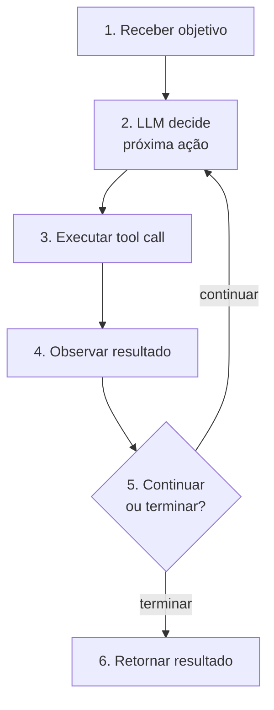

# O que é um agent

> [!abstract] TL;DR
> Um **AI agent** é um sistema que combina um LLM (cérebro), um conjunto de **ferramentas** (mãos), e um **loop de execução** com autonomia de decisão. Dado um objetivo, o agent decide sozinho o que fazer em cada passo: qual tool chamar, com quais argumentos, quando pedir mais informação, quando terminar. Isso é o que distingue agent de chat, de pipeline RAG, e de workflow hardcoded. **Autonomia de decisão no loop é o que define um agent.**

## A definição operacional

```
Chat       = LLM(input) → output
RAG        = retrieve(input) → LLM(context+input) → output
Workflow   = step1 → step2 → step3 → ...           (ordem fixa)
Agent      = LLM decide próximo step iterativamente até terminar
```

A linha que separa: **quem decide a próxima ação?**

- Chat / RAG / Workflow: você decide (no código).
- Agent: o LLM decide (em runtime).

## Anatomia mínima



## Diferenciador chave: autonomia no loop

**Chat simples:** você manda 1 pergunta, recebe 1 resposta. Sem ferramentas, sem iteração.

**Prompt com RAG:** pipeline fixo. O sistema decide "buscar antes" e "responder depois". O LLM não decide o quê buscar.

**Workflow hardcoded:** sequência fixa de chamadas LLM. Programador desenhou a ordem.

**Agent:** dada a tarefa, o LLM decide a cada turno. Decisão iterativa, não-determinística.

## Quando NÃO usar agent

> [!warning] Anti-pattern: agent prematuro
> A maior parte das tarefas que parece "precisar de agent" funciona melhor como **workflow determinístico**. Anthropic: *"use workflows when you can, agents when you must"*.

| Tarefa | Padrão certo |
|---|---|
| Classificar tickets | LLM call simples |
| Resumir email | LLM call simples |
| Buscar e responder Q&A | RAG pipeline |
| Multi-step com ordem previsível | Workflow |
| Multi-step **com decisões dinâmicas** | Agent |

## Quando usar agent

Sinais:

- **Decisão depende de resultados intermediários**
- **Espaço de busca aberto** (research, debugging exploratório)
- **Tarefa é open-ended**
- **Sub-tarefas variáveis** dependendo do contexto

Exemplos: research assistant, coding agent (Claude Code, Cursor), debugging agent, customer support com escalação.

## O que diferencia um senior em agents

> [!tip]
> 1. Sabe quando NÃO usar agent
> 2. Desenha tools como APIs de verdade: descrições claras, tipos, erros úteis, sem sobreposição
> 3. Sempre define `max_steps` e guardrails
> 4. Trata ações destrutivas com human-in-the-loop
> 5. Instrumenta tudo: cada tool call, input, output, latência, custo
> 6. Entende que agents falham de formas novas
> 7. Decompõe em sub-agents quando a tarefa é complexa
> 8. Mede resultado, não processo
> 9. Pratica prompt injection defense
> 10. Tem evaluation de agent, não só de LLM

## A pergunta de teste

> *"Esse problema requer que o LLM decida o próximo step em runtime, ou eu consigo escrever a ordem dos steps em código?"*

Se você consegue escrever em código → workflow.
Se não consegue → talvez agent.

## Veja também

- [[02 - O loop ReAct e native tool use]]
- [[03 - Tool design — princípios e categorias]]
- [[08 - Patterns comuns de agents]]
- [[Agentes de Codificação]]
- [[Anatomia dos LLMs|01 - O que é um LLM]]

## Referências

- **Anthropic** — *Building Effective Agents* (2024)
- **Anthropic** — *Effective Context Engineering for AI Agents* (2025)
- **OpenAI** — *A Practical Guide to Building Agents* (2025)
- **Yao et al.** — *ReAct: Reasoning and Acting* (arxiv 2022)
