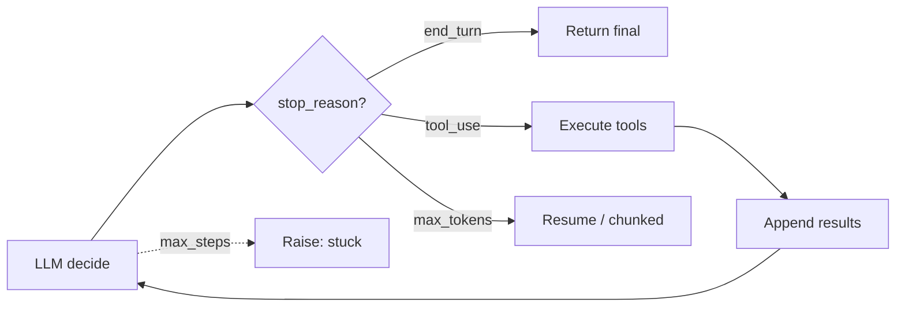

# O loop ReAct e native tool use

> [!abstract] TL;DR
> **ReAct** (Reasoning + Acting), introduzido por Yao et al. em 2022, virou o padrão mental de agents. Combina raciocínio (*"thoughts"*) com ações (tool calls) e observações em loop. Em 2026, ninguém mais formata ReAct textualmente — LLMs modernos têm **native tool use** (Anthropic, OpenAI, Google), e o loop é gerenciado pelo SDK. **Mas o mental model é o mesmo.** Um agent é um while loop que termina quando o LLM diz "acabei" (`end_turn`) ou bate `max_steps`.

## ReAct — o padrão original

```text
Objective: "Find the 5 most recent papers about context engineering and summarize them."

Thought: I need to search for recent papers on this topic.
Action: web_search(query="context engineering LLM agents 2025", limit=10)
Observation: [lista de 10 resultados]

Thought: I have candidates. I need to read the top 5.
Action: read_url(url="https://arxiv.org/abs/2506.12345")
Observation: [conteúdo do paper 1]

... (repete para papers 2-5)

Thought: I have enough. Let me synthesize.
Final answer: [sumário estruturado dos 5 papers]
```

Três elementos sempre presentes:

| Elemento | Função |
|---|---|
| **Thought** | Raciocínio sobre próximo passo |
| **Action** | Tool call concreta |
| **Observation** | Resultado da tool, alimentado de volta |

## Native tool use — como funciona em 2026

LLMs modernos não pedem ReAct textual — eles têm **tool use nativo**, com schema estruturado.

```python
from anthropic import Anthropic

client = Anthropic()

tools = [
    {
        "name": "web_search",
        "description": "Search the web for recent articles and pages",
        "input_schema": {
            "type": "object",
            "properties": {
                "query": {"type": "string"},
                "limit": {"type": "integer", "default": 10}
            },
            "required": ["query"]
        }
    }
]

def run_agent(objective: str, max_steps: int = 15):
    messages = [{"role": "user", "content": objective}]

    for step in range(max_steps):
        response = client.messages.create(
            model="claude-sonnet-4-6",
            max_tokens=4096,
            tools=tools,
            messages=messages
        )
        messages.append({"role": "assistant", "content": response.content})

        if response.stop_reason == "end_turn":
            final = next((b.text for b in response.content if b.type == "text"), "")
            return final

        tool_results = []
        for block in response.content:
            if block.type == "tool_use":
                result = execute_tool(block.name, block.input)
                tool_results.append({
                    "type": "tool_result",
                    "tool_use_id": block.id,
                    "content": result
                })
        messages.append({"role": "user", "content": tool_results})

    raise RuntimeError("Max steps exceeded")
```

Esse é o **"hello world" de um agent**. Todos os frameworks são variações disso.

## Os 4 stop reasons que importam

| `stop_reason` | Significado | O que fazer |
|---|---|---|
| `end_turn` | Agent terminou — tem resposta final | Sair do loop |
| `tool_use` | Agent quer chamar tool | Executar + alimentar resultado |
| `max_tokens` | Geração foi cortada | Aumentar `max_tokens` ou re-prompt |
| `stop_sequence` | Bateu em sequência de parada | Tratar conforme caso |

## Padrões dentro do loop

### 1. Tool use paralelo

LLMs modernos podem retornar **múltiplas tool calls** num mesmo turno. Vantagem: latência menor (executar em paralelo no seu código).

### 2. Chain-of-thought entrelaçado

Em modelos com **extended thinking** (Claude 4+), o reasoning fica em block separado, **invisível** ao próximo turno mas usado pelo modelo para decisão.

### 3. Self-correction

Quando tool retorna erro, agent vê e tenta de novo:

```
Action: read_url("https://fake.com/missing")
Observation: 404 not found
Thought: URL deu 404. Vou tentar outra fonte.
Action: read_url("https://other.com/article")
```

Padrão poderoso. Requer descrições de erro claras (ver [[03 - Tool design — princípios e categorias]]).

## O loop visualizado em produção



## Pitfalls do loop

### 1. `max_steps` ausente

Agent decide errado, fica em loop, queima budget. **Sempre** defina `max_steps`. Padrão: 15-30.

### 2. Tool result silencioso

Tool retorna `None`, agent não sabe que falhou, repete. **Fix:** sempre retorne mensagem informativa.

### 3. Output gigante de tool

Tool retorna 50K tokens. Atenção dilui ([[Context Engineering|03 - Context rot e atenção diluída]]). **Fix:** truncate, paginar, ou retornar só relevante.

### 4. Loop sem progresso

Agent chama mesma tool com mesmos args repetidamente. **Fix:** detectar duplicação, abortar, injetar prompt "tente algo diferente".

## Variantes além de ReAct

| Padrão | Diferença |
|---|---|
| **Plan-then-execute** | Plano completo primeiro, depois executa. Menos flexível, mais previsível |
| **Self-ask** | Decompõe pergunta em sub-perguntas, responde cada uma |
| **Reflexion** | Reflete sobre falhas antes de tentar de novo (custo alto) |
| **Tree-of-Thought** | Explora múltiplos caminhos, escolhe melhor (custo muito alto) |

ReAct continua sendo o **default certo** na maioria dos casos.

## Veja também

- [[01 - O que é um agent]]
- [[03 - Tool design — princípios e categorias]]
- [[05 - Planning — plan-then-execute, dynamic, hierarchical]]
- [[Anatomia dos LLMs|09 - APIs de LLM — anatomia de uma chamada]]
- [[Economia de Tokens|03 - Por que agentes gastam tanto]]

## Referências

- **Yao et al.** — *ReAct: Reasoning and Acting* (arxiv:2210.03629)
- **Schick et al.** — *Toolformer* (arxiv:2302.04761)
- **Anthropic** — *Tool use documentation* (2026)
- **OpenAI** — *Function calling guide* (2026)
