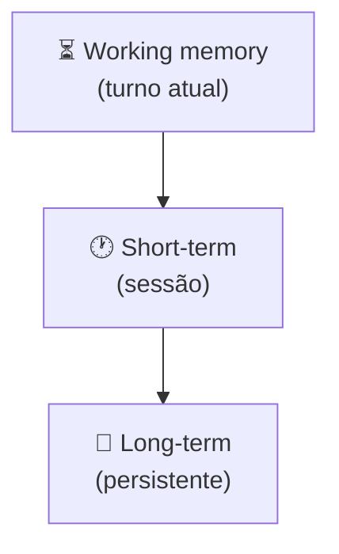
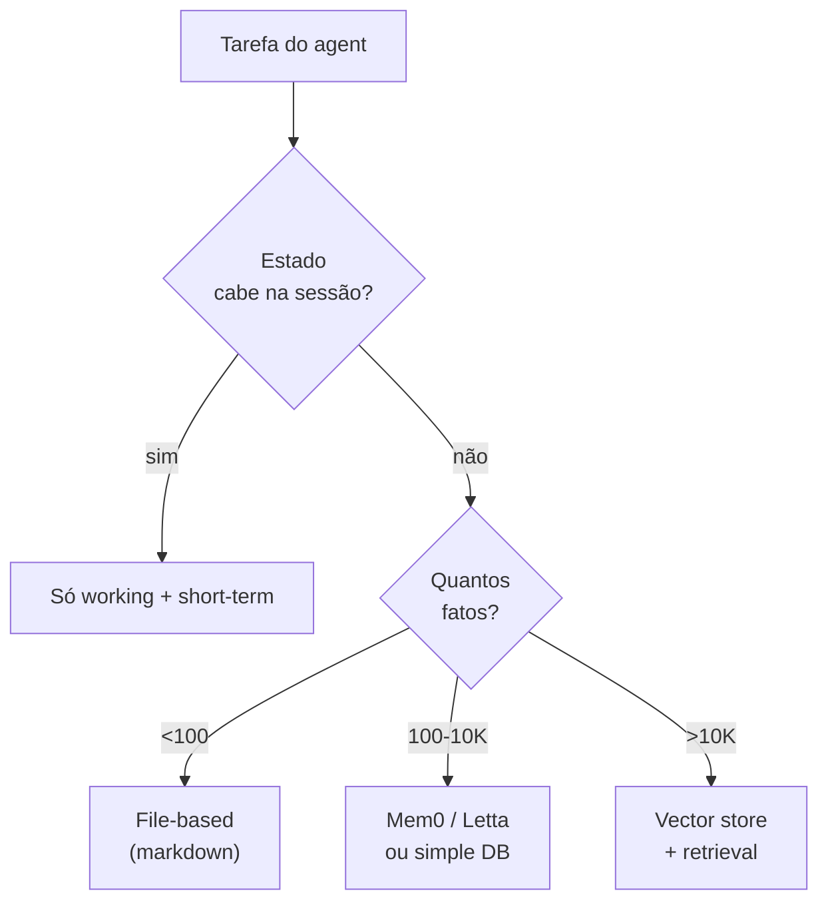

# Memory em agents

> [!abstract] TL;DR
> Agents precisam **lembrar** entre passos. Três tipos coexistem: **short-term** (working memory carregada no prompt, limitada pela context window, descarta ao terminar), **long-term** (persistente entre sessões, em arquivo/DB/vector store), e **structured state** (NOTES.md, TODO.md). Compactação é essencial — context cresce, atenção dilui ([[Context Engineering|03 - Context rot e atenção diluída]]). Para deep dive em sistemas avançados (MemGPT, Letta, Mem0, Zep), ver a trilha [[Memória de Agentes]].

## Os 3 tipos



| Tipo | Onde mora | Vida útil | Tamanho |
|---|---|---|---|
| **Working memory** | Prompt do turno | Segundos | Ilimitado dentro da janela |
| **Short-term** | Histórico da sessão | Horas | Cresce — precisa compactar |
| **Long-term** | DB, files, vector store | Dias a anos | Ilimitado |

## Working memory — o scratchpad

Espaço de raciocínio dentro do prompt do turno atual. Em modelos com extended thinking (Claude 4+, o1), fica em block separado.

**Características:**
- Descartado após o turno (em models com thinking)
- Não consome tokens do output (em modelos modernos)
- Permite raciocínio antes da ação

## Short-term memory — o histórico

O histórico da conversa atual. Cresce a cada turno.

**Problema clássico:** sessão de 50 turnos vira contexto de 200K tokens. [[Context Engineering|03 - Context rot e atenção diluída|Atenção dilui]], custo explode.

**Mitigações:**
- Compactação automática ([[Context Engineering|07 - Compressão e pruning de informação]])
- Sliding window (manter só últimos N turnos)
- Sumarização periódica
- Sub-agents com contexto isolado ([[06 - Multi-agent — orchestrator e sub-agents]])

## Long-term memory — o que persiste

Info que sobrevive entre sessões. Várias estratégias:

### File-based (markdown)

```
project/
└── .agent-memory/
    ├── NOTES.md         # observações e decisões
    ├── TODO.md          # próximos passos
    ├── DECISIONS.md     # log de ADRs
    └── facts/
```

**Prós:** simples, inspecionável, git-friendly, agent pode editar como qualquer arquivo
**Contras:** não escala para milhares de fatos
**Use quando:** projeto solo ou time pequeno, codebase ou vault Obsidian

Detalhamento em [[Context Engineering|10 - Structured state tracking]].

### Vector store

Embeddings de memórias passadas, recuperadas por similaridade semântica.

**Prós:** escalável, busca natural por significado
**Contras:** menos controlável, pode trazer noise
**Tools:** Pinecone, Weaviate, Qdrant, Mem0/Zep

### Structured DB

Tabelas com entidades, relações, fatos. Máxima estrutura.

**Use quando:** compliance pesado, auditoria total

### Self-editing memory (MemGPT, Letta)

LLM tem ferramentas para escrever, ler, podar a própria memória durante reasoning.

Deep dive em [[Context Engineering|08 - Memória agentica — self-editing memory]].

## Working memory compaction — o pattern essencial

Quando histórico passa do limite, **resuma e substitua**. Claude Code faz isso automaticamente. Em código próprio, dispare quando tokens > 70% da janela.

## Decisão: que memória usar?



## Sinais que precisa de long-term memory

- Mesmo usuário interage múltiplas vezes
- Agent deveria "lembrar" preferências
- Decisões anteriores precisam ser referenciadas
- Histórico cumulativo é diferencial competitivo

## Sinais que NÃO precisa

- Cada sessão é stateless (chatbot anônimo)
- Aplicação é one-shot
- Compliance proíbe retenção
- Time pequeno sem orçamento para manter memória

## Anti-patterns

- **Achatar tudo em short-term** — context rot inevitável
- **Long-term sem TTL** — fato de 2024 ainda servido em 2026
- **Sem compactação** — sessão de 8h envia 800K tokens em cada turno
- **Vector store para tudo** — muito barulho; markdown basta para a maioria
- **Self-editing memory sem governance** — memory poisoning, PII leak

## Para deep dive

A trilha [[Memória de Agentes]] tem 23 notas dedicadas: taxonomia (episódica, semântica, procedural), implementações (MemGPT/Letta, Mem0, Zep, Graphiti, Generative Agents Stanford), comparativo crítico, guia de implementação.

## Veja também

- [[02 - O loop ReAct e native tool use]]
- [[05 - Planning — plan-then-execute, dynamic, hierarchical]]
- [[Context Engineering|05 - Camadas de contexto — persistente, temporal, transiente]]
- [[Context Engineering|07 - Compressão e pruning de informação]]
- [[Context Engineering|08 - Memória agentica — self-editing memory]]
- [[Context Engineering|10 - Structured state tracking]]
- [[Memória de Agentes]]

## Referências

- **Packer et al.** — *MemGPT: Towards LLMs as Operating Systems* (2023)
- **Anthropic** — *Effective context engineering for AI agents* (2025)
- **Letta** — *Memory Blocks documentation* (2025)
