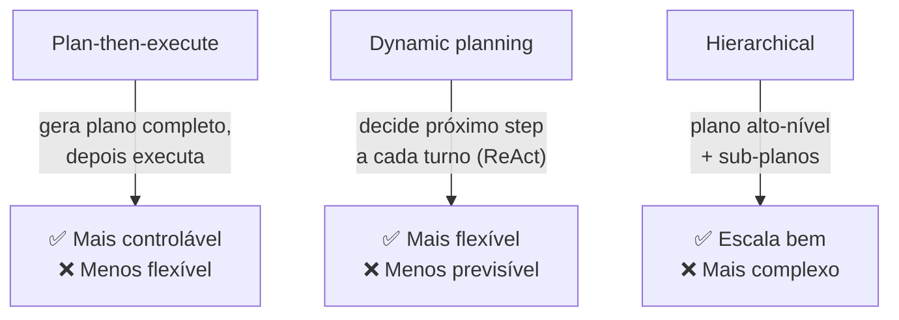

# Planning — plan-then-execute, dynamic, hierarchical

> [!abstract] TL;DR
> Para tarefas complexas, agents se beneficiam de **planejamento explícito** antes de executar. Três estratégias: **plan-then-execute** (gera plano em markdown, revisa, depois executa — mais controlável), **dynamic** (decide próximo passo a cada iteração — mais flexível, padrão de ReAct puro), e **hierarchical** (plano alto-nível com sub-planos). Pattern recomendado em coding agents: sempre pedir plano em markdown antes de tocar código em features não-triviais. Esse padrão **elimina a maior parte** dos *"o agent foi fazer outra coisa"*.

## As 3 estratégias



## Estratégia 1 — Plan-then-execute

**Como funciona:**
1. Agent recebe objetivo
2. Em vez de agir, primeiro **gera plano** em markdown
3. Humano revisa (opcionalmente) e aprova
4. Agent executa cada passo do plano
5. Se desviar, registra e (opcionalmente) pausa

**Quando usar:**
- Tarefas grandes com decisões importantes
- Coding em features não-triviais
- Custo de erro alto
- Humano precisa entender antes de aprovar

**Exemplo (Claude Code):**

```
User: "Refatore auth para usar JWT em vez de sessions"

Agent:
## Plano de refatoração — auth → JWT
1. Analisar uso atual de sessions em src/auth/
2. Adicionar lib jsonwebtoken
3. Criar src/auth/jwt.ts com sign/verify
4. Migrar src/middleware/auth.ts
5. Atualizar testes em tests/auth/
6. Verificar refresh token flow

[Aguardando aprovação]
```

## Estratégia 2 — Dynamic planning

**Como funciona:** ReAct puro — sem plano antecipado. Cada decisão acontece em runtime.

**Quando usar:**
- Tarefas exploratórias (research, debugging)
- Espaço de busca aberto
- Plano antecipado seria especulação
- Pequena escala (1-10 steps)

**Exemplo:**
```
User: "Debug why API /payments returns 500"

Agent:
[Step 1] Vou ler logs recentes... → encontra erro de DB
[Step 2] Vou checar conexão... → conexão ok
[Step 3] Vou ler código do endpoint... → encontra null pointer em line 42
[Step 4] Vou propor fix...
```

Cada decisão vem do passo anterior. Não dava pra prever.

## Estratégia 3 — Hierarchical planning

**Como funciona:** plano de N níveis. Topo é abstrato; folhas são executáveis.

**Quando usar:**
- Tarefas grandes que não cabem em um único plano linear
- Multi-team ou multi-agent
- Quando algumas partes são paralelizáveis

**Exemplo:**

```
Plano: "Lançar feature X em produção"

Sub-plano A: Backend
  1. Migration de DB
  2. Endpoints
  3. Testes integração

Sub-plano B: Frontend (paralelo a A após contracts)
  1. Componentes
  2. Integração
  3. Testes

Sub-plano C: Deploy (depois de A e B)
  1. Staging
  2. Validação
  3. Production rollout
```

Conecta com [[Spec-Driven Development|09 - SDD com agentes — coordinator, implementor, validator|multi-agent CIV]] e [[06 - Multi-agent — orchestrator e sub-agents]].

## Heurística: qual estratégia usar?

| Sinal | Estratégia |
|---|---|
| Tarefa cabe em <5 steps simples | Dynamic |
| Tarefa exploratória (research, debugging) | Dynamic |
| Coding em feature de >1 dia | Plan-then-execute |
| Mudança em código que afeta múltiplos arquivos | Plan-then-execute |
| Risco alto (auth, payment, infra) | Plan-then-execute |
| Multi-agent paralelizável | Hierarchical |
| Decomposição clara em sub-tarefas | Hierarchical |

## O padrão "plan-then-execute" em Claude Code

> [!quote] Anthropic best practice
> *"Para qualquer feature não-trivial, peça ao Claude Code primeiro um plano em markdown. Revise. Aprove. Aí execute."*

Esse padrão sozinho elimina ~80% dos casos de "agent foi pelo caminho errado".

## Re-planning durante execução

Quando algo muda durante execução, **agent deve pausar e re-planejar**. Detectar surpresa: resultado contradiz expectativa, descoberta de constraint não considerada, ou tool retorna algo inesperado.

## Anti-patterns

- **Plano sempre, em todo passo** — overhead ridículo em tarefas simples
- **Plano nunca** — agent vibe-coding, vai pelo caminho errado
- **Plano sem revisão** — humano não viu, perde benefício
- **Re-plan silencioso** — agent muda de plano sem registrar; vira drift
- **Hierarchical raso** — só 2 níveis quando precisava 3-4
- **Plano em prosa** — não-executável; use markdown estruturado

## Métricas

| Métrica | Alvo |
|---|---|
| **% tarefas grandes com plano antecipado** | >80% |
| **% planos aprovados sem mudança** | 30-60% |
| **% steps executados conforme plano** | >85% |
| **% re-plans silenciosos detectados** | <5% |

## Veja também

- [[02 - O loop ReAct e native tool use]]
- [[06 - Multi-agent — orchestrator e sub-agents]]
- [[Spec-Driven Development|02 - O que é Spec-Driven Development]]
- [[Spec-Driven Development|05 - Fase Design e Plan — arquitetura e decomposição]]
- [[Agentes de Codificação|03 - O comprehension gate]]

## Referências

- **Anthropic** — *Best practices for Claude Code: Planning* (2026)
- **Anthropic** — *Building Effective Agents* (2024)
- **Wei et al.** — *Plan-and-Solve Prompting* (arxiv 2023)
- **Yao et al.** — *Tree of Thoughts* (arxiv 2023)
