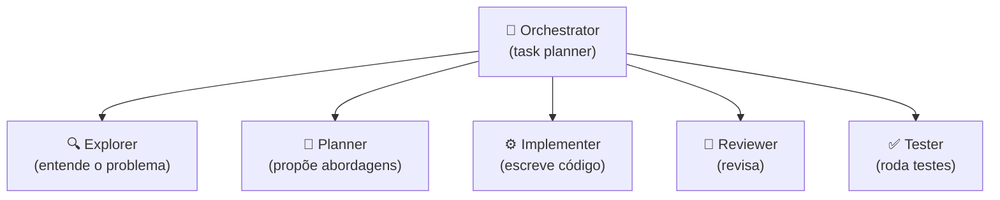

# Multi-agent — orchestrator e sub-agents

> [!abstract] TL;DR
> Para tarefas grandes, um **agent orchestrator** delega para **sub-agents especializados**. Cada sub-agent tem contexto pequeno e focado, falhas localizadas não contaminam o todo, paralelização vira possível, e cada sub-agent pode usar modelo diferente (Haiku para Explorer, Sonnet para Implementer, Opus para Reviewer). Custo: overhead de coordenação, handoff é onde info se perde, debugging mais complexo. **Single agent bem desenhado > multi-agent confuso.** Use sub-agents quando tarefa não cabe num contexto só, ou quando especialização claramente ajuda.

## A premissa



Cada papel **isolado** com contexto próprio. Orchestrator coordena handoffs.

## Vantagens

- **Cada sub-agent tem contexto pequeno e focado** — combate [[Context Engineering|03 - Context rot e atenção diluída|context rot]]
- **Falhas localizadas** não contaminam o todo
- **Paralelização**: múltiplos sub-agents independentes rodam concorrentes
- **Especialização por modelo**: Explorer pode ser Haiku, Implementer Sonnet, Reviewer Opus
- **Custo otimizado**: modelos baratos onde dá

## Desvantagens

- **Overhead de coordenação** — mais tokens, mais latência
- **Handoff é onde informação se perde**
- **Debugging mais complexo** — bug pode estar em qualquer sub-agent
- **Premature abstraction** — multi-agent prematuro vira pior que single

## Quando usar sub-agents

✅ **Use:**
- Tarefa não cabe em um único contexto
- Especialização claramente ajuda (research vs implement)
- Sub-tarefas paralelizáveis
- Cada sub-agent precisa de tools muito diferentes
- Audit trail por papel é requisito (compliance)

❌ **NÃO use:**
- Tarefa pequena (1-3 steps) — overhead supera ganho
- Sub-tarefas têm muito contexto compartilhado
- Time não tem expertise para debugar coordenação
- Sem métrica clara de quando coordenação está dando errado

## Padrões de orquestração

### Pattern 1 — Coordinator-Implementor-Verifier (CIV)

Padrão peer-reviewed (VeriMAP, EACL 2026). Orchestrator transforma spec em DAG. Implementors trabalham em paralelo. Validator verifica saídas antes de aceitar.

Detalhamento em [[Spec-Driven Development|09 - SDD com agentes — coordinator, implementor, validator]].

### Pattern 2 — Specialist subagents (Kiro)

Em vez de implementors genéricos, **subagents especializados**:

- `security-reviewer`
- `api-contract-validator`
- `db-migration-writer`
- `test-author`

Orchestrator escolhe specialist por tipo de task.

### Pattern 3 — Hierarchical (multi-level)

Orchestrator delega a **sub-coordinators** para mega-tasks:

```
Orchestrator
├── Sub-coordinator A (feature 1)
│   ├── Implementor A1
│   └── Implementor A2
└── Sub-coordinator B (feature 2)
    ├── Implementor B1
    └── Implementor B2
```

Útil em features grandes ou multi-equipes.

### Pattern 4 — Conversational multi-agent (AutoGen)

Múltiplos agents conversam entre si até chegar a consenso. Mais experimental; menos previsível.

## Implementações em 2026

| Stack | Como fazer multi-agent |
|---|---|
| **Claude Code** | `Task` tool com `subagent_type` (general-purpose, explore, plan) |
| **LangGraph** | StateGraph com nodes coordinator/sub-agent |
| **Kiro** | Custom subagents nativos |
| **OpenAI Swarm** | Handoffs entre agents |
| **CrewAI** | Crew com roles + tasks |
| **Custom** | Loop em código próprio |

## A regra de ouro do handoff

> [!warning] Não passe histórico bruto
>
> Padrão errado: orchestrator passa histórico inteiro para sub-agent.
> Resultado: sub-agent vê demais, contexto inflado, decisões erradas.
>
> Padrão certo: orchestrator passa **resumo + intent + dados estruturados**.
> Sub-agent recebe contexto enxuto, foca na sub-tarefa.

```python
# Errado
sub_agent.run(history=orchestrator.full_history)

# Certo
sub_agent.run(
    summary=summarize(orchestrator.history),
    intent="Validar compliance da proposta",
    structured_data={
        "decision": orchestrator.decision,
        "constraints": orchestrator.constraints
    }
)
```

## Especialização por modelo

```python
# Modelos diferentes por papel
orchestrator = "claude-opus-4"      # raciocínio sobre o todo
explorer = "claude-haiku-4-5"        # rápido e barato
implementer = "claude-sonnet-4-6"    # equilíbrio
reviewer = "claude-opus-4"           # análise crítica
```

Custo total **menor** que single Opus. Latência total similar (paralelismo compensa).

## Métricas

| Métrica | Alvo |
|---|---|
| **Speedup vs single-agent** | 2-4x em features com tasks paralelizáveis |
| **% tasks aprovadas em primeira validation** | >75% |
| **Coordinação overhead** | <20% do tempo total |
| **Tokens por feature (multi vs single)** | Comparável ou menor |

## Anti-patterns

- **Multi-agent prematuro** — "vamos fazer 5 agents especializados" para task simples
- **Coordinator sem paralelismo** — vira chain inútil
- **Implementors recebendo plan completo** — perde isolamento de contexto
- **Validator com prompt = "is this good?"** — viés de aceitar
- **Sem fallback quando task falha 3+ vezes** — coordinator entra em loop
- **Custos não monitorados** — N agents × tokens vira custo escondido

## Single agent bem desenhado > multi-agent confuso

> [!tip]
> Antes de partir para multi-agent, pergunte:
> 1. Single agent bem promptado resolve isso?
> 2. Tools bem desenhadas resolveriam o problema do contexto?
> 3. Sub-agent é arquitetura ou complexidade gratuita?
>
> Se resposta é "sim" para 1-2, **fique single**.

## Veja também

- [[01 - O que é um agent]]
- [[03 - Tool design — princípios e categorias]]
- [[05 - Planning — plan-then-execute, dynamic, hierarchical]]
- [[Economia de Tokens|10 - Sub-agentes especializados]]
- [[Spec-Driven Development|09 - SDD com agentes — coordinator, implementor, validator]]
- [[Context Engineering|09 - Shared memory em multi-agent]]

## Referências

- **Anthropic** — *Building Effective Agents* (2024)
- **Anthropic** — *Claude Agent SDK: Subagents and Tasks* (2025)
- **Augment Code** — *Coordinator-Implementor-Verifier Pattern* (2026)
- **VeriMAP** — *EACL 2026 paper, verification-aware multi-agent planning*
- **OpenAI Swarm** — *github.com/openai/swarm* (2024+)
