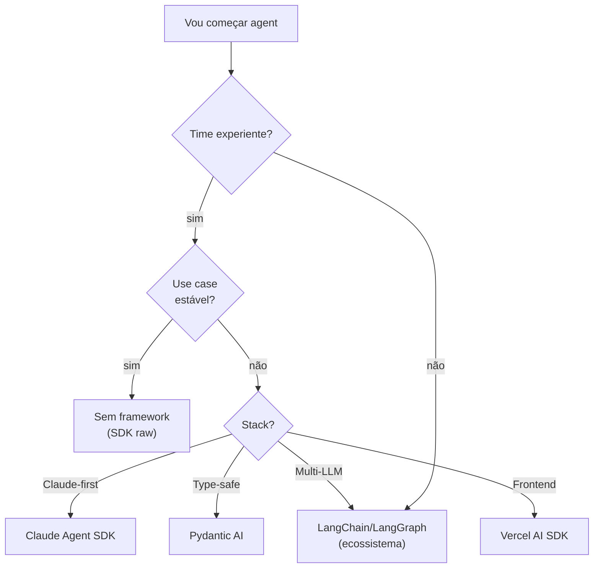

# Frameworks 2026 — Claude Agent SDK, LangGraph, AutoGen, CrewAI

> [!abstract] TL;DR
> O ecossistema de frameworks para agents em 2026 estabilizou em 5 grandes opções: **Claude Agent SDK** (oficial Anthropic), **LangGraph** (mais popular para workflows complexos), **CrewAI** (multi-agent role-based), **AutoGen** (Microsoft, conversational), **Pydantic AI** (TypeScript/Python type-safe). Mas o movimento crescente é **"sem framework"**: SDK raw + 500 linhas de código próprio. Frameworks engessam, mudam frequentemente, são difíceis de debugar. **Use framework quando o pain de não ter excede o pain de ter.**

## O panorama em uma tabela

| Framework | Linguagem | Forte em | Quando usar |
|---|---|---|---|
| **Claude Agent SDK** | Python | Integração nativa Claude, MCP | Comprometido com Claude |
| **LangChain / LangGraph** | Python, JS | Ecossistema enorme, workflows complexos | Múltiplas integrações + state graph |
| **CrewAI** | Python | Multi-agent role-based | Protótipos multi-agent |
| **AutoGen** | Python | Conversational multi-agent | Pesquisa, experimental |
| **Pydantic AI** | Python | Type-safe, structured outputs | Times type-first |
| **Vercel AI SDK** | TypeScript | Frontend Next.js/React + LLM | SPA/webapp com IA |
| **Sem framework** | Qualquer | Controle total, debug fácil | Time experiente, use case estável |

## Claude Agent SDK

Framework oficial da Anthropic para construir agents com Claude.

```python
from anthropic import Anthropic
# (Claude Agent SDK abstrai o loop, tools, observabilidade)

agent = Agent(
    model="claude-sonnet-4-6",
    tools=[search_tool, read_tool],
    max_steps=15,
    observability=langfuse_client
)

result = agent.run("Pesquise X e sintetize")
```

**Prós:**
- Integração nativa com Claude (tool use otimizado)
- Observabilidade built-in
- Suporte nativo a MCP

**Contras:**
- Lock-in Anthropic (otimizado para Claude)
- Menos maduro que LangChain

**Use quando:** comprometido com Claude e quer o melhor do Claude.

## LangChain / LangGraph

O framework mais popular para agents em Python/JS.

- **LangChain:** abstrações de "chain" e "agent", muitas integrações
- **LangGraph:** layer para grafos de execução, stateful workflows, cycles, branches

```python
from langgraph.graph import StateGraph

class AgentState(TypedDict):
    messages: list
    findings: list

graph = StateGraph(AgentState)
graph.add_node("researcher", researcher_fn)
graph.add_node("writer", writer_fn)
graph.add_edge("researcher", "writer")
```

**Prós:**
- Ecossistema enorme, integra com tudo
- LangSmith para observabilidade
- StateGraph é poderoso para multi-agent

**Contras:**
- Abstrações pesadas
- Mudanças frequentes (debugging difícil)
- Curva de aprendizado íngreme

**Use quando:** projetos que precisam de múltiplas integrações e estão ok com overhead.

## CrewAI

Framework especializado em multi-agent orchestration.

```python
from crewai import Crew, Agent, Task

researcher = Agent(role="Researcher", goal="Find sources")
writer = Agent(role="Writer", goal="Synthesize findings")

task = Task(description="Research X", agent=researcher)
crew = Crew(agents=[researcher, writer], tasks=[task])
crew.kickoff()
```

**Prós:**
- Paradigma claro de "crew" (papéis + tarefas)
- Boa para ideação e protótipos

**Contras:**
- Menos maduro
- Documentação variável

**Use quando:** protótipos multi-agent, ideação rápida.

## AutoGen (Microsoft)

Framework de multi-agent conversational.

**Prós:**
- Paradigma claro de conversação
- Suporte a human-in-the-loop

**Contras:**
- Mais acadêmico, menos otimizado para prod
- Output pode ser caro (agents conversam muito)

**Use quando:** pesquisa, experimentação multi-agent.

## Pydantic AI

Framework type-safe focado em structured outputs.

```python
from pydantic_ai import Agent

class ResearchResult(BaseModel):
    findings: list[str]
    sources: list[str]
    confidence: float

agent = Agent(
    "claude-sonnet-4-6",
    result_type=ResearchResult,
    tools=[search, read]
)

result = agent.run_sync("Pesquise X")
print(result.data.findings)  # type-safe
```

**Prós:**
- Type-safe (Pydantic validation)
- Structured outputs garantidos
- Bom DX

**Contras:**
- Menos integrações que LangChain

**Use quando:** time prefere type-first development.

## Vercel AI SDK

Framework para aplicações Next.js/React com LLM.

**Prós:**
- Excelente DX em frontend
- Streaming nativo, hooks React

**Contras:**
- Focado em aplicações web
- Não para agents servidor-puros

**Use quando:** SPA/webapp com IA.

## "Sem framework" — o movimento crescente

Em 2026, muita gente está voltando para **SDK raw + código próprio**. Razões:

> [!quote] Simon Willison e devs senior
> *"Frameworks são abstrações que engessam. Um agent de 500 linhas em TypeScript raw é mais fácil de debugar, mais fácil de otimizar custo, mais fácil de adaptar."*

**Quando "sem framework" vence:**
- Time sabe o que está fazendo
- Use case estável (não muda toda semana)
- Custo importa muito
- Debug é prioritário

**Quando framework vale:**
- Time precisa de muitas integrações
- Velocidade de prototipagem > controle
- Time menos experiente

## Heurística de escolha



## A pergunta de teste

> *"O pain de manter framework excede o pain de manter código próprio?"*

Se sim → use framework.
Se não → comece sem.

## Anti-patterns

- **Framework como religião** — escolheu LangChain, força em tudo
- **Framework para protótipo** — overhead em algo que ia mudar
- **Sem framework + sem disciplina** — código vira spaghetti
- **Trocar framework no meio** — custo enorme, raramente vale
- **Framework cutting-edge em produção** — versões mudam, breakages

## Métricas para avaliar adoção

| Métrica | Alvo |
|---|---|
| **Tempo até primeiro agent funcional** | <2 dias |
| **Linhas de código de glue** | <500 |
| **% de bugs que vêm do framework** | <30% |
| **Curva de onboarding novo dev** | <1 semana |

## Veja também

- [[01 - O que é um agent]]
- [[02 - O loop ReAct e native tool use]]
- [[06 - Multi-agent — orchestrator e sub-agents]]
- [[Agentes de Codificação|10 - OpenCode — o harness open source]]
- [[Agentes de Codificação|13 - Devin e agentes autônomos cloud]]

## Referências

- **Anthropic** — *Claude Agent SDK docs* (2026)
- **LangChain** — *python.langchain.com* (2026)
- **CrewAI** — *docs.crewai.com* (2026)
- **AutoGen** — *microsoft.github.io/autogen* (2026)
- **Pydantic AI** — *ai.pydantic.dev* (2026)
- **Vercel AI SDK** — *sdk.vercel.ai* (2026)
- **Simon Willison** — *blog on agents and frameworks* (2024-2026)
