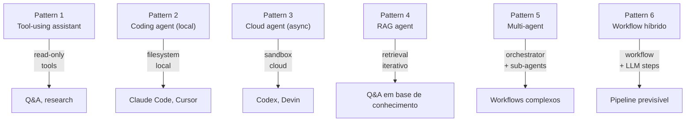

# Patterns comuns de agents

> [!abstract] TL;DR
> Agents na prática se cristalizaram em **6 patterns** repetíveis: tool-using assistant (read-only Q&A), coding agent (Claude Code/Cursor — operam no filesystem), cloud agent (Codex/Devin — sandbox cloud), RAG agent (busca dinâmica + síntese), multi-agent orchestration (CrewAI/LangGraph/AutoGen), e workflow híbrido (workflow + chamadas LLM disfarçado de agent). Reconhecer o pattern certo é meio caminho — implementar o pattern errado é fonte clássica de over-engineering.

## Os 6 patterns



## Pattern 1 — Tool-using assistant

Agent único com **ferramentas read-only**, usado para Q&A e análise.

**Exemplos:** pesquisa, análise de logs, Q&A sobre documentação interna.

**Tools:** `web_search`, `read_url`, `read_doc`, `query_db`.

**Guardrails:** nenhum crítico porque tools são safe.

**Quando usar:** task de pesquisa, exploração, sem ações destrutivas.

## Pattern 2 — Coding agent (local)

Agent que edita código, roda testes, faz commits. Opera no filesystem **local** do usuário.

**Exemplos:** Claude Code, Cursor, Cline, Aider.

**Tools:** `read_file`, `write_file`, `run_shell`, `git_commit`, `glob`, `grep`.

**Guardrails essenciais:**
- `max_steps` alto mas finito (30-50)
- Confirmação antes de `git push`, `rm -rf`, operations fora do workspace
- Sandboxing quando possível
- Human review antes de merge

**Quando usar:** desenvolvimento ativo, par programmer, refactoring.

Detalhamento em [[Agentes de Codificação]].

## Pattern 3 — Cloud agent (async)

Agent rodando em sandbox cloud, recebe task, retorna PR.

**Exemplos:** OpenAI Codex, Devin.

**Vantagens:**
- Não afeta ambiente local
- Pode rodar em paralelo
- Multi-hour tasks possível

**Desvantagens:**
- Menos interativo
- Difícil de "steer" quando vai pelo caminho errado
- Confiança alta exigida

**Quando usar:** tasks longas e bem-definidas, paralelismo desejado, time já maduro com agents.

## Pattern 4 — RAG agent

Pipeline RAG com agent decidindo quando buscar, o quê buscar, quando expandir busca.

**Exemplos:** agent de pesquisa que usa web search + read, agent de Q&A sobre base de conhecimento.

**Tools:** `search` (vector ou web), `rerank`, `read_doc`.

**Diferença de RAG "pipeline fixo":** o agent decide iterativamente se o contexto obtido é suficiente.

**Quando usar:**
- Q&A em base grande onde uma busca não basta
- Multi-hop reasoning (resposta requer juntar 2-3 fontes)
- Busca exploratória

Conecta com [[Context Engineering|06 - Dynamic retrieval beyond RAG]].

## Pattern 5 — Multi-agent orchestration

Múltiplos agents especializados coordenados por orchestrator. Usado em workflows complexos.

**Frameworks:** CrewAI, AutoGen, LangGraph, Claude Agent SDK.

**Use cases:**
- Geração de conteúdo (pesquisa → draft → revisão → publicação)
- Análise de dados (fetch → clean → analyze → visualize → report)
- SDD com CIV ([[Spec-Driven Development|09 - SDD com agentes — coordinator, implementor, validator]])

**Quando usar:** tarefa decomponível em sub-tarefas com expertise distinta.

Detalhamento em [[06 - Multi-agent — orchestrator e sub-agents]].

## Pattern 6 — Workflow híbrido (workflow + agent)

Workflow determinístico com **steps que são prompts LLM ou pequenos agents**. Muita gente chama de "agent" mas é mais workflow.

**Quando usar:** quando o processo é previsível e estável. Mais barato, mais debugável.

> [!quote] Anthropic
> *"Use workflows when you can, agents when you must."*

**Exemplo:**
```python
# Workflow híbrido — não é agent
def process_ticket(ticket):
    classified = llm_classify(ticket)              # LLM step
    if classified.category == "bug":
        triaged = llm_triage(ticket, classified)   # LLM step
        return create_jira_ticket(triaged)          # determinístico
    elif classified.category == "feature":
        return llm_route_to_team(ticket)            # LLM step
    return None
```

Pattern usado em **muito** do que se chama "agent em produção" hoje.

## Como reconhecer o pattern certo

> [!question] Heurística rápida
>
> | Sinal | Pattern |
> |---|---|
> | Apenas Q&A, sem ações | Pattern 1 |
> | Coding no IDE/CLI | Pattern 2 |
> | Long-running task assíncrona | Pattern 3 |
> | Q&A em base de conhecimento grande | Pattern 4 |
> | Sub-tarefas distintas com expertise diferente | Pattern 5 |
> | Processo previsível, mas alguns steps precisam LLM | Pattern 6 |

## Anti-patterns por confusão de pattern

- **Pattern 6 chamado de Pattern 5** — workflow virando "multi-agent" desnecessariamente
- **Pattern 2 chamado de Pattern 3** — coding agent local rodando "como se fosse cloud"
- **Pattern 1 com tools destrutivas** — Q&A virando ação sem proteção
- **Pattern 4 sem rerank** — RAG agent que só busca, nunca filtra

## Combinações que funcionam

- **Pattern 4 + Pattern 5**: research multi-agent (Explorer faz Pattern 4, Writer sintetiza)
- **Pattern 2 + Pattern 5**: coding com sub-agents especializados (security, tests, etc.)
- **Pattern 6 + Pattern 1**: workflow com tool-using assistant em um dos steps

## Sinais de over-engineering

> [!warning]
> - Pattern 5 quando Pattern 6 resolveria
> - Pattern 3 quando Pattern 2 bastava
> - Pattern 4 quando RAG fixo bastava
> - Multi-agent com 5 agents para task que cabia em 1
> - Custom framework quando SDK raw bastava
>
> A regra: **comece simples, adicione complexidade só quando dói**.

## Veja também

- [[01 - O que é um agent]]
- [[06 - Multi-agent — orchestrator e sub-agents]]
- [[07 - Frameworks 2026]]
- [[Agentes de Codificação]]
- [[Spec-Driven Development|09 - SDD com agentes — coordinator, implementor, validator]]
- [[Context Engineering|06 - Dynamic retrieval beyond RAG]]

## Referências

- **Anthropic** — *Building Effective Agents* (2024) — categorização canônica
- **OpenAI** — *A Practical Guide to Building Agents* (2025)
- **LangChain Blog** — *Agent supervisor patterns* (2025)
