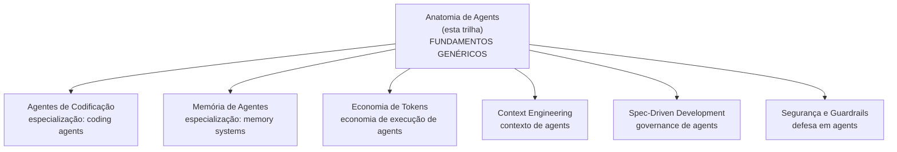

# Anatomia de Agents

Agents são o nível mais alto de abstração em aplicações com LLM em 2026. A diferença entre um chatbot e um agent é a mesma entre uma função pura e um programa inteiro: agents **raciocinam, decidem, usam ferramentas, observam resultados, e iteram** até terminar a tarefa. Esta trilha cobre os **fundamentos genéricos** de agents — o ciclo, tools, memory, planning, multi-agent, frameworks, patterns, evaluation. Para coding agents específicos (Cursor, Claude Code, Copilot), ver [[Agentes de Codificação]]. Para memória avançada (MemGPT, Letta), ver [[Memória de Agentes]].

> [!info] Pré-requisitos
> Recomendado ter lido [[Anatomia dos LLMs]] (Trilha 1) — especialmente sobre tool use ([[Anatomia dos LLMs|09 - APIs de LLM — anatomia de uma chamada]]). Esta trilha é o **fundamento genérico** sobre o qual outras trilhas se especializam.

> [!warning] Over-engineering é o pior risco
> A maior parte das tarefas que parece "precisar de agent" funciona melhor como **workflow determinístico**. *"Use workflows when you can, agents when you must"* — Anthropic. Esta trilha enfatiza tanto **quando usar** quanto **quando não usar**.

## Comece por aqui

Trilha sequencial recomendada — fundamentos → ciclo → componentes → patterns → produção.

### Bloco 1 — Fundamentos (2 notas)

O que é um agent, e o ciclo que define seu funcionamento.

- [[01 - O que é um agent]] — definição, autonomia no loop, quando NÃO usar
- [[02 - O loop ReAct e native tool use]] — ciclo Thought-Action-Observation, native tool use 2026

### Bloco 2 — Componentes Essenciais (3 notas)

Os 3 pilares que sustentam qualquer agent.

- [[03 - Tool design — princípios e categorias]] — 7 princípios, 5 categorias, tools destrutivas
- [[04 - Memory em agents]] — short-term, long-term, working memory, compactação
- [[05 - Planning — plan-then-execute, dynamic, hierarchical]] — 3 estratégias e quando usar cada

### Bloco 3 — Multi-agent e Frameworks (2 notas)

Quando um agent não basta, e que stack usar.

- [[06 - Multi-agent — orchestrator e sub-agents]] — vantagens, padrões CIV, especialização por modelo
- [[07 - Frameworks 2026]] — Claude Agent SDK, LangGraph, CrewAI, AutoGen, Pydantic AI, "sem framework"

### Bloco 4 — Produção (2 notas)

Reconhecer o pattern certo, medir o que importa.

- [[08 - Patterns comuns de agents]] — 6 patterns canônicos, anti-patterns por confusão
- [[09 - Evaluation de agents]] — métricas, golden set, trace review, regression tests

## Rotas alternativas

### Rota prática (vou construir um agent agora)
*"Tenho task real, preciso construir agent funcional rapidamente"*

[[01 - O que é um agent]] → [[02 - O loop ReAct e native tool use]] → [[03 - Tool design — princípios e categorias]] → [[07 - Frameworks 2026]] → [[09 - Evaluation de agents]]

### Rota arquiteto (multi-agent design)
*"Preciso desenhar sistema com múltiplos agents coordenados"*

[[01 - O que é um agent]] → [[05 - Planning — plan-then-execute, dynamic, hierarchical]] → [[06 - Multi-agent — orchestrator e sub-agents]] → [[08 - Patterns comuns de agents]] → [[Spec-Driven Development|09 - SDD com agentes — coordinator, implementor, validator]]

### Rota produção (agent em prod com confiança)
*"Agent precisa rodar 24/7 com observabilidade real"*

[[02 - O loop ReAct e native tool use]] → [[04 - Memory em agents]] → [[09 - Evaluation de agents]] → [[Segurança e Guardrails]] → [[Economia de Tokens|03 - Por que agentes gastam tanto]]

### Rota cético (preciso entender antes de adotar)
*"Tem hype demais, quero entender quando agent realmente vale"*

[[01 - O que é um agent]] → [[08 - Patterns comuns de agents]] → [[Spec-Driven Development|12 - Debates — spec-as-source vs pragmatismo]]

## Como esta trilha se conecta



Anatomia de Agents é o **núcleo conceitual** — outras trilhas aplicam esses fundamentos a domínios específicos.

## Leituras recomendadas

| Fonte | Tipo | Cobertura |
|---|---|---|
| **Anthropic — Building Effective Agents** | Artigo | Trilha inteira — must read |
| **Anthropic — Effective Context Engineering for AI Agents** | Artigo | Notas 02, 04 |
| **Yao et al. — ReAct: Reasoning and Acting** | Paper (arxiv:2210.03629) | Nota 02 |
| **Schick et al. — Toolformer** | Paper (arxiv:2302.04761) | Nota 03 |
| **Packer et al. — MemGPT** | Paper (2023) | Nota 04 |
| **Wei et al. — Plan-and-Solve Prompting** | Paper (2023) | Nota 05 |
| **VeriMAP** | Paper (EACL 2026) | Nota 06 |
| **OpenAI — A Practical Guide to Building Agents** | Guide | Notas 01, 08 |
| **12-Factor Agents** | Manifesto | Trilha inteira |
| **Anthropic Claude Agent SDK** | Docs | Nota 07 |
| **Simon Willison blog** | Posts | Notas 07, 08 |

## Referências externas (Apêndice)

> [!note] Para deep dive
> O conteúdo abaixo é resumido nas notas; siga os links para o material original.
>
> **Papers fundamentais:**
> - [ReAct: Reasoning and Acting](https://arxiv.org/abs/2210.03629)
> - [Toolformer](https://arxiv.org/abs/2302.04761)
> - [Reflexion](https://arxiv.org/abs/2303.11366)
> - [Self-Refine](https://arxiv.org/abs/2303.17651)
> - [Voyager (Minecraft agent)](https://arxiv.org/abs/2305.16291)
>
> **Documentação:**
> - [Building Effective Agents — Anthropic](https://www.anthropic.com/research/building-effective-agents)
> - [Effective Context Engineering — Anthropic](https://www.anthropic.com/engineering/effective-context-engineering-for-ai-agents)
> - [Claude Agent SDK](https://docs.anthropic.com/en/docs/agents)
> - [12-Factor Agents](https://github.com/humanlayer/12-factor-agents)

## How to explain in English

> [!quote] Short pitch
> *"Agents are LLM systems with tools and a decision loop. They reason about what to do, call tools, observe results, and iterate until done. The mature posture: use workflows whenever possible, agents when dynamic decision-making is genuinely required. Every production agent needs max_steps, observability, and guardrails for destructive actions — those are not optional."*

### Phrases to use

- *"Workflows when you can, agents when you must."*
- *"A tool without a clear description is worse than no tool at all."*
- *"Agents fail in new and creative ways. Design for that."*
- *"Prompt injection is the SQL injection of the LLM era. Assume adversarial input."*
- *"Observability is not optional. An agent without traces is a time bomb."*
- *"Don't use a framework unless the pain of not having one exceeds the pain of having one."*

### Key vocabulary

| PT-BR | EN |
|---|---|
| agente | agent |
| loop de agente | agent loop |
| ferramenta | tool |
| uso de ferramenta | tool use / function calling |
| raciocínio e ação | reasoning and acting (ReAct) |
| planejamento | planning |
| orquestração | orchestration |
| sub-agente | sub-agent |
| memória | memory |
| memória persistente | persistent memory |
| caixa de areia | sandbox |
| humano no loop | human-in-the-loop |
| passo máximo | max steps |
| orçamento de custo | cost budget |
| injeção de prompt | prompt injection |
| chave de emergência | kill switch |
| rastreamento | tracing |

## Veja também

- [[Agentes de Codificação]] — coding agents (Cursor, Claude Code, etc.)
- [[Memória de Agentes]] — sistemas de memória avançados
- [[Economia de Tokens]] — custo de execução de agents
- [[Context Engineering]] — contexto que agents recebem
- [[Spec-Driven Development]] — disciplina sobre agents
- [[Segurança e Guardrails]] — defesa de agents

## Todas as notas

```dataview
TABLE
  title AS "Título",
  status AS "Status",
  join(tags, ", ") AS "Tags"
FROM "03-Domínios/IA/Anatomia de Agents"
WHERE type != "moc"
SORT file.name ASC
```
