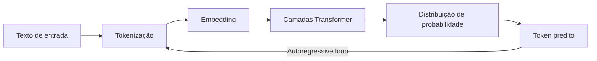

# O que é um LLM

> [!abstract] TL;DR
> Um Large Language Model é uma rede neural treinada em bilhões de tokens de texto para prever a próxima palavra — e, por extensão, para raciocinar, gerar código, traduzir e conversar. Em 2026, LLMs são a infraestrutura central da engenharia de software assistida por IA, com modelos que variam de 7 bilhões a mais de 1 trilhão de parâmetros e custam desde zero (open-weight) até centenas de dólares por milhão de tokens.

## O que é

Um **Large Language Model** (LLM) é um modelo de machine learning baseado na arquitetura **Transformer** que aprende padrões estatísticos de linguagem a partir de quantidades massivas de texto. O treinamento consiste essencialmente em uma tarefa: dado um contexto de tokens anteriores, prever o próximo token. Essa tarefa simples, repetida trilhões de vezes sobre corpora enormes, produz modelos capazes de:

- **Gerar texto** coerente e contextualmente relevante
- **Raciocinar** sobre problemas lógicos e matemáticos
- **Escrever e depurar código** em dezenas de linguagens
- **Traduzir** entre idiomas naturais e formais
- **Seguir instruções** complexas e multi-step

O termo "large" refere-se à escala de parâmetros — os pesos numéricos que codificam o conhecimento do modelo. Modelos modernos variam de ~7B (bilhões) de parâmetros (executáveis em hardware de consumo) até >1T (trilhão), acessíveis apenas via API ou clusters de GPUs.

## Por que importa

Sem entender o que é um LLM, um engenheiro de software cai em três armadilhas:

1. **Antropomorfismo** — tratar o modelo como um colega que "entende" e "pensa", quando na verdade ele calcula distribuições de probabilidade sobre tokens
2. **Caixa preta** — usar a ferramenta sem entender por que ela falha, alucina ou custa caro
3. **Decisões cegas** — escolher modelo errado para a tarefa (pagar caro por flagship quando um modelo budget resolve, ou usar budget onde precisa de reasoning)

## Como funciona

### O ciclo fundamental

1. **Tokenização** — o texto é quebrado em unidades chamadas tokens (ver [[02 - Tokens e tokenização]])
2. **Embedding** — cada token é convertido em um vetor numérico de alta dimensão
3. **Processamento** — os vetores passam por dezenas de camadas Transformer com mecanismo de atenção (ver [[04 - Atenção e o mecanismo transformer]])
4. **Predição** — o modelo produz uma distribuição de probabilidade sobre todo o vocabulário para o próximo token
5. **Geração** — o token mais provável (ou um amostrado) é selecionado e o ciclo recomeça

### Fases de construção de um LLM

| Fase | O que acontece | Custo típico |
|------|---------------|--------------|
| **Pré-treino** | Modelo aprende linguagem a partir de trilhões de tokens da web, livros, código | $10M–$100M+ |
| **Post-training (SFT)** | Ajuste supervisionado com exemplos de instruções e respostas de alta qualidade | $100K–$1M |
| **RLHF/RLAIF** | Alinhamento com preferências humanas via reinforcement learning | $100K–$1M |
| **Quantização** | Compressão dos pesos para reduzir memória e custo de inferência | Baixo |

### Categorias de modelos (2026)

| Categoria | Exemplos | Parâmetros ativos | Uso típico |
|-----------|----------|-------------------|------------|
| **Frontier (flagship)** | GPT-5.4, Claude Opus 4.6, Gemini 3.1 Pro | 200B–1T+ | Raciocínio complexo, arquitetura |
| **Mid-tier** | Claude Sonnet 4.6, Gemini Flash | 50B–200B | Codificação diária, chat |
| **Budget** | GPT-4.1 Nano, Haiku 4.5, Flash-Lite | 7B–50B | Autocomplete, tarefas simples |
| **Open-weight** | Llama 4, DeepSeek V4, Qwen 3.6 | 7B–700B | Self-hosting, pesquisa, soberania |
| **Reasoning** | o4, Claude Thinking, Gemini Deep Think | Variável | Problemas matemáticos, lógica |

### Dense vs MoE — a bifurcação arquitetural

A diferença mais importante entre modelos em 2026:

- **Dense** — todos os parâmetros são ativados para cada token. Simples, estável, mas caro em escala. Exemplo: Llama 3 70B.
- **Mixture-of-Experts (MoE)** — apenas um subconjunto de "especialistas" é ativado por token, via um roteador. Permite ter 1T de parâmetros totais com custo de inferência de um modelo de 100B. Exemplo: DeepSeek V4, Mixtral. Ver [[07 - Dense vs Mixture-of-Experts]].

## Glossário

| Termo | Definição |
|-------|-----------|
| **Parâmetro** | Um peso numérico aprendido durante o treinamento |
| **Token** | Unidade mínima de texto que o modelo processa |
| **Inferência** | O processo de gerar respostas a partir de um modelo treinado |
| **Context window** | Quantidade máxima de tokens que o modelo pode "ver" de uma vez |
| **Embedding** | Representação vetorial de um token em espaço contínuo |
| **Autoregressive** | Geração sequencial: cada token depende dos anteriores |
| **Open-weight** | Modelo com pesos públicos (não necessariamente open-source na licença) |

## Armadilhas

- **"A IA entende"** — LLMs calculam correlações estatísticas. Não entendem no sentido humano. Produzem texto plausível, não verdadeiro. Alucinações são consequência direta disso.
- **"Maior é melhor"** — um modelo de 7B bem ajustado para código pode superar um flagship genérico em tarefas específicas. Tamanho importa, mas contexto e fine-tuning importam mais.
- **"Open-source = grátis"** — rodar um modelo de 70B localmente exige ~40GB de VRAM. O hardware tem custo significativo.
- **Ignorar a família do modelo** — cada família (GPT, Claude, Gemini, Llama) tem personalidade e pontos fortes diferentes. Testar em uma e assumir que serve para outra é receita para surpresa.

## Veja também
- [[02 - Tokens e tokenização]] — como o texto vira números
- [[04 - Atenção e o mecanismo transformer]] — o mecanismo central da arquitetura
- [[05 - Panorama de modelos 2026]] — quem é quem no mercado
- [[07 - Dense vs Mixture-of-Experts]] — a escolha arquitetural mais impactante

## Referências
- **Vaswani et al.** — *Attention Is All You Need* (2017). O paper que introduziu a arquitetura Transformer.
- **Brown et al.** — *Language Models are Few-Shot Learners* (GPT-3, 2020). Demonstrou que escala produz capacidades emergentes.
- **Raschka, Sebastian** — *Build a Large Language Model from Scratch* (2024). Guia prático de construção de LLMs.
- **Clarifai** — *LLM Architecture Explained* (2026). Overview das arquiteturas modernas.
