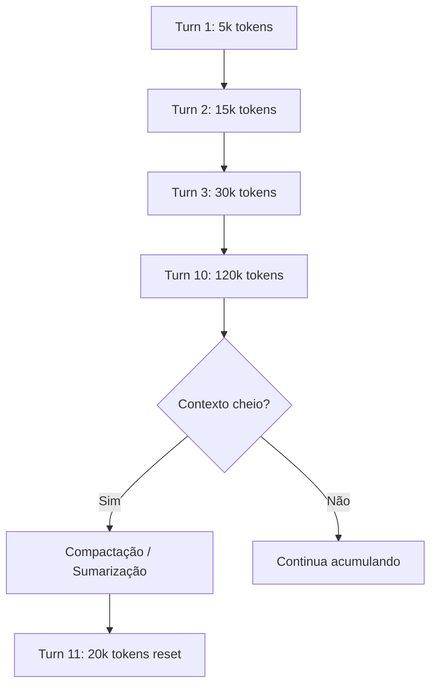

# A janela de contexto

> [!abstract] TL;DR
> A janela de contexto é o limite máximo de tokens que um LLM pode processar de uma vez — incluindo input (prompt, histórico, system instructions) E output (resposta gerada). Em 2026, janelas de 1M+ tokens são comuns nos modelos frontier, mas ter 1M de contexto não significa que o modelo é bom em usá-lo todo. Atenção degrada com distância, custo cresce linearmente, e contexto grande sem curadoria desperdiça dinheiro e qualidade.

## O que é

A **janela de contexto** (context window) é a quantidade máxima de tokens que um LLM consegue "ver" simultaneamente durante uma interação. Ela engloba **tudo**:

- System prompt e instruções
- Histórico de mensagens
- Documentos e código inseridos como contexto
- Tool definitions e respostas de ferramentas
- A resposta que o modelo está gerando

Quando o total excede o limite, dados antigos são **silenciosamente descartados** (truncamento) ou a API retorna um erro.

## Por que importa

1. **Custo direto** — cada token no contexto é cobrado como input token. Contexto de 100k tokens × $3/MTok = $0.30 por chamada
2. **Qualidade** — modelos perdem acurácia ao longo de janelas muito grandes. O fenômeno "lost in the middle" — informação no meio do contexto é a mais esquecida
3. **Velocidade** — TTFT (time-to-first-token) cresce com o tamanho do contexto porque a fase de prefill processa todos os input tokens
4. **Design de sistemas** — saber o tamanho do contexto determina se você precisa de RAG, memória persistente, ou sumarização

## Como funciona

### Input tokens vs output tokens

```mermaid
graph LR
    subgraph "Context Window (ex: 200k)"
        A["System prompt<br>~2k tokens"] --> B["Histórico<br>~50k tokens"]
        B --> C["Código/docs<br>~30k tokens"]
        C --> D["Resposta do modelo<br>~5k tokens"]
    end
    style A fill:#2d4a2d
    style D fill:#4a2d2d
```

| Tipo                 | Descrição                                               | Custo                                       |
| -------------------- | ------------------------------------------------------- | ------------------------------------------- |
| **Input tokens**     | Tudo que você envia: prompt, histórico, contexto, tools | Mais barato (ex: $3/MTok no Claude Sonnet)  |
| **Output tokens**    | Tudo que o modelo gera: resposta, tool calls, reasoning | Mais caro (ex: $15/MTok no Claude Sonnet)   |
| **Reasoning tokens** | Tokens internos de "pensamento" em modelos de reasoning | Cobrados como output, invisíveis ao usuário |

### Janelas de contexto em 2026

| Modelo            | Context window   | Output máximo | Nota                                    |
| ----------------- | ---------------- | ------------- | --------------------------------------- |
| GPT-5.4           | ~1.1M tokens     | ~64k tokens   | —                                       |
| Claude Opus 4.6   | 1M tokens        | 128k tokens   | Maior output do mercado                 |
| Claude Sonnet 4.6 | 200k tokens      | 64k tokens    | Custo-benefício para código             |
| Gemini 3.1 Pro    | 1M–2M tokens     | 64k tokens    | Suporte experimental a 2M               |
| DeepSeek V4       | 128k–163k tokens | 32k tokens    | Menor contexto, mas mais barato         |
| Qwen 3.6          | 1M tokens        | 64k tokens    | Foco em agentes                         |
| Llama 4 Scout     | 10M tokens       | —             | MoE com 16 experts, janela experimental |

### Context window ≠ memória real

> [!warning] Distinção crítica
> Ter 1M de contexto **não** é a mesma coisa que ter 1M de "memória de trabalho efetiva". Na prática:

- **"Lost in the middle"** — pesquisa de Stanford (2023, revalidada em 2025) mostrou que modelos performam melhor nas informações do **início** e do **fim** do contexto. O meio é a zona morta.
- **Atenção diluída** — quanto mais tokens no contexto, mais a atenção se distribui, reduzindo a "resolução" com que o modelo enxerga cada pedaço
- **Custo acumulado** — em agentes, o contexto cresce a cada turn. Uma sessão de 50 turns pode facilmente ultrapassar 200k tokens

### O ciclo do contexto em agentes

Ferramentas como Claude Code e Cursor implementam **compactação automática** — quando o contexto se aproxima do limite, resumem o histórico e reiniciam com um contexto menor mas denso.

## Quando usar / quando não usar

| Cenário                            | Abordagem                       | Contexto necessário      |
| ---------------------------------- | ------------------------------- | ------------------------ |
| Chat simples                       | Janela padrão                   | <10k tokens              |
| Edição multi-arquivo               | Context com arquivos relevantes | 50k–200k tokens          |
| Análise de codebase inteiro        | RAG + semantic search           | Não cabe — use retrieval |
| Agente autônomo (longa sessão)     | Compactação + state files       | Gerenciado ativamente    |
| Processamento de documentos longos | Modelo com 1M+ contexto         | 200k–1M tokens           |

## Armadilhas

- **"Mais contexto = melhor resposta"** — falso. Contexto irrelevante dilui a atenção do modelo e aumenta custo sem melhorar qualidade. Curadoria > quantidade.
- **Ignorar o custo acumulado** — uma sessão de agente que roda 100 turns pode custar $10+ só em input tokens se o contexto não for gerenciado.
- **Confiar no truncamento silencioso** — quando o contexto excede o limite, o que é cortado depende da implementação. Pode ser justamente a informação mais importante.
- **"O modelo lembra tudo"** — não lembra. Cada chamada de API é stateless. O "histórico" é reenviado a cada turn, consumindo tokens de input.
- **Não distinguir input de output tokens** — output é 3-5x mais caro. Um modelo verboso que gera respostas longas custa muito mais que um conciso.

## Veja também

- [[02 - Tokens e tokenização]] — a unidade que mede a janela
- [[12 - Streaming, batching e latência]] — como o tamanho do contexto afeta performance
- [[11 - Prompt caching e otimizações de API]] — como reduzir custo de contexto repetido

## Referências

- **Liu et al.** — *Lost in the Middle: How Language Models Use Long Contexts* (Stanford, 2023). O paper que documentou a degradação de atenção em contextos longos.
- **Anthropic** — *Claude Model Card* (2026). Especificações de context window e output limits.
- **OpenAI** — *API Reference — Models* (2026). Documentação de context windows por modelo.
- **Google DeepMind** — *Gemini Technical Report* (2026). Detalhes da arquitetura de contexto longo.
