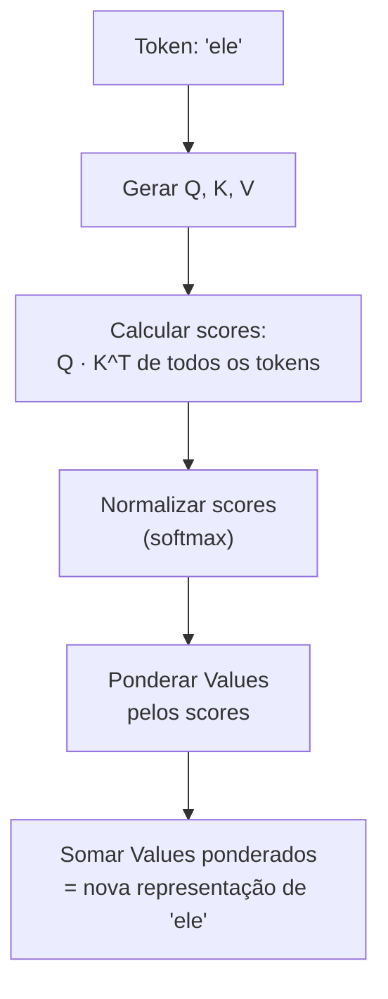

# Atenção e o mecanismo transformer

> [!abstract] TL;DR
> O mecanismo de atenção é o coração dos LLMs. Ele permite que cada token "olhe" para todos os outros tokens no contexto simultaneamente, calculando pesos de relevância via Query-Key-Value. Multi-head attention faz isso em paralelo com diferentes "lentes". É isso que torna LLMs capazes de entender contexto, resolver referências e processar sequências inteiras de uma vez — e também é o motivo pelo qual contexto longo é caro.

## O que é

O **Transformer** é a arquitetura de rede neural introduzida por Vaswani et al. em 2017 no paper *"Attention Is All You Need"*. Antes dele, modelos de linguagem usavam RNNs (Recurrent Neural Networks) que processavam texto sequencialmente — uma palavra por vez, da esquerda para a direita. Isso era lento e perdia informação em distâncias longas.

O Transformer substituiu a recorrência por **atenção** — um mecanismo que permite processar todos os tokens de uma sequência **em paralelo**, calculando a relação de cada token com todos os outros.

## Por que importa

A atenção explica diretamente:

- **Por que LLMs são bons em contexto** — cada token é enriquecido pelo contexto de todos os outros
- **Por que contexto longo custa caro** — a atenção escala quadraticamente: O(n²) com o tamanho da sequência
- **Por que GPUs são necessárias** — a paralelização massiva da atenção é perfeita para hardware paralelo
- **Por que "lost in the middle" acontece** — os pesos de atenção podem se diluir em contextos muito longos

## Como funciona

### A intuição: "quem é relevante pra mim?"

Considere a frase: *"O animal não atravessou a rua porque **ele** estava cansado."*

Quando o modelo processa "ele", o mecanismo de atenção calcula:

- Alta atenção para "animal" (é a referência provável)
- Baixa atenção para "rua" (irrelevante para "ele")
- Atenção moderada para "cansado" (descreve "ele")

O resultado: a representação de "ele" é enriquecida com informação de "animal".

### Os três vetores: Query, Key, Value

Para cada token, o modelo cria três vetores através de multiplicação por matrizes de pesos aprendidas:

| Vetor         | Papel                      | Analogia                 |
| ------------- | -------------------------- | ------------------------ |
| **Query (Q)** | "O que estou procurando?"  | A pergunta de busca      |
| **Key (K)**   | "O que eu ofereço?"        | O índice de um documento |
| **Value (V)** | "Qual é minha informação?" | O conteúdo do documento  |

### O cálculo passo a passo



1. **Score** = Q(ele) · K(cada_token)ᵀ — produto escalar que mede similaridade
2. **Normalização** = softmax(scores / √d_k) — transforma em probabilidades que somam 1
3. **Output** = Σ (score_i × V_i) — média ponderada dos Values

A divisão por √d_k (dimensão das keys) evita que os scores fiquem muito grandes, o que tornaria o softmax muito "pontudo" (concentrado em um único token).

### Fórmula canônica

$$\text{Attention}(Q, K, V) = \text{softmax}\left(\frac{QK^T}{\sqrt{d_k}}\right)V$$

### Multi-Head Attention

Em vez de calcular atenção uma vez, o modelo faz isso **N vezes em paralelo** (geralmente 32-128 "heads"). Cada head aprende a detectar um tipo diferente de relação:

| Head   | Pode aprender a detectar               |
| ------ | -------------------------------------- |
| Head 1 | Referências pronominais (ele → animal) |
| Head 2 | Relações sintáticas (sujeito → verbo)  |
| Head 3 | Padrões de código (variável → tipo)    |
| Head N | Outros padrões emergentes              |

Os outputs de todos os heads são concatenados e projetados para produzir a representação final.

### A complexidade quadrática

O cálculo Q·Kᵀ compara cada token com todos os outros:

| Tokens no contexto | Comparações       | Custo relativo |
| ------------------ | ----------------- | -------------- |
| 1.000              | 1.000.000         | 1x             |
| 10.000             | 100.000.000       | 100x           |
| 100.000            | 10.000.000.000    | 10.000x        |
| 1.000.000          | 1.000.000.000.000 | 1.000.000x     |

É por isso que contextos de 1M tokens exigem hardware especializado e otimizações como **FlashAttention**, **paged attention**, e **KV cache**.

### Otimizações modernas (2026)

| Otimização                        | O que faz                                                           | Ganho                                    |
| --------------------------------- | ------------------------------------------------------------------- | ---------------------------------------- |
| **FlashAttention 3**              | Reorganiza computação para minimizar I/O de memória                 | 2-4x mais rápido, sem perda de qualidade |
| **KV Cache**                      | Cacheia Key/Value de tokens já processados para evitar recomputação | Essencial para geração autoregressiva    |
| **Grouped Query Attention (GQA)** | Compartilha Keys/Values entre múltiplos heads                       | Reduz memória 2-8x                       |
| **Paged Attention**               | Gerencia KV cache como "páginas" de memória virtual                 | Permite batching eficiente (vLLM)        |
| **Sparse Attention**              | Cada token atende apenas a um subconjunto relevante                 | Reduz O(n²) para O(n·√n) ou O(n·log(n))  |

### A arquitetura completa do Transformer

```mermaid
graph TD
    A[Input Tokens] --> B[Token Embeddings + Positional Encoding]
    B --> C[Layer 1]
    subgraph "Transformer Layer (repete N vezes)"
        C --> D[Multi-Head Self-Attention]
        D --> E[Add & Normalize]
        E --> F[Feed-Forward Network]
        F --> G[Add & Normalize]
    end
    G --> H[..."Layer N"]
    H --> I[Linear + Softmax]
    I --> J[Probabilidade do próximo token]
```

Cada camada combina:

1. **Self-attention** — captura relações entre tokens
2. **Feed-forward network** — processa cada token independentemente (onde fica o "conhecimento" armazenado)
3. **Residual connections + layer norm** — estabilizam o treinamento em redes profundas

## Armadilhas

- **"O modelo lê da esquerda pra direita"** — na geração sim, mas durante o processamento do input, self-attention vê todos os tokens simultaneamente.
- **"Atenção = compreensão"** — atenção é correlação estatística. O modelo pode dar peso alto a um token por razões estatísticas, não semânticas.
- **Ignorar o custo quadrático** — duplicar o contexto quadruplica o custo de atenção. É por isso que context engineering importa tanto.
- **"Flash Attention muda a qualidade"** — não. FlashAttention é matematicamente equivalente à atenção padrão. Só reorganiza a computação para ser mais eficiente em hardware.
- **Confundir parâmetros com atenção** — os pesos das camadas feed-forward (não a atenção) é onde o "conhecimento factual" do modelo reside. Atenção é o mecanismo de busca/organização.

## Veja também

- [[01 - O que é um LLM]] — contexto geral da arquitetura
- [[03 - A janela de contexto]] — a consequência prática da atenção
- [[07 - Dense vs Mixture-of-Experts]] — como MoE modifica as camadas feed-forward

## Referências

- **Vaswani et al.** — *Attention Is All You Need* (NeurIPS, 2017). O paper fundador.
- **Dao, Tri** — *FlashAttention: Fast and Memory-Efficient Exact Attention with IO-Awareness* (2022). A otimização que viabilizou contextos longos.
- **Ainslie et al.** — *GQA: Training Generalized Multi-Query Transformer Models from Multi-Head Checkpoints* (Google, 2023). Grouped Query Attention.
- **3Blue1Brown** — *Attention in transformers, visually explained* (YouTube, 2024). Explicação visual excelente.
- **Karpathy, Andrej** — *Let's build GPT from scratch* (YouTube, 2023). Implementação completa com atenção.
