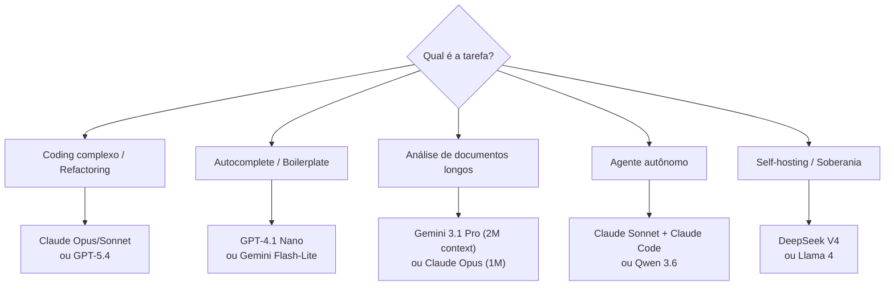

# Panorama de modelos 2026

> [!abstract] TL;DR
> Em maio de 2026, o mercado de LLMs é maduro e estratificado. Três provedores dominam o tier comercial (OpenAI, Anthropic, Google) e dois players chineses lideram o open-weight (DeepSeek, Alibaba/Qwen). Não existe "melhor modelo" — existe o modelo certo para a tarefa. A escolha se faz pelo cruzamento de três eixos: capacidade de raciocínio, custo por token e tipo de integração (API, IDE, self-hosting).

## O que é

O panorama de modelos é o mapa de quem compete com quem no mercado de LLMs. Em 2026, a diferenciação deixou de ser apenas "qual modelo é mais inteligente" e passou a incluir:

- **Eficiência** — custo por tarefa resolvida, não custo por token
- **Agentic capability** — capacidade de operar como agente autônomo (tool use, planejamento, multi-step)
- **Especialização** — modelos otimizados para código, raciocínio, multimodal, ou agentes

## Por que importa

Escolher o modelo errado pode significar:

- Pagar 25x mais (flagship vs budget) por resultado equivalente em tarefas simples
- Obter código lento ou incorreto porque o modelo não é forte em agentic coding
- Ficar preso a vendor lock-in quando alternativas open-weight resolveriam

## Como funciona

### Os grandes players (maio 2026)

#### OpenAI

| Modelo       | Tipo      | Context | Input $/MTok | Output $/MTok | Melhor para                       |
| ------------ | --------- | ------- | ------------ | ------------- | --------------------------------- |
| GPT-5.4      | Flagship  | 1.1M    | ~$2.50       | ~$15.00       | Raciocínio geral, knowledge depth |
| o4-mini      | Reasoning | 200k    | ~$1.10       | ~$4.40        | Lógica, matemática, planejamento  |
| GPT-4.1      | Mid-tier  | 1M      | ~$2.00       | ~$8.00        | Equilíbrio custo-qualidade        |
| GPT-4.1 Nano | Budget    | 1M      | ~$0.10       | ~$0.40        | Autocomplete, tarefas simples     |

**Forças:** Ecossistema maduro, integração enterprise, GPT Store, Batch API com 50% de desconto.
**Fraquezas:** Pricing premium, menos transparente sobre arquitetura.

#### Anthropic

| Modelo            | Tipo     | Context | Input $/MTok | Output $/MTok | Melhor para                          |
| ----------------- | -------- | ------- | ------------ | ------------- | ------------------------------------ |
| Claude Opus 4.6   | Flagship | 1M      | $5.00        | $25.00        | Coding complexo, raciocínio profundo |
| Claude Sonnet 4.6 | Mid-tier | 200k    | $3.00        | $15.00        | Codificação diária, agents           |
| Claude Haiku 4.5  | Budget   | 200k    | $1.00        | $5.00         | Rápido, tarefas simples              |

**Forças:** Melhor reasoning para código, Claude Code (terminal agent), prompt caching maduro, 128k output tokens no Opus.
**Fraquezas:** Mais caro token por token, menos modelos no lineup.

#### Google DeepMind

| Modelo                | Tipo     | Context | Input $/MTok | Output $/MTok | Melhor para                      |
| --------------------- | -------- | ------- | ------------ | ------------- | -------------------------------- |
| Gemini 3.1 Pro        | Flagship | 1M–2M   | ~$2.00       | ~$12.00       | Multimodal, contexto ultra-longo |
| Gemini 3 Flash        | Mid-tier | 1M      | ~$0.50       | ~$3.00        | Custo-benefício, velocidade      |
| Gemini 2.5 Flash-Lite | Budget   | 1M      | ~$0.10       | ~$0.40        | Classificação, extração          |

**Forças:** Contexto mais longo (2M experimental), multimodal nativo (áudio, vídeo, imagem), integração GCP, preço competitivo.
**Fraquezas:** Menos consistente em coding puro que Claude, ecossistema de tools menos maduro.

#### Open-Weight (ver detalhes em [[06 - Modelos chineses]])

| Modelo        | Origem              | Parâmetros           | Licença       | Melhor para                     |
| ------------- | ------------------- | -------------------- | ------------- | ------------------------------- |
| DeepSeek V4   | DeepSeek (China)    | MoE, ~600B total     | MIT           | Raciocínio, coding defensivo    |
| Qwen 3.6 Plus | Alibaba (China)     | MoE                  | Apache 2.0    | Agentes, contexto longo (1M)    |
| Llama 4       | Meta (EUA)          | Dense + MoE variants | Llama License | Base para fine-tuning           |
| Kimi K2.6     | Moonshot AI (China) | —                    | Proprietário* | Sub-agentes, multi-file editing |
| GLM-5.1       | Zhipu AI (China)    | —                    | MIT           | Engenharia agentic              |

*\*Kimi tem modelo via API; não é fully open-weight.*

### Mapa de decisão

## Comparativo

### Custo por tarefa (estimativa para coding task típica)

| Tarefa                         | Tokens estimados    | Claude Sonnet | GPT-4.1 | Gemini Flash |
| ------------------------------ | ------------------- | ------------- | ------- | ------------ |
| Fix de bug simples             | ~5k in + 2k out     | $0.045        | $0.026  | $0.009       |
| Refactoring de arquivo         | ~20k in + 10k out   | $0.21         | $0.12   | $0.04        |
| Feature multi-file (agent)     | ~100k in + 30k out  | $0.75         | $0.44   | $0.14        |
| Sessão de agent (1h, 50 turns) | ~500k in + 100k out | $4.00         | $2.80   | $0.55        |

### SWE-bench Verified (referência de coding, abril 2026)

| Modelo          | Score | Notas                           |
| --------------- | ----- | ------------------------------- |
| Claude Opus 4.6 | ~72%  | Líder em coding agentic         |
| GPT-5.4         | ~69%  | Forte em reasoning geral        |
| Gemini 3.1 Pro  | ~65%  | Melhora com contexto longo      |
| DeepSeek V4     | ~63%  | Impressionante para open-weight |
| Qwen 3.6 Plus   | ~61%  | Melhor em workflows agentic     |

> [!warning] Benchmarks são guia, não verdade
> SWE-bench mede performance do **scaffolding + modelo**. O mesmo modelo com scaffolding diferente pode ter scores muito diferentes. Teste no seu codebase.

## Armadilhas

- **"O benchmark mais alto = o melhor"** — benchmarks medem cenários controlados. Performance real depende do seu tipo de código, linguagem, e workflow.
- **Vendor lock-in** — construir toda a stack ao redor de um provider. Se o preço sobe ou o modelo degrada, a migração é dolorosa. Use abstrações.
- **Ignorar o mid-tier** — a maioria das tarefas de codificação não precisa de flagship. Claude Sonnet ou GPT-4.1 resolvem 90% dos casos a metade do custo.
- **"Open-weight é pior"** — DeepSeek V4 compete com flagships em coding e reasoning. Qwen 3.6 lidera em agentic. O gap fechou significativamente.

## Veja também

- [[06 - Modelos chineses — DeepSeek, Qwen, Kimi, GLM]] — deep dive nos players chineses
- [[07 - Dense vs Mixture-of-Experts]] — a arquitetura por trás das diferenças de custo
- [[10 - Pricing de APIs — como calcular custos]] — como traduzir preços por token em custo real

## Referências

- **Anthropic** — *Claude Model Card* (2026). Especificações e benchmarks.
- **OpenAI** — *GPT-5 System Card* (2026). Detalhes de capabilities e safety.
- **Google DeepMind** — *Gemini 3 Technical Report* (2026). Arquitetura e benchmarks.
- **Artificial Analysis** — *LLM Leaderboard* (2026). Comparativo independente de preço e performance.
