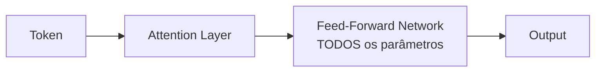
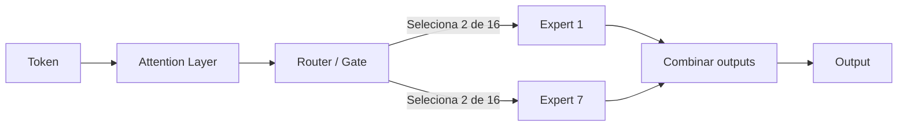

# Dense vs Mixture-of-Experts

> [!abstract] TL;DR
> Dense models ativam todos os parâmetros para cada token — simples mas caro. Mixture-of-Experts (MoE) ativa apenas um subconjunto de "especialistas" por token via um roteador, permitindo modelos com 1 trilhão de parâmetros totais que inferem com o custo de um modelo 10x menor. MoE é a arquitetura dominante em modelos frontier de 2026 (DeepSeek V4, GPT-5.x, Gemini 3.x, Llama 4). A escolha entre dense e MoE determina custo, latência e viabilidade de self-hosting.

## O que é

A diferença entre dense e MoE está em **quantos parâmetros são ativados durante a inferência**:

- **Dense:** 100% dos parâmetros participam do processamento de cada token
- **MoE (Sparse):** Apenas 10-25% dos parâmetros são ativados por token, selecionados dinamicamente por um "roteador"

É a bifurcação arquitetural mais consequente de 2026, porque determina diretamente o trade-off entre capacidade (total de parâmetros) e custo computacional (parâmetros ativos).

## Por que importa

| Decisão                     | Dense                                | MoE                                        |
| --------------------------- | ------------------------------------ | ------------------------------------------ |
| Custo de inferência         | Alto (proporcional ao tamanho total) | Baixo (proporcional aos parâmetros ativos) |
| Self-hosting                | Difícil acima de 70B                 | Viável mesmo com modelos de 600B+ total    |
| Estabilidade de treinamento | Alta                                 | Complexa (load balancing)                  |
| Fine-tuning                 | Simples                              | Mais desafiador                            |

## Como funciona

### Arquitetura Dense

Em cada camada do Transformer, o token passa por:

1. **Self-attention** — todos os heads processam
2. **Feed-Forward Network (FFN)** — todos os neurônios do FFN processam

Se o modelo tem 70B de parâmetros, cada token usa ~70B de computação.

### Arquitetura MoE

A diferença está nas camadas FFN, que são substituídas por **múltiplos sub-networks (experts)**:

1. **Router** — uma pequena rede neural que examina o token e decide quais experts são mais relevantes
2. **Seleção** — tipicamente 2 de 8-16 experts são ativados (top-K routing)
3. **Processamento** — apenas os experts selecionados processam o token
4. **Combinação** — os outputs são combinados via weighted sum

Se o modelo tem 600B de parâmetros totais mas ativa apenas 50B por token, o custo de inferência é equivalente a um dense de ~50B.

### Números reais (2026)

| Modelo         | Tipo  | Parâmetros totais | Parâmetros ativos/token | Experts            |
| -------------- | ----- | ----------------- | ----------------------- | ------------------ |
| Llama 3 70B    | Dense | 70B               | 70B                     | —                  |
| DeepSeek V4    | MoE   | ~600B             | ~50B                    | 128 experts, top-8 |
| Mixtral 8x22B  | MoE   | 141B              | ~39B                    | 8 experts, top-2   |
| Llama 4 Scout  | MoE   | ~109B             | ~17B                    | 16 experts         |
| GPT-5.4        | MoE*  | ~1T+              | ~200B*                  | Não divulgado      |
| Gemini 3.1 Pro | MoE*  | ~1T+              | Não divulgado           | Não divulgado      |

*\*Arquitetura inferida; OpenAI e Google não publicam detalhes arquiteturais.*

### O problema do load balancing

O maior desafio técnico do MoE é garantir que os experts sejam usados de forma equilibrada:

- **Expert collapse** — se o router direciona tudo para poucos experts, os demais são desperdiçados e o modelo efetivamente encolhe
- **Auxiliary loss** — técnica de treinamento que penaliza distribuição desbalanceada de tokens entre experts
- **Expert parallelism** — distribuir experts em diferentes GPUs requer comunicação inter-GPU, que pode ser gargalo

### Implicações para self-hosting

| Aspecto                  | Dense 70B               | MoE 600B (ativo ~50B)                       |
| ------------------------ | ----------------------- | ------------------------------------------- |
| VRAM necessária          | ~40GB (quantizado)      | ~80-120GB (todos os experts na memória)     |
| Velocidade de inferência | Previsível              | Rápida por token (mas carrega mais memória) |
| Latência                 | Linear com parâmetros   | Menor que dense equivalente em qualidade    |
| Multi-GPU                | Necessário acima de 40B | Necessário (expert parallelism)             |

> [!warning] MoE precisa de MAIS memória, não menos
> Todos os parâmetros precisam estar na memória (VRAM), mesmo que só uma fração seja ativada por token. Um MoE de 600B total precisa de ~120GB de VRAM (quantizado INT4), versus ~40GB para um dense de 70B.

## Quando usar / quando não usar

| Cenário                          | Recomendação                                                  |
| -------------------------------- | ------------------------------------------------------------- |
| API cloud (não self-hosting)     | **MoE indiretamente** — os melhores modelos de API já são MoE |
| Self-hosting com GPU limitada    | **Dense** — modelos de 7B-14B cabem em uma GPU                |
| Self-hosting com cluster de GPUs | **MoE** — melhor qualidade/custo                              |
| Fine-tuning simples              | **Dense** — processo mais estável e documentado               |
| Fine-tuning avançado             | **MoE** — possível mas requer expertise extra                 |
| Máxima qualidade por token       | **MoE flagship** — DeepSeek V4, GPT-5.4                       |
| Máxima previsibilidade           | **Dense** — comportamento mais uniforme                       |

## Armadilhas

- **"MoE é melhor em tudo"** — MoE troca complexidade de treinamento e memória total por eficiência de inferência. Para modelos pequenos (<14B), dense é mais simples e eficiente.
- **Confundir parâmetros totais com ativos** — "esse modelo tem 600B de parâmetros" não significa que ele é 8x melhor que um de 70B. Compare parâmetros ativos.
- **"Self-hosting MoE é fácil porque ativa poucos parâmetros"** — falso. Todos os parâmetros precisam estar na memória. A economia é em compute, não em VRAM.
- **Ignorar a qualidade do router** — um router mal treinado pode direcionar tokens para experts subótimos, degradando a qualidade abaixo de um dense menor.

## Veja também

- [[01 - O que é um LLM]] — contexto geral da arquitetura
- [[06 - Modelos chineses — DeepSeek, Qwen, Kimi, GLM]] — modelos que lideram em MoE
- [[08 - Modelos locais e self-hosting]] — como rodar esses modelos

## Referências

- **Shazeer et al.** — *Outrageously Large Neural Networks: The Sparsely-Gated Mixture-of-Experts Layer* (Google, 2017). Paper fundador de MoE para NLP.
- **DeepSeek AI** — *DeepSeek-V3 Technical Report* (2025). Inovações em MoE routing e auxiliary loss.
- **Raschka, Sebastian** — *Understanding and Using Mixture of Experts* (2024). Explicação acessível.
- **Weights & Biases** — *MoE Architecture Deep Dive* (2025). Comparativo técnico com benchmarks.
