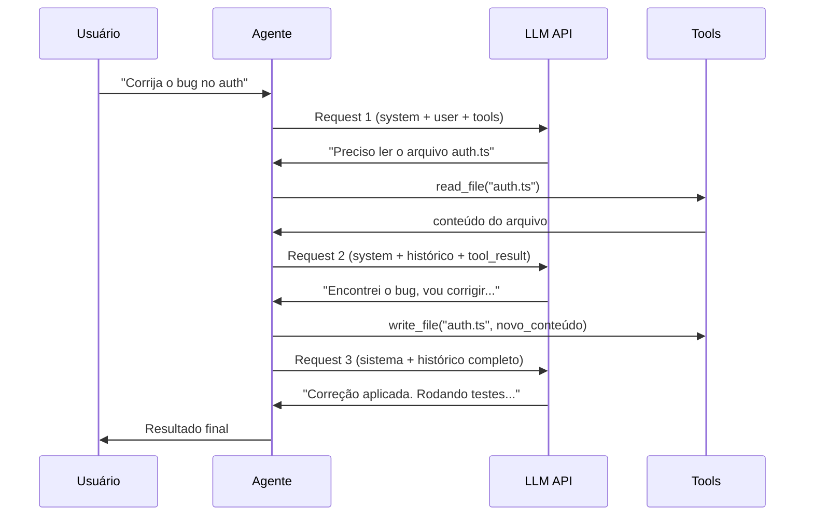

# APIs de LLM — anatomia de uma chamada

> [!abstract] TL;DR
> Uma chamada de API de LLM é um POST HTTP com um array de mensagens (system, user, assistant), parâmetros de controle (temperature, max_tokens) e opcionalmente definições de tools. A resposta vem com o texto gerado e metadados de uso (tokens consumidos). Entender essa anatomia é fundamental para debugar problemas, otimizar custos e construir agentes — porque cada "conversa" com um LLM é na verdade uma série de chamadas HTTP stateless.

## O que é

A API de um LLM é a interface HTTP que permite enviar prompts e receber respostas programaticamente. O formato **Chat Completions** (padronizado pela OpenAI e adotado por quase todos os providers) é o padrão da indústria em 2026.

Cada chamada é **stateless** — o modelo não "lembra" interações anteriores. O "histórico de conversa" é reenviado integralmente a cada request.

## Por que importa

- **Custo** — cada campo do request consome tokens. Campos desnecessários desperdiçam dinheiro.
- **Debugging** — 90% dos problemas com LLMs estão no request (contexto mal formado, roles errados, temperature inadequada)
- **Agentes** — ferramentas como Claude Code e Cursor constroem requests complexos por baixo dos panos. Entender a anatomia ajuda a configurá-los melhor.

## Como funciona

### Anatomia do Request

```json
{
  "model": "claude-sonnet-4.6",
  "max_tokens": 4096,
  "temperature": 0.3,
  "system": "Você é um engenheiro de software sênior...",
  "messages": [
    {
      "role": "user",
      "content": "Refatore este código para usar async/await"
    },
    {
      "role": "assistant",
      "content": "Vou analisar o código..."
    },
    {
      "role": "user",
      "content": "Agora adicione tratamento de erros"
    }
  ],
  "tools": [
    {
      "name": "read_file",
      "description": "Lê conteúdo de um arquivo",
      "input_schema": {
        "type": "object",
        "properties": {
          "path": {"type": "string"}
        }
      }
    }
  ]
}
```

### Campos do Request

| Campo         | Obrigatório | Descrição                                   | Impacto em tokens                               |
| ------------- | ----------- | ------------------------------------------- | ----------------------------------------------- |
| `model`       | Sim         | Qual modelo usar                            | Nenhum (metadata)                               |
| `messages`    | Sim         | Array de mensagens com roles                | **Principal consumidor** de input tokens        |
| `system`      | Não*        | Instruções de sistema                       | Input tokens (cacheable)                        |
| `max_tokens`  | Sim†        | Limite máximo de output                     | Limita output tokens (e custo)                  |
| `temperature` | Não         | Criatividade (0=determinístico, 1=criativo) | Nenhum                                          |
| `top_p`       | Não         | Nucleus sampling                            | Nenhum                                          |
| `tools`       | Não         | Definições de ferramentas                   | **Consumidor oculto** — schemas JSON são tokens |
| `tool_choice` | Não         | Forçar ou sugerir uso de tool               | Nenhum                                          |
| `stop`        | Não         | Sequências que param a geração              | Nenhum                                          |
| `stream`      | Não         | Habilitar streaming SSE                     | Nenhum                                          |

*\*Em Anthropic é campo separado; em OpenAI é uma mensagem com `role: "system"`. †Anthropic exige; OpenAI tem default.*

### Roles e sua função

| Role        | Quem fala                       | Consumo                     | Cacheable?             |
| ----------- | ------------------------------- | --------------------------- | ---------------------- |
| `system`    | O desenvolvedor (instruções)    | Input tokens                | ✅ Sim (prompt caching) |
| `user`      | O humano (perguntas, contexto)  | Input tokens                | ⚠️ Parcial              |
| `assistant` | O modelo (respostas anteriores) | Input tokens (no histórico) | ⚠️ Parcial              |
| `tool`      | Resultado de uma ferramenta     | Input tokens                | ❌ Geralmente não       |

### Anatomia do Response

```json
{
  "id": "msg_01XF...",
  "model": "claude-sonnet-4.6",
  "content": [
    {
      "type": "text",
      "text": "Aqui está o código refatorado..."
    }
  ],
  "usage": {
    "input_tokens": 2847,
    "output_tokens": 1253,
    "cache_read_input_tokens": 1500,
    "cache_creation_input_tokens": 0
  },
  "stop_reason": "end_turn"
}
```

### O campo `usage` — seu monitor de custos

| Métrica                       | Significado                                           |
| ----------------------------- | ----------------------------------------------------- |
| `input_tokens`                | Total de tokens de input (prompt + histórico + tools) |
| `output_tokens`               | Tokens gerados pelo modelo                            |
| `cache_read_input_tokens`     | Tokens lidos do cache (mais baratos)                  |
| `cache_creation_input_tokens` | Tokens escritos no cache (custo normal)               |

### Temperature e suas consequências

| Temperature | Comportamento                            | Quando usar                             |
| ----------- | ---------------------------------------- | --------------------------------------- |
| 0.0         | Determinístico, sempre a mesma resposta  | Código, refactoring, dados estruturados |
| 0.1–0.3     | Quase determinístico, pequenas variações | Coding geral, análise                   |
| 0.5–0.7     | Criativo mas controlado                  | Escrita de docs, brainstorming          |
| 0.8–1.0     | Altamente variável                       | Geração criativa, exploração            |

### O ciclo de um agente

O que uma ferramenta como Claude Code faz por baixo dos panos:



Cada seta para a API é uma chamada HTTP completa, com o histórico inteiro reenviado. É por isso que sessões longas de agentes ficam caras.

## Armadilhas

- **"A API lembra o que falei antes"** — não. Cada chamada é stateless. O histórico é reenviado integralmente.
- **Ignorar tool definitions nos tokens** — schemas JSON de ferramentas consomem 500-2000 tokens facilmente. 10 ferramentas com descriptions verbosas podem consumir 5k+ tokens de input em cada chamada.
- **max_tokens muito alto** — não custa nada configurar, mas se o modelo gerar até o limite, você paga. Defina o mínimo razoável para a tarefa.
- **Temperature 0 para tudo** — temperature 0 é boa para código, mas pode causar repetição em texto longo. Para documentação, use 0.2-0.4.
- **Não monitorar `usage`** — se você não loga os tokens consumidos por chamada, não tem como identificar onde está o desperdício.

## Veja também

- [[10 - Pricing de APIs — como calcular custos]] — traduzindo tokens em dinheiro
- [[11 - Prompt caching e otimizações de API]] — reduzindo custo de chamadas repetitivas
- [[12 - Streaming, batching e latência]] — performance da comunicação

## Referências

- **OpenAI** — *Chat Completions API Reference* (2026). Documentação canônica do formato.
- **Anthropic** — *Messages API Reference* (2026). Formato com variações (system separado, tool use).
- **Google** — *Gemini API Reference* (2026). Formato com integrações multimodais.
