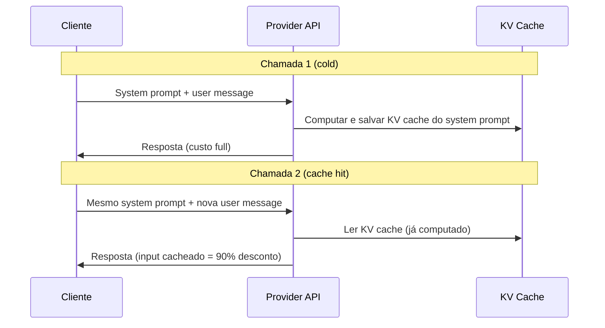
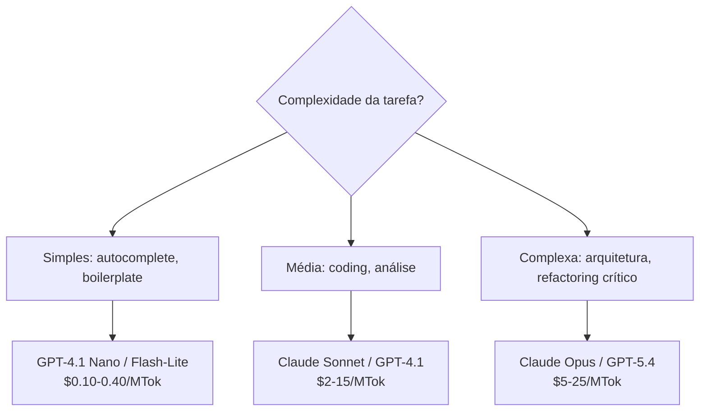

# Prompt caching e otimizações de API

> [!abstract] TL;DR
> Prompt caching permite reutilizar tokens de input que não mudam entre chamadas (system prompt, documentação, esquemas), reduzindo custo de input em até 90%. Em 2026, Anthropic, OpenAI e Google oferecem caching nativo. A combinação de caching + Batch API + model routing pode reduzir a conta mensal de LLM em 70-80%. Não usar essas otimizações é literalmente queimar dinheiro.

## O que é

**Prompt caching** é um mecanismo em que o provider armazena a representação computada (KV cache) de partes do prompt que se repetem entre chamadas. Na segunda chamada com o mesmo prefixo, o modelo pula a fase de "prefill" desses tokens, economizando compute e cobrando menos.

## Por que importa

Em workflows agentic, a mesma estrutura se repete em cada chamada:

- System prompt (~1-3k tokens)
- Documentação de projeto (~5-20k tokens)
- Definições de ferramentas (~2-5k tokens)

Sem caching, esses tokens são reprocessados a cada turn. Com caching, são lidos da memória com **desconto de 80-90% no preço**.

## Como funciona

### O mecanismo



### Implementação por provider

#### Anthropic (Claude)

```json
{
  "model": "claude-sonnet-4.6",
  "system": [
    {
      "type": "text",
      "text": "Você é um engenheiro de software sênior...",
      "cache_control": {"type": "ephemeral"}
    }
  ],
  "messages": [...]
}
```

- **Desconto de leitura:** ~90% (ex: $3.00 → $0.30 por MTok)
- **Custo de escrita:** ~25% a mais que preço normal (pago apenas na primeira vez)
- **TTL:** 5 minutos (renovado a cada uso)
- **Mínimo para cachear:** 1.024 tokens (Sonnet/Opus), 2.048 (Haiku)

#### OpenAI (GPT)

```json
{
  "model": "gpt-5.4",
  "messages": [
    {"role": "system", "content": "...instrução longa e estável..."}
  ]
}
```

- **Automático:** OpenAI cacheia prefixos comuns automaticamente (sem `cache_control` explícito)
- **Desconto de leitura:** ~50%
- **Sem custo de escrita:** Caching é transparente

#### Google (Gemini)

```python
# Via API, usar Context Caching
cached_content = genai.caching.create(
    model='gemini-3.1-pro',
    display_name='project-docs',
    contents=[large_document],
    ttl=datetime.timedelta(hours=1)
)
```

- **Mais flexível:** Permite cachear documentos inteiros com TTL configurável
- **Desconto de leitura:** ~75%
- **Custo de storage:** Cobrança por hora de cache armazenado

### Comparativo de caching

| Feature                 | Anthropic                   | OpenAI            | Google                    |
| ----------------------- | --------------------------- | ----------------- | ------------------------- |
| **Controle**            | Explícito (`cache_control`) | Automático        | Explícito (API separada)  |
| **Desconto de leitura** | ~90%                        | ~50%              | ~75%                      |
| **Custo de escrita**    | 25% a mais                  | Nenhum            | Custo de storage por hora |
| **TTL**                 | 5 min (renova)              | Automático        | Configurável (1h–24h)     |
| **Mínimo**              | 1.024 tokens                | Não documentado   | Não documentado           |
| **Melhor para**         | System prompts estáveis     | Tudo (automático) | Documentos grandes        |

### Outras otimizações de API

#### Batch API

Enviar tasks em lote para processamento assíncrono:

| Provider  | Desconto | SLA de entrega | Melhor para                                           |
| --------- | -------- | -------------- | ----------------------------------------------------- |
| Anthropic | ~50%     | Até 24h        | Geração de testes, documentação, refactoring em massa |
| OpenAI    | ~50%     | Até 24h        | Processamento de dados, migrações                     |

```json
// Anthropic Batch API
{
  "requests": [
    {"custom_id": "task-1", "params": {"model": "claude-sonnet-4.6", "messages": [...]}},
    {"custom_id": "task-2", "params": {"model": "claude-sonnet-4.6", "messages": [...]}},
    // ...até 10.000 requests
  ]
}
```

#### Model routing (cascading)

Usar o modelo certo para cada tarefa:



#### Compressão de tool definitions

Antes:

```json
{
  "name": "read_file",
  "description": "Reads the complete contents of a file from the local filesystem. This tool supports reading text files as well as some binary files such as images. The file path must be an absolute path to ensure correct resolution.",
  "input_schema": {
    "type": "object",
    "properties": {
      "path": {
        "type": "string",
        "description": "The absolute path to the file that should be read from the local filesystem."
      }
    },
    "required": ["path"]
  }
}
```

Depois (economiza ~60% dos tokens de tool definitions):

```json
{
  "name": "read_file",
  "description": "Read file contents. Absolute path.",
  "input_schema": {
    "type": "object",
    "properties": {
      "path": {"type": "string"}
    },
    "required": ["path"]
  }
}
```

### Impacto combinado

| Otimização                     | Redução de custo           | Esforço |
| ------------------------------ | -------------------------- | ------- |
| Prompt caching (system + docs) | 30-50% do total            | Baixo   |
| Batch API para tarefas offline | 50% nessas tarefas         | Baixo   |
| Model routing                  | 40-60% nas tarefas simples | Médio   |
| Compressão de tools            | 5-10% do input             | Baixo   |
| Compactação de histórico       | 20-40% em sessões longas   | Médio   |
| **Combinação de todas**        | **60-80% do total**        | Médio   |

## Armadilhas

- **"Caching resolve tudo"** — só funciona para partes estáticas do prompt. Se cada chamada tem contexto completamente diferente, cache hit rate é zero.
- **TTL de 5 minutos** — no Anthropic, o cache expira em 5 minutos sem uso. Em workflows com pausas longas (esperar CI, review), o cache frio é recomputado.
- **Custo de escrita do cache** — na Anthropic, a primeira chamada custa 25% a mais. Se o padrão de uso é chamada única sem reuso, caching é mais caro.
- **Comprimir demais as tools** — tool descriptions muito curtas podem confundir o modelo sobre quando e como usar a ferramenta. Encontre o equilíbrio.
- **Não medir o impacto** — implementar otimização sem comparar `cache_read_input_tokens` antes e depois é otimizar às cegas.

## Veja também

- [[10 - Pricing de APIs — como calcular custos]] — os preços que o caching reduz
- [[09 - APIs de LLM — anatomia de uma chamada]] — a estrutura do request que é cacheada
- [[12 - Streaming, batching e latência]] — otimizações de performance

## Referências

- **Anthropic** — *Prompt Caching Documentation* (2026). Guia oficial com exemplos.
- **OpenAI** — *Prompt Caching Guide* (2026). Documentação do caching automático.
- **Google** — *Context Caching in Gemini* (2026). API de caching explícito.
