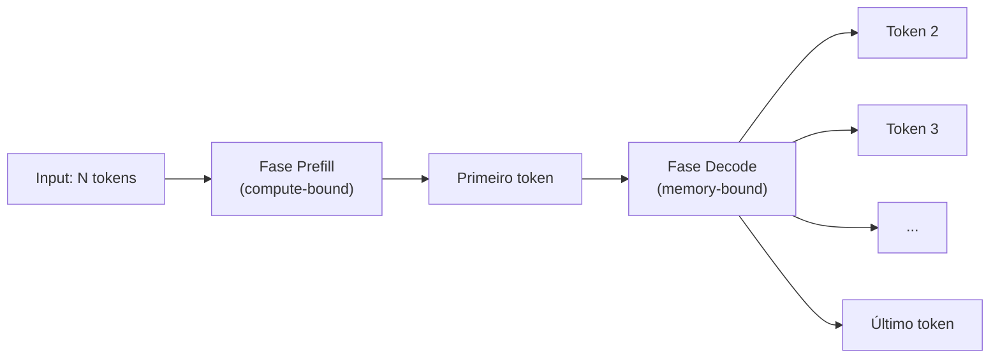
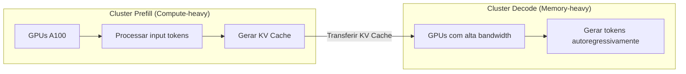

# Streaming, batching e latência

> [!abstract] TL;DR
> A experiência de velocidade de um LLM é definida por duas métricas: TTFT (tempo até o primeiro token aparecer) e TPOT (tempo entre tokens seguintes). TTFT depende do tamanho do input (fase prefill); TPOT depende do hardware de inferência (fase decode). Streaming via SSE é obrigatório para UX responsiva. Batching aumenta throughput mas pode degradar TTFT individual. Em 2026, a fronteira é "inferência desagregada" — prefill e decode em hardware separado.

## O que é

Latência em LLMs não é um número único. É um sistema de trade-offs entre três dimensões:

1. **Latência** — quão rápido um usuário individual recebe resposta
2. **Throughput** — quantas requisições o sistema processa por segundo
3. **Custo** — quanto compute/dinheiro por requisição

Otimizar uma frequentemente degrada outra. O trabalho do engenheiro é encontrar o equilíbrio certo para cada caso de uso.

## Por que importa

- **UX** — TTFT > 2s faz o usuário pensar que a ferramenta travou. TTFT < 500ms é percebido como "instantâneo".
- **Produtividade de agentes** — agentes fazem dezenas de chamadas sequenciais. Cada 500ms de latência extra acumula.
- **Custo vs velocidade** — modelos mais rápidos custam mais. Entender as métricas permite escolher o equilíbrio certo.

## Como funciona

### As duas fases da inferência



| Fase        | O que faz                                     | Bottleneck              | Métrica    |
| ----------- | --------------------------------------------- | ----------------------- | ---------- |
| **Prefill** | Processa todos os input tokens, cria KV cache | **Compute** (FLOPs)     | TTFT       |
| **Decode**  | Gera tokens autoregressivamente, um por vez   | **Memória** (bandwidth) | TPOT / ITL |

### Métricas de performance

| Métrica         | O que mede                      | Bom               | Aceitável | Ruim    |
| --------------- | ------------------------------- | ----------------- | --------- | ------- |
| **TTFT**        | Tempo até o primeiro token      | <500ms            | 500ms–2s  | >2s     |
| **TPOT / ITL**  | Tempo entre tokens consecutivos | <30ms             | 30–80ms   | >100ms  |
| **TPS**         | Tokens por segundo (output)     | >50 tps           | 20–50 tps | <20 tps |
| **E2E latency** | Tempo total da chamada          | Depende do output | —         | —       |

### Streaming via SSE

**Server-Sent Events (SSE)** é o protocolo padrão para streaming de LLMs. Em vez de esperar a resposta completa, o servidor envia tokens incrementalmente:

```
# Request com streaming
POST /v1/chat/completions
{"model": "claude-sonnet-4.6", "stream": true, "messages": [...]}

# Response (SSE)
data: {"type":"content_block_delta","delta":{"text":"Aqui"}}
data: {"type":"content_block_delta","delta":{"text":" está"}}
data: {"type":"content_block_delta","delta":{"text":" o"}}
data: {"type":"content_block_delta","delta":{"text":" código"}}
data: {"type":"message_stop"}
```

**Por que streaming é obrigatório:**

- **Percepção de velocidade** — o usuário vê progresso imediatamente, mesmo que o tempo total seja igual
- **Early termination** — se a resposta já está errada, o usuário pode cancelar sem esperar o output completo
- **Progress feedback** — em agentes, mostra o "pensamento" do modelo em tempo real

### Batching e seus trade-offs

| Tipo de batching        | Como funciona                                      | Impacto                                       |
| ----------------------- | -------------------------------------------------- | --------------------------------------------- |
| **Static batching**     | Agrupa N requests, processa juntas, retorna juntas | Throughput alto, latência individual alta     |
| **Continuous batching** | Insere/remove requests do batch a cada iteração    | Throughput alto, latência individual moderada |
| **Dynamic batching**    | Ajusta batch size baseado em load e SLOs           | Melhor equilíbrio                             |

**Continuous batching** é o estado da arte em 2026 (usado por vLLM, TGI, TensorRT-LLM):

- Quando um request no batch termina, seu slot é imediatamente preenchido por um novo request
- Isso mantém a GPU ocupada sem fazer novos requests esperarem pelo batch inteiro

### Otimizações de latência (2026)

| Otimização                  | O que faz                                                             | Ganho                                          |
| --------------------------- | --------------------------------------------------------------------- | ---------------------------------------------- |
| **Prefix caching**          | Reutiliza KV cache de prefixos comuns                                 | TTFT -50-85%                                   |
| **FlashAttention 3**        | Computação de atenção I/O-aware                                       | 2-4x mais rápido                               |
| **Speculative decoding**    | Modelo "draft" gera tokens rápido, modelo principal verifica em batch | Throughput 2-3x                                |
| **Quantização (INT8/INT4)** | Reduz tamanho dos pesos                                               | TPOT -30-50%, mais batches                     |
| **Inferência desagregada**  | Prefill e decode em GPUs separadas                                    | TTFT e throughput otimizados independentemente |

### Inferência desagregada: a fronteira

Em 2026, a técnica mais avançada é **separar prefill e decode em hardware diferente**:



Benefício: cada cluster é otimizado para seu bottleneck específico.

## Quando usar / quando não usar

| Cenário                    | Streaming? | Batching?                | Modelo rápido?      |
| -------------------------- | ---------- | ------------------------ | ------------------- |
| Chat interativo            | ✅ Sempre   | ❌ Latência individual    | ✅ Flash/Nano        |
| Agente de coding           | ✅ Sempre   | ❌ Sequencial             | ⚠️ Depende da tarefa |
| Geração de testes em massa | ❌ Opcional | ✅ Batch API              | ✅ Budget            |
| Pipeline de dados          | ❌ Não      | ✅ Batch API + concurrent | ✅ Budget            |

## Armadilhas

- **"Streaming é mais rápido"** — não. O tempo total é o mesmo. Streaming melhora a **percepção** de velocidade, não a velocidade real.
- **Otimizar só TTFT** — em agentes, TPOT importa mais porque a resposta precisa estar completa antes de prosseguir para o próximo step.
- **Ignorar P99 latency** — média de TTFT pode ser 300ms, mas P99 pode ser 5s. O tail latency é o que o usuário percebe como "travou".
- **"GPU mais cara = mais rápida"** — nem sempre. Para decode, bandwidth de memória importa mais que compute. Uma A100 pode perder para hardware com HBM3.
- **Não configurar timeouts** — sem timeout, uma chamada que trava pode bloquear um pipeline inteiro. Configure 30-60s para interativo, 5-10min para batch.

## Veja também

- [[09 - APIs de LLM — anatomia de uma chamada]] — a estrutura que é streamada
- [[11 - Prompt caching e otimizações de API]] — caching para reduzir TTFT
- [[03 - A janela de contexto]] — contexto grande = prefill mais lento

## Referências

- **Kwon et al.** — *Efficient Memory Management for Large Language Model Serving with PagedAttention* (vLLM, 2023). O paper que revolucionou batching.
- **BentoML** — *The LLM Inference Trilemma* (2025). Framework para pensar em latência vs throughput vs custo.
- **NVIDIA** — *TensorRT-LLM Best Practices* (2026). Guia de otimização de inferência.
- **Databricks** — *Continuous Batching Explained* (2025). Explicação acessível do conceito.
