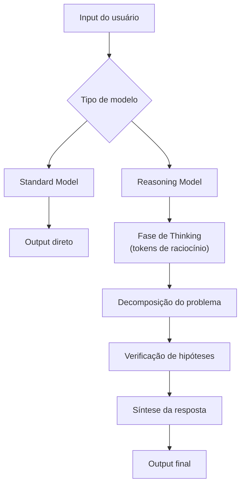

# Reasoning models e chain-of-thought

> [!abstract] TL;DR
> Reasoning models (OpenAI o-series, Claude Thinking, Gemini Deep Think) são LLMs treinados para "pensar antes de responder", gerando tokens internos de raciocínio antes do output visível. Isso melhora dramaticamente performance em matemática, lógica e problemas complexos — mas custa 2-10x mais porque os tokens de pensamento são cobrados como output. Em 2026, saber quando ativar reasoning e quando usar um modelo standard é uma competência essencial para controlar custos.

## O que é

**Reasoning models** são LLMs que, antes de gerar a resposta final, produzem uma cadeia de "pensamento" (chain-of-thought) composta por tokens internos que decompõem o problema em passos. Esses tokens podem ser:

- **Visíveis** — exibidos ao usuário (Claude Thinking com `thinking` habilitado)
- **Ocultos** — processados internamente mas não incluídos no response (OpenAI o-series)

O conceito evolui do **chain-of-thought prompting** (2022), que descobriu que pedir ao modelo "pense passo a passo" melhorava resultados. Reasoning models incorporam isso no treinamento via reinforcement learning.

## Por que importa

| Sem reasoning                         | Com reasoning                                          |
| ------------------------------------- | ------------------------------------------------------ |
| Responde rápido, pode errar em lógica | Pensa antes, muito mais preciso em problemas complexos |
| Custo previsível                      | Custo variável (depende da complexidade)               |
| Bom para tarefas diretas              | Essencial para problemas multi-step                    |

Para engenheiros de software, reasoning models são particularmente úteis em:

- Debugging de problemas complexos com múltiplas dependências
- Arquitetura de sistemas (trade-offs, decisões de design)
- Refactoring que exige entender o impacto em cascata
- Problemas algorítmicos e otimização

## Como funciona

### Arquitetura conceitual



### Implementação por provider

#### OpenAI — série o

| Modelo  | Thinking         | Custo relativo   | Uso                  |
| ------- | ---------------- | ---------------- | -------------------- |
| o4-mini | Oculto (interno) | 2-5x vs GPT-4.1  | Raciocínio acessível |
| o4      | Oculto (interno) | 5-10x vs GPT-4.1 | Máxima performance   |

```json
// Os tokens de thinking são cobrados mas não visíveis
{
  "usage": {
    "input_tokens": 1500,
    "output_tokens": 800,
    "reasoning_tokens": 12000  // ← cobrados como output!
  }
}
```

#### Anthropic — Claude Thinking

| Modo              | Thinking                   | Controle                 |
| ----------------- | -------------------------- | ------------------------ |
| Standard          | Desabilitado               | Normal                   |
| Extended thinking | Visível (bloco `thinking`) | `thinking.budget_tokens` |

```json
// Ativar extended thinking no Claude
{
  "model": "claude-opus-4.6",
  "thinking": {
    "type": "enabled",
    "budget_tokens": 10000  // Limite para tokens de pensamento
  }
}
```

O thinking budget permite controlar custos: limitar a 5k tokens para tarefas moderadas, expandir para 50k+ para problemas profundos.

#### Google — Gemini Thinking

Gemini 3.x oferece modo de "deep thinking" com funcionalidade similar, onde o modelo produz passos de raciocínio antes da resposta final.

### O custo real do reasoning

Exemplo: pedir para refatorar um módulo de autenticação.

| Modelo                             | Input      | Thinking   | Output visível | Custo total |
| ---------------------------------- | ---------- | ---------- | -------------- | ----------- |
| Claude Sonnet (standard)           | 20k tokens | 0          | 5k tokens      | $0.135      |
| Claude Opus (standard)             | 20k tokens | 0          | 5k tokens      | $0.225      |
| Claude Opus (thinking, 10k budget) | 20k tokens | 8k tokens  | 5k tokens      | $0.425      |
| Claude Opus (thinking, 50k budget) | 20k tokens | 40k tokens | 5k tokens      | $1.225      |

**O reasoning pode custar 5-10x mais** que uma chamada standard para a mesma tarefa.

### Chain-of-thought prompting vs reasoning models

| Aspecto           | CoT Prompting                         | Reasoning Models                            |
| ----------------- | ------------------------------------- | ------------------------------------------- |
| **Como funciona** | "Pense passo a passo" no prompt       | Treinamento dedicado (RL)                   |
| **Qualidade**     | Melhora modesta                       | Melhora dramática                           |
| **Custo**         | Gera mais output tokens visíveis      | Gera tokens de pensamento (visíveis ou não) |
| **Controle**      | Depende do modelo seguir a instrução  | Built-in, consistente                       |
| **Melhor para**   | Modelos standard em tarefas moderadas | Problemas realmente complexos               |

> [!warning] CoT prompting está obsolescendo
> Em 2026, para modelos avançados (Claude 4.x, GPT-5.x), prompts do tipo "pense passo a passo" podem até *degradar* performance. Esses modelos já raciocinam internamente. Forçar CoT adiciona verbosidade sem benefício. Use reasoning models nativos quando precisar de raciocínio profundo.

## Quando usar / quando não usar

| Tarefa                      | Standard               | Reasoning                |
| --------------------------- | ---------------------- | ------------------------ |
| Autocomplete de código      | ✅                      | ❌ Desperdício            |
| Fix de bug simples          | ✅                      | ❌ Overhead desnecessário |
| Refactoring complexo        | ⚠️ Pode errar           | ✅                        |
| Debugging de race condition | ❌ Frequentemente falha | ✅                        |
| Decisão de arquitetura      | ⚠️ Superficial          | ✅                        |
| Geração de testes unitários | ✅                      | ❌                        |
| Problema algorítmico        | ❌                      | ✅ Essencial              |
| Chat casual                 | ✅                      | ❌ Desperdício extremo    |

## Armadilhas

- **"Sempre usar reasoning"** — para tarefas simples, reasoning é desperdício. Autocomplete com o4 em vez de GPT-4.1 Nano é pagar 40x mais pelo mesmo resultado.
- **Não limitar o thinking budget** — sem limite, o modelo pode "pensar" por 100k+ tokens em problemas difíceis. Use `budget_tokens` para controlar.
- **"Reasoning tokens são baratos"** — não. São cobrados como output tokens (a tier mais cara). 50k tokens de pensamento no Claude Opus = $1.25 só em thinking.
- **Confundir CoT com reasoning nativo** — adicionar "pense passo a passo" em um modelo que já faz reasoning internamente gera overhead sem benefício.
- **Ignorar reasoning tokens no monitoramento** — se você monitora só `output_tokens`, os `reasoning_tokens` ocultos (OpenAI) ficam invisíveis na análise de custos.

## Veja também

- [[10 - Pricing de APIs — como calcular custos]] — impacto dos reasoning tokens na conta
- [[05 - Panorama de modelos 2026]] — quais modelos oferecem reasoning
- [[01 - O que é um LLM]] — contexto geral da arquitetura

## Referências

- **Wei et al.** — *Chain-of-Thought Prompting Elicits Reasoning in Large Language Models* (Google, 2022). Paper fundador de CoT.
- **OpenAI** — *Learning to Reason with LLMs* (2024). Blog post introduzindo o1.
- **Anthropic** — *Extended Thinking Documentation* (2026). Guia oficial do Claude Thinking.
- **Snell et al.** — *Scaling LLM Test-Time Compute* (2024). Fundamentação teórica de "mais compute na inferência".
