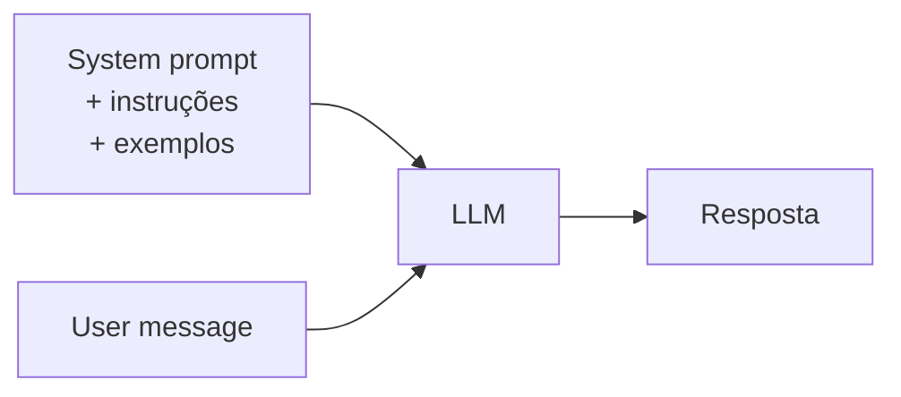
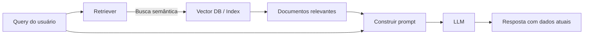
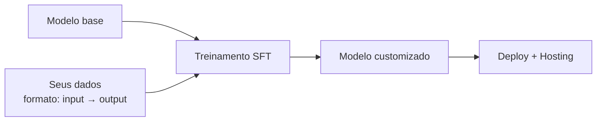
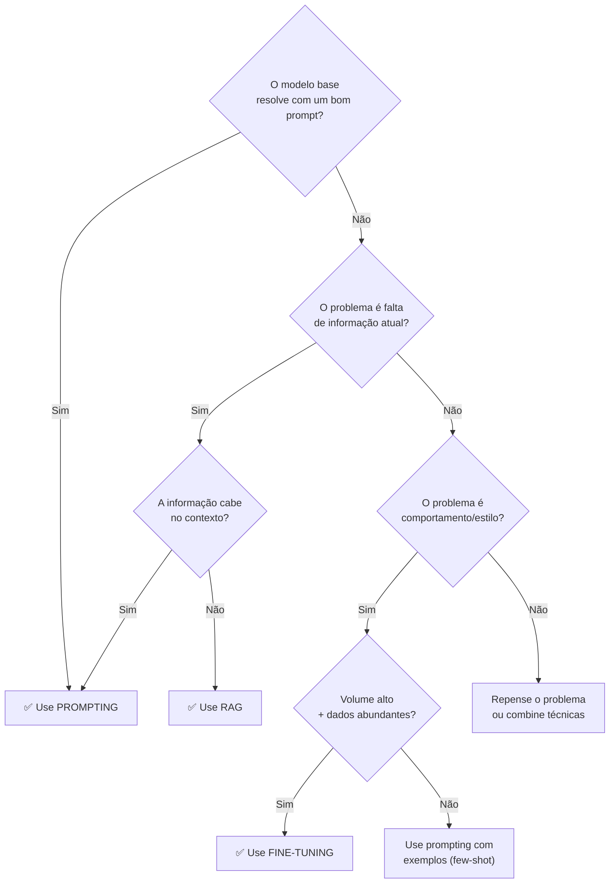

# Fine-tuning vs prompting vs RAG

> [!abstract] TL;DR
> Três técnicas para adaptar um LLM ao seu caso de uso: **prompting** (instruções no contexto — custo zero, efeito imediato), **RAG** (busca e injeta informação relevante no contexto — custo moderado, dados sempre atualizados), e **fine-tuning** (retreina o modelo nos seus dados — custo alto, muda o comportamento do modelo). Em 2026, a maioria dos engenheiros resolve 95% dos problemas com prompting + RAG. Fine-tuning é reservado para tarefas de alta especialização com volume massivo.

## O que é

Cada técnica opera em uma camada diferente:

| Técnica         | O que modifica                                | Persistência                          | Custo                       |
| --------------- | --------------------------------------------- | ------------------------------------- | --------------------------- |
| **Prompting**   | O input (contexto da chamada)                 | Nenhuma — reconstruído a cada chamada | Apenas tokens de input      |
| **RAG**         | O input (com dados recuperados dinamicamente) | Dados persistem no índice             | Infra de retrieval + tokens |
| **Fine-tuning** | Os pesos do modelo                            | Permanente (novo modelo)              | Treinamento + hosting       |

## Por que importa

Escolher a técnica errada é o erro mais caro em projetos de LLM:

- Fine-tuning quando prompting resolve → meses de trabalho desnecessário
- Prompting quando RAG é necessário → contexto explode e custos sobem
- RAG quando fine-tuning é necessário → qualidade nunca atinge o nível exigido

## Como funciona

### 1. Prompting (Context Engineering)

O modelo recebe todas as instruções e contexto no input de cada chamada.

| Vantagem                     | Limitação                                       |
| ---------------------------- | ----------------------------------------------- |
| Zero setup, efeito imediato  | Limitado pela janela de contexto                |
| Fácil de iterar e testar     | Não "ensina" o modelo — apenas direciona        |
| Sem custo de treinamento     | Informação precisa ser reenviada a cada chamada |
| Funciona com qualquer modelo | Muito contexto → custo alto, atenção diluída    |

**Quando usar:** A primeira opção para tudo. Só migre para RAG ou fine-tuning quando prompting comprovadamente não resolve.

### 2. RAG (Retrieval-Augmented Generation)

O sistema busca informação relevante em uma base de dados e injeta no contexto antes de enviar ao modelo.

| Vantagem                                | Limitação                                    |
| --------------------------------------- | -------------------------------------------- |
| Dados sempre atualizados (just-in-time) | Requer infraestrutura (vector DB, indexação) |
| Escala para milhões de documentos       | Qualidade depende do retriever               |
| Não precisa retreinar o modelo          | Aumenta input tokens (custo)                 |
| Citações e rastreabilidade              | Retrieval errado → alucinação com confiança  |

**Quando usar:**

- Base de conhecimento que muda frequentemente
- Codebase grande demais para caber no contexto
- Necessidade de citar fontes
- Múltiplas fontes de dados heterogêneas

### 3. Fine-tuning

Retreina os pesos do modelo em dados específicos do domínio.

| Vantagem                              | Limitação                                               |
| ------------------------------------- | ------------------------------------------------------- |
| Muda o "comportamento base" do modelo | Custo alto de treinamento ($100–$10k+)                  |
| Reduz necessidade de prompt longo     | Risco de "catastrófico forgetting"                      |
| Pode aprender padrões complexos       | Precisa de dados limpos e abundantes (1k-100k exemplos) |
| Latência reduzida (sem retrieval)     | Modelo fica "congelado" nos dados de treino             |

**Quando usar:**

- Tarefa muito específica com padrão consistente (ex: classificação médica)
- Volume massivo (>10k chamadas/dia com padrão similar)
- Estilo ou formato de output muito específico
- Reduzir latência eliminando context longo

### Árvore de decisão

## Comparativo

| Critério                           | Prompting                  | RAG                 | Fine-tuning            |
| ---------------------------------- | -------------------------- | ------------------- | ---------------------- |
| **Tempo de setup**                 | Minutos                    | Dias–semanas        | Semanas–meses          |
| **Custo inicial**                  | $0                         | $100–$1k (infra)    | $1k–$50k (treinamento) |
| **Custo por chamada**              | Tokens de input            | Tokens + retrieval  | Hosting do modelo      |
| **Dados atualizados**              | Manual (reescrever prompt) | ✅ Automático        | ❌ Retreinar            |
| **Escala de dados**                | <100k tokens               | Milhões de docs     | 1k–100k exemplos       |
| **Qualidade em tarefa específica** | Boa                        | Muito boa           | Excelente              |
| **Flexibilidade**                  | Alta (muda o prompt)       | Alta (muda o index) | Baixa (retreinar)      |
| **Complexidade ops**               | Zero                       | Média               | Alta                   |

## Na prática

### Cenário 1: chatbot de suporte técnico

- **Solução:** RAG sobre documentação + prompting para tom e formato
- **Motivo:** Docs mudam semanalmente, precisam estar atualizados

### Cenário 2: agente de coding no projeto

- **Solução:** Prompting (CLAUDE.md, agents.md, context files)
- **Motivo:** O codebase já é o contexto; RAG para buscar arquivos específicos

### Cenário 3: classificador de tickets (10k/dia)

- **Solução:** Fine-tuning de modelo budget
- **Motivo:** Padrão repetitivo, volume alto, latência baixa necessária

### Cenário 4: pesquisa sobre papers acadêmicos

- **Solução:** RAG com vector DB de papers + prompting
- **Motivo:** Base de conhecimento grande e especializada

## Armadilhas

- **"Fine-tuning é sempre melhor"** — é o mais caro e menos flexível. Use apenas quando prompting + RAG comprovadamente falham.
- **RAG sem avaliação do retriever** — se o retriever puxa documentos irrelevantes, o modelo alucina com confiança, citando fontes erradas.
- **"Prompting não escala"** — com context engineering disciplinado (caching, state files, context pruning), prompting escala para a maioria dos casos.
- **Fine-tuning com poucos dados** — menos de 1000 exemplos de alta qualidade geralmente não produz melhoria significativa. O modelo pode memorizar em vez de generalizar.
- **Combinar errado** — RAG + fine-tuning pode degradar se o modelo fine-tuned ignora o contexto retrieved em favor do "conhecimento" aprendido.

## Veja também

- [[03 - A janela de contexto]] — o limite que determina quando prompting não basta
- [[11 - Prompt caching e otimizações de API]] — otimizações para prompting de alta escala
- [[15 - O futuro dos LLMs — tendências 2026-2027]] — para onde essas técnicas estão evoluindo

## Referências

- **Lewis et al.** — *Retrieval-Augmented Generation for Knowledge-Intensive NLP Tasks* (Facebook AI, 2020). Paper fundador de RAG.
- **OpenAI** — *Fine-tuning Guide* (2026). Guia oficial com melhores práticas.
- **Anthropic** — *Prompt Engineering Guide* (2026). Referência para prompting avançado.
- **Pinecone** — *RAG Architecture Guide* (2026). Referência para implementação de RAG.
