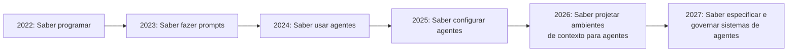

# O futuro dos LLMs — tendências 2026-2027

> [!abstract] TL;DR
> O campo está convergindo em cinco direções: (1) agentes verdadeiramente autônomos que executam tarefas de ponta a ponta, (2) contexto "infinito" via arquiteturas híbridas Transformer+SSM, (3) modelos multimodais nativos que operam igualmente em texto, imagem, áudio e vídeo, (4) commoditização via modelos open-weight chineses que forçam preços para baixo, e (5) a emergência de "context engineering" como disciplina central da engenharia de software. O engenheiro de 2027 provavelmente não escreve código — ele escreve especificações e governa agentes.

## O que é

As tendências que moldam o próximo ciclo de evolução dos LLMs, baseadas em papers publicados, roadmaps de empresas, e sinais do mercado. Não são previsões — são extrapolações de trajetórias em curso.

## Por que importa

Investir em aprender tecnologias que serão obsoletas em 18 meses é desperdício. Investir nas direções certas é multiplicador de carreira. Estas tendências informam:

- Quais skills aprender agora
- Quais ferramentas provavelmente terão longevidade
- Como arquitetar sistemas que não fiquem obsoletos rápido

## Como funciona

### Tendência 1 — Agentes autônomos como padrão

O ciclo **sugestão → assistência → autonomia** está se completando:

| Era                | Período       | Interação                                                             |
| ------------------ | ------------- | --------------------------------------------------------------------- |
| Autocomplete       | 2021-2023     | Modelo sugere, humano aceita/rejeita                                  |
| Assistente         | 2023-2025     | Modelo executa tarefas sob supervisão direta                          |
| **Agente**         | **2025-2027** | **Modelo planeja e executa tarefas multi-step com supervisão mínima** |
| Co-piloto autônomo | 2027+         | Modelo recebe spec, entrega feature testada                           |

**Sinais concretos (2026):**

- Devin opera em sandbox isolada sem intervenção humana
- Claude Code e Cursor executam sessões de 50+ steps com tool use
- GitHub Copilot Agents resolvem issues diretamente
- O conceito de "comprehension gate" — se o humano não entende a mudança, não faz merge

### Tendência 2 — Contexto infinito

A corrida por contexto cada vez maior continua, mas com mudança de abordagem:

| Abordagem                   | Contexto   | Trade-off                         |
| --------------------------- | ---------- | --------------------------------- |
| Brute-force (mais tokens)   | 1M–2M      | Caro, atenção degradada           |
| **Híbrido Transformer+SSM** | 10M+       | Melhor retenção, menor custo      |
| **Memória persistente**     | "Infinito" | Requer infra de memory management |

State Space Models (SSMs) como Mamba estão sendo integrados em arquiteturas Transformer para processar contextos ultra-longos com complexidade linear O(n) em vez de quadrática O(n²).

**Implicação:** A distinção entre "janela de contexto" e "memória" vai se borrar. LLMs de 2027 provavelmente terão memória nativa persistente.

### Tendência 3 — Multimodal nativo

Modelos que processam texto, imagem, áudio e vídeo com a mesma facilidade:

| Capacidade                | 2024                | 2026                  | 2027 (projetado) |
| ------------------------- | ------------------- | --------------------- | ---------------- |
| Texto → texto             | ✅ Excelente         | ✅ Excelente           | ✅ Excelente      |
| Imagem → texto            | ✅ Bom               | ✅ Excelente           | ✅ Excelente      |
| Texto → imagem            | ✅ Separado (DALL-E) | ⚠️ Integrado em alguns | ✅ Nativo         |
| Áudio → texto             | ⚠️ Whisper separado  | ✅ Nativo (Gemini)     | ✅ Universal      |
| Vídeo → texto             | ❌ Experimental      | ⚠️ Gemini, Qwen        | ✅ Standard       |
| Texto → código → execução | ❌                   | ⚠️ Agentes de coding   | ✅ End-to-end     |

**Implicação para engenheiros:** Debugging visual (screenshot → diagnóstico → fix), geração de UI a partir de wireframes, e análise de logs de vídeo se tornam workflows padrão.

### Tendência 4 — Commoditização via open-weight

A trajetória de preço está em queda livre:

| Ano  | Custo de modelo frontier (input/MTok) | Melhor open-weight    |
| ---- | ------------------------------------- | --------------------- |
| 2023 | $30.00 (GPT-4)                        | Llama 2 70B           |
| 2024 | $10.00 (Claude 3 Opus)                | Llama 3 70B           |
| 2025 | $5.00                                 | DeepSeek V3           |
| 2026 | $2.00–5.00                            | DeepSeek V4, Qwen 3.6 |
| 2027 | $0.50–2.00 (projetado)                | ?                     |

**Drivers da commoditização:**

- DeepSeek publica técnicas de treinamento eficiente que toda a indústria adota
- Alibaba/Qwen distribui modelos de 1M de contexto sob Apache 2.0
- Meta continua investindo em Llama como "infraestrutura aberta"
- Provedores de hosting (Together, Fireworks, Groq) competem por menor preço

### Tendência 5 — Context engineering como disciplina

A habilidade mais valiosa está se deslocando:

**O que isso significa na prática:**

- `agents.md`, `.cursorrules`, `CLAUDE.md` se tornam artefatos de engenharia tão importantes quanto código
- Spec-Driven Development substitui vibe coding em ambientes profissionais
- O engenheiro se torna "arquiteto de informação para agentes"

## Debates e controvérsias

| Debate                             | Lado A                                         | Lado B                                                |
| ---------------------------------- | ---------------------------------------------- | ----------------------------------------------------- |
| **"IA substitui devs"**            | Sim, para tarefas repetitivas de implementação | Não, aumenta demanda por arquitetos e revisores       |
| **"Scaling laws acabaram"**        | Sim, retornos decrescentes em pré-treino bruto | Não, test-time compute (reasoning) é a nova fronteira |
| **"Open-weight alcançou closed"**  | Sim, em coding e reasoning específico          | Não, em capability geral e safety                     |
| **"Context infinito elimina RAG"** | Sim, para bases pequenas-médias                | Não, para bilhões de documentos e custo               |

## Armadilhas

- **"O modelo de 2027 resolve tudo"** — modelos melhores não eliminam a necessidade de engenharia. Apenas deslocam o trabalho de "escrever código" para "especificar e validar".
- **Apostar tudo em um provider** — o mercado está volátil. Abstração de providers é essencial.
- **Ignorar skills fundamentais** — se você não entende arquitetura de software, um agente melhor não resolve. "Garbage in, garbage out" vale para specs também.
- **"Open-weight = commodity sem diferenciação"** — o modelo é commodity, mas o sistema (contexto, tools, guardrails) ao redor dele é o diferencial competitivo.

## Veja também

- [[05 - Panorama de modelos 2026]] — o estado atual que dá base para essas projeções
- [[01 - O que é um LLM]] — fundamentos da arquitetura que está evoluindo
- [[06 - Modelos chineses — DeepSeek, Qwen, Kimi, GLM]] — os drivers da commoditização

## Referências

- **Anthropic** — *Core Views on AI Safety* (2026). Visão de longo prazo sobre evolução de capabilities.
- **DeepMind** — *Gemini Technical Report* (2026). Roadmap implícito de multimodal.
- **Gu, Dao** — *Mamba: Linear-Time Sequence Modeling with Selective State Spaces* (2023). Arquitetura SSM.
- **Sutskever, Ilya** — *Talks on Scaling Laws* (2024-2025). Perspectivas sobre limites do scaling.
