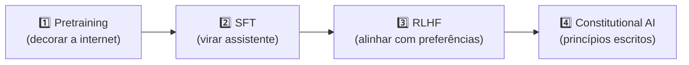
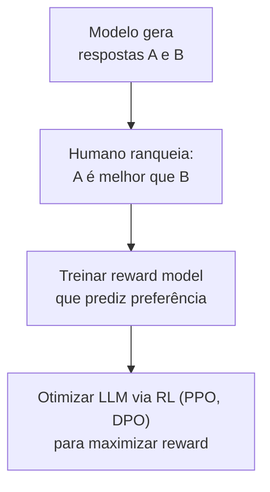

# Como LLMs são treinados — pretraining, SFT, RLHF

> [!abstract] TL;DR
> O pipeline canônico tem **quatro estágios** que explicam quase todo o comportamento que você vê na API. **Pretraining** "decora a internet" (predict next token, custo de centenas de milhões em compute). **SFT** ensina formato de assistente. **RLHF** alinha com preferências humanas. **Constitutional AI** (Anthropic) reduz dependência de labelers via princípios escritos. Saber esse pipeline explica por que modelos são bajuladores, recusam tarefas inofensivas, e por que fine-tuning posterior muda menos do que você espera.

## O pipeline em uma imagem



Cada estágio adiciona uma camada de comportamento. **Não substitui** a anterior — modula.

## Estágio 1 — Pretraining

> *"Decorando a internet."*

| Aspecto | Detalhe |
|---|---|
| **Dados** | Trilhões de tokens (web, livros, código, papers) |
| **Objetivo** | Dado N tokens, prever o N+1 |
| **Resultado** | Modelo "sabe" quase tudo sobre linguagem, fatos comuns, código — mas **não sabe ajudar** |
| **Custo** | Dezenas a centenas de milhões de dólares em GPU-anos |
| **Duração** | Semanas a meses em milhares de GPUs |

**Como se comporta um modelo só com pretraining:**

```
User: "A capital da França é"
Model: "Paris. A capital da Alemanha é Berlim. A capital da Espanha é Madri..."
```

Ele continua o padrão. **Não responde** à sua pergunta como assistente — completa texto plausível.

> [!info] Por que isso importa para você
> Todos os "fatos" do modelo vêm daqui. Knowledge cutoff = data dos dados de pretraining. Bias dos dados → bias do modelo. **Não é "bug" — é o mecanismo central.**

## Estágio 2 — Supervised Fine-Tuning (SFT)

> *"Aprendendo a ser assistente."*

| Aspecto | Detalhe |
|---|---|
| **Dados** | Milhares a centenas de milhares de pares `(pergunta, resposta ideal)` escritos por humanos |
| **Objetivo** | Ajustar para responder em formato de assistente |
| **Resultado** | Modelo agora **responde** "A capital da França é Paris" quando perguntado |
| **Custo** | Pequena fração do pretraining |
| **Duração** | Dias |

**A mudança de comportamento é dramática.** O mesmo modelo que continuava listando capitais agora responde *uma* pergunta com *uma* resposta.

**Quem faz SFT:**

- Anthropic, OpenAI, Google, Meta — internamente
- Comunidade open source — datasets como Anthropic HH-RLHF, OpenAssistant
- Você pode fazer SFT em modelos open source (LoRA, QLoRA, full fine-tuning)

## Estágio 3 — RLHF (Reinforcement Learning from Human Feedback)

> *"Aprendendo o que humanos preferem."*



| Aspecto | Detalhe |
|---|---|
| **Processo** | Humanos comparam respostas; treina-se *reward model*; LLM é otimizado via RL para maximizar reward |
| **Algoritmos** | PPO (Proximal Policy Optimization), DPO (Direct Preference Optimization, mais novo) |
| **Resultado** | Modelo útil, honesto, inofensivo — mais alinhado com expectativas humanas |
| **Custo** | Caro em human labelers |

**Side effects negativos do RLHF:**

- **Bajulação** — modelo aprende que humanos gostam de elogios
- **Hedging excessivo** — "isso depende de muitos fatores", "sou apenas um modelo de linguagem"
- **Recusa precaucionária** — recusa tarefas inofensivas por excesso de safety
- **Mode collapse** — diversidade de output reduz; respostas se parecem demais
- **Sycophancy** — concorda com o usuário mesmo quando deveria discordar

> [!warning] Comportamentos "chatos" são RLHF, não pretraining
> Se o modelo está se desculpando demais, hedging, ou recusando tarefas razoáveis — isso é artefato de RLHF, não falha do modelo base. **System prompt claro pode reverter** boa parte desses comportamentos.

## Estágio 4 — Constitutional AI (Anthropic)

> *"Princípios escritos no lugar de mais labelers."*

Específico da Anthropic, mas a ideia se espalhou em variantes.

| Aspecto | Detalhe |
|---|---|
| **Processo** | Conjunto de princípios escritos guia o **próprio modelo** a auto-avaliar respostas |
| **Princípios** | Exemplos: *"Be helpful, harmless, honest"*, *"Avoid sycophancy"*, *"Cite uncertainty"* |
| **Resultado** | Claude tende a ser mais consistente em recusas, mais transparente sobre seu raciocínio, menos bajulador |
| **Vantagem** | Reduz dependência de labelers humanos para safety; escala melhor |

**Implicações:** Claude tem comportamentos sutilmente diferentes de GPT — não por ser "mais inteligente", mas por ter passado por Constitutional AI em vez de só RLHF tradicional.

## Variantes recentes (2025-2026)

### DPO (Direct Preference Optimization)

Substitui RLHF tradicional. Em vez de treinar reward model + RL, otimiza diretamente do dataset de preferências. **Mais simples, mais barato, comparável em qualidade.** Adoção crescente.

### RLAIF (RL from AI Feedback)

Usa outro LLM como labeler em vez de humano. Reduz custo. Cuidado: viés do labeler-LLM se propaga.

### Mixture of Experts pós-training

Para modelos MoE (DeepSeek, Mixtral), pós-training tem cuidados específicos com routing dos experts.

### Long-context fine-tuning

Modelos modernos (Claude 200K+, Gemini 1M+, GPT-5) precisam de SFT/RLHF em prompts longos para evitar [[03 - A janela de contexto|context rot]] muito severo.

## Implicações práticas para você

### 1. Fine-tuning posterior do usuário muda **pouco**

LoRA/QLoRA em cima de modelos comerciais ajusta margens. Não espere alteração radical de personalidade ou novas capacidades — pretraining domina.

### 2. Prompt engineering vence quase sempre

99% das diferenças que você quer ver no comportamento são reveladas por prompt + system message. Antes de pensar em fine-tune, exauste prompt engineering ([[Skills e Prompting]]).

### 3. Recusas são reverssíveis (parcialmente)

Se modelo recusa tarefa inofensiva, system prompt explicando contexto resolve em ~80% dos casos. Não é sempre "limitação do modelo" — é cautela do RLHF.

### 4. Knowledge cutoff é fixo

O modelo só sabe o que estava nos dados de pretraining + uma pequena janela de SFT. Para info recente: RAG ou tool use (web search). Não tem como o modelo "saber" o que não viu.

### 5. Modelos diferentes têm pós-training diferente

| Modelo | Pós-training característico |
|---|---|
| **Claude** | Constitutional AI + RLHF — mais conservador, mais transparente |
| **GPT** | RLHF clássico + DPO — mais "agradável" |
| **Gemini** | RLHF + Google internal alignment |
| **Llama** | SFT + DPO open — diretamente otimizável |
| **DeepSeek** | RL focado em raciocínio — mais "raw" |

Escolha de modelo é também escolha de **persona** moldada pelo pós-training.

## Quando faz sentido fine-tune?

| Situação | Vale fine-tune? |
|---|---|
| Mudar tom de voz / persona | ✅ LoRA basta |
| Domínio jurídico/médico com vocabulário específico | ✅ Sim, com cuidado |
| Adicionar conhecimento factual | ❌ Não — use RAG |
| "Tornar o modelo mais inteligente" | ❌ Impossível — pretraining é fixo |
| Prompt está longo e caro | ⚠️ Considere fine-tune para encurtar |
| Adicionar nova skill emergente | ❌ Improvável de funcionar |

Ver [[14 - Fine-tuning vs prompting vs RAG]] para árvore de decisão.

## Veja também

- [[01 - O que é um LLM]]
- [[14 - Fine-tuning vs prompting vs RAG]]
- [[17 - Evaluation de LLMs em produção]]
- [[Spec-Driven Development|02 - O que é Spec-Driven Development]]

## Referências

- **OpenAI** — *InstructGPT paper* (2022) — fundamento do RLHF.
- **Anthropic** — *Constitutional AI: Harmlessness from AI Feedback* (2022).
- **Rafailov et al.** — *Direct Preference Optimization* (2023).
- **Karpathy** — *State of GPT* (2023, ainda relevante).
- **HuggingFace** — *RLHF: Reinforcement Learning from Human Feedback* (blog).
