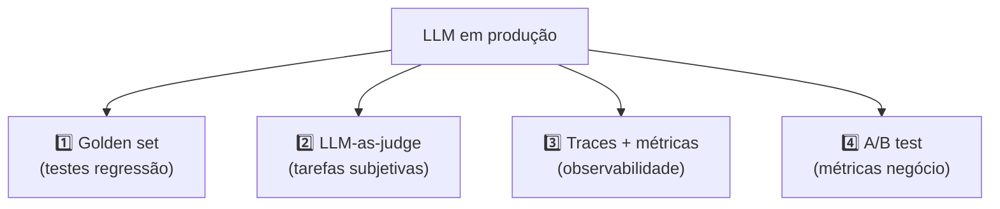

# Evaluation de LLMs em produção

> [!abstract] TL;DR
> LLM em produção sem evaluation é aposta. Não é tradeoff — é dívida. **Práticas mínimas:** golden set de 30-100 exemplos representativos rodado a cada mudança de prompt/modelo; **LLM-as-judge** para tarefas subjetivas (com cuidado de viés); **traces e observabilidade** instrumentando toda chamada (tokens, latência, custo, taxa de erro); **A/B test** em produção com métricas de negócio. Sem isso, "prompt engineering" vira superstição — mudou prompt, ninguém sabe se melhorou.

## Por que eval é diferente em LLMs

Software tradicional:

```
Input X → função pura → Output Y → assert Y == esperado ✅
```

LLM:

```
Input X → função estocástica → Output Y (semanticamente similar a esperado, talvez)
→ ?? como medir ??
```

Não dá pra fazer `assertEqual`. Eval de LLM precisa de **métricas semânticas**, não exatas.

## Os 4 pilares de eval



Cada pilar resolve uma pergunta diferente. **Maturidade real é ter os 4.**

## Pilar 1 — Golden set

**O que é:** 30-100 exemplos representativos com resposta esperada (ou critério). Rodados a cada mudança de prompt ou modelo.

**Conteúdo do golden set:**

```yaml
- id: classify_001
  input: "App crashou na inicialização após update"
  expected:
    category: "bug"
    severity: "high"

- id: classify_002
  input: "Pode adicionar dark mode?"
  expected:
    category: "feature"
    severity: "low"

- id: extract_003
  input: "Reunião amanhã às 14h com Maria"
  expected:
    type: "meeting"
    when: "tomorrow 14:00"
    with: "Maria"
```

**Como avaliar:**

| Tipo de tarefa | Métrica |
|---|---|
| **Classificação** | Equality (`actual.category == expected.category`) |
| **Extração estruturada** | Equality + schema valid |
| **Geração de texto** | Embedding similarity (cosine) > threshold |
| **Geração de código** | Test pass + linter pass |
| **Resumo / criatividade** | LLM-as-judge (Pilar 2) |

**Quanto eval custa:**

```
100 exemplos × $0.01/exemplo (Sonnet) = $1 por rodada de eval
× 50 rodadas/mês (ajustes de prompt) = $50/mês

ROI: detectar 1 bug em prod paga o ano inteiro de evals.
```

## Pilar 2 — LLM-as-judge

**Quando usar:** tarefas subjetivas onde equality não funciona (resumos, escrita criativa, conversação).

**Como funciona:** modelo (geralmente mais forte) avalia output de outro modelo.

```python
JUDGE_PROMPT = """
Você é avaliador rigoroso. Dados:
- Pergunta: {question}
- Resposta correta: {expected}
- Resposta do modelo: {actual}

Avalie de 0-10 quão correta a resposta do modelo é. Seja estrito.

Output em JSON:
{{
  "score": <0-10>,
  "reason": "<justificativa curta>",
  "issues": ["<problema 1>", "<problema 2>"]
}}
"""

def llm_as_judge(question, expected, actual):
    response = client.messages.create(
        model="claude-opus-4",  # judge mais forte que o modelo avaliado
        max_tokens=300,
        messages=[{
            "role": "user",
            "content": JUDGE_PROMPT.format(
                question=question,
                expected=expected,
                actual=actual
            )
        }]
    )
    return parse_json(response.content[0].text)
```

> [!warning] Cuidados com LLM-as-judge
> - **Viés do judge** — se judge é Claude, ele tende a preferir respostas estilo Claude. Use judge **diferente** do avaliado quando possível.
> - **Custo** — judge é geralmente modelo grande. Eval com 100 exemplos × Opus é caro.
> - **Position bias** — em comparação A vs B, judges às vezes preferem o primeiro. **Randomize ordem.**
> - **Calibração** — score 7/10 do judge nem sempre é "bom". Calibre com gabarito humano antes.

## Pilar 3 — Traces e observabilidade

**Instrumentar toda chamada:**

| Métrica | O que mede | Por que importa |
|---|---|---|
| **Input tokens** | Tokens consumidos | Custo + atenção dilui ([[03 - A janela de contexto]]) |
| **Output tokens** | Tokens gerados | Custo principal |
| **Total cost** | $ por chamada | Direto pro budget |
| **TTFT** | Time to First Token | UX em streaming |
| **Total latency** | TTFT + decode time | UX geral |
| **Error rate** | timeout, rate limit, schema invalid | Reliability |
| **User feedback** | thumbs up/down, ratings | Sinal de qualidade real |

**Ferramentas em 2026:**

| Ferramenta | Forte em |
|---|---|
| **Langfuse** | Open source, self-hostable, rico em features |
| **LangSmith** | Integração nativa LangChain |
| **Helicone** | Proxy + analytics, bom pra times sem instrumentação |
| **Arize Phoenix** | Sessions com timeline, debugging |
| **Braintrust** | Eval-first, comparação de versions |

**Pattern recomendado:**

```python
import langfuse

@langfuse.observe()
def classify_ticket(text: str):
    response = client.messages.create(
        model="claude-sonnet-4-6",
        max_tokens=200,
        messages=[{"role": "user", "content": text}]
    )
    # langfuse instrumenta automaticamente
    return response.content[0].text
```

Em 2-3 linhas de código você ganha trace completo + dashboard.

## Pilar 4 — A/B test em produção

**Por que:** golden set + traces medem o sistema. **A/B mede impacto no usuário.**

```python
# Pseudocode
def get_response(user_id, query):
    variant = ab_assign(user_id, "prompt_v2_test", split=0.5)

    if variant == "control":
        prompt = PROMPT_V1
    else:
        prompt = PROMPT_V2

    response = client.messages.create(
        system=prompt,
        messages=[{"role": "user", "content": query}]
    )

    log_event("ai_response", {
        "user_id": user_id,
        "variant": variant,
        "response": response.content[0].text,
    })

    return response.content[0].text
```

**Métricas para comparar:**

- Métricas de negócio: conversion, resolution time, NPS
- Métricas de uso: re-prompts, abandono
- Métricas de custo: tokens médios por interação

> [!tip] A/B test > golden set para impacto real
> Golden set diz "v2 é 5% mais preciso". A/B test diz "v2 reduz tickets de suporte em 18%". A segunda métrica vende para stakeholders.

## Maturidade — onde você está?

> [!example] Diagnóstico
>
> | Nível | Sinal |
> |---|---|
> | **Nível 0 — Zero eval** | "Olhei e tá bom" |
> | **Nível 1 — Golden set ad-hoc** | Lista de exemplos em planilha; rodada manual eventual |
> | **Nível 2 — Eval em CI** | Golden set roda automaticamente em PR de prompt |
> | **Nível 3 — Eval + observabilidade** | Traces de prod + LLM-as-judge para tarefas subjetivas |
> | **Nível 4 — A/B test em prod** | Variantes comparadas com métricas de negócio |
> | **Nível 5 — Eval continuous** | Golden set evolui com casos reais de prod, evaluation contínua |
>
> Maioria dos times está em Nível 0-1. Nível 2 é meta para 2026.

## Anti-patterns

- **Eval só "no final"** — após shippar, nunca mais
- **Golden set de 5 exemplos** — não é representativo
- **Equality em tarefas abertas** — sempre vai falhar; use embedding ou judge
- **Judge igual ao avaliado** — viés de auto-aprovação
- **Métricas de modelo, não de negócio** — "accuracy 92%" não é resolution rate
- **Mudar prompt sem rodar eval** — cego total

## Métricas-alvo em 2026

| Métrica | Alvo |
|---|---|
| **Eval coverage** (% prompts com golden set) | >80% |
| **Eval frequency** (toda mudança rodada?) | Sempre |
| **Trace coverage** | 100% das chamadas em prod |
| **Custo de eval / custo total** | <5% |
| **Time to detect prompt regression** | <1 dia |
| **A/B test em features novas** | Sempre |

## Veja também

- [[16 - Como LLMs são treinados — pretraining, SFT, RLHF]]
- [[Economia de Tokens|04 - Monitoramento — ccusage, Langfuse, dashboards]]
- [[Segurança e Guardrails|10 - Métricas de qualidade AI — defect escape rate, rework ratio]]
- [[Anatomia de Agents|08 - Evaluation de agents]]
- [[Spec-Driven Development|07 - Fase Validate — spec como contrato executável]]

## Referências

- **Chip Huyen** — *AI Engineering* (2025), capítulo sobre evaluation.
- **Langfuse** — *Evaluation patterns documentation* (2026).
- **OpenAI** — *Evals framework (github.com/openai/evals)* (2024+).
- **Eugene Yan** — *Patterns for Building LLM-based Systems* (2024).
- **Braintrust** — *AI evaluation best practices* (2026).
