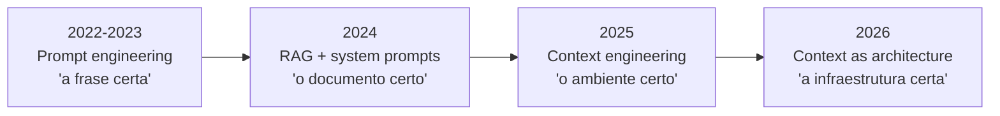

# De prompt engineering a context engineering

> [!abstract] TL;DR
> Prompt engineering é sobre **a frase certa**. Context engineering é sobre **o ambiente informacional inteiro** que cerca o agente: documentos retrieved, tool definitions, memória, histórico, system instructions, scratchpad. Karpathy resumiu em junho de 2025: "o LLM é a CPU, a janela de contexto é a RAM, e você é o sistema operacional responsável por carregar a informação certa para cada tarefa". Em 2026, Anthropic chamou context engineering de "load-bearing skill" — a habilidade que sustenta tudo o que vem depois.

## A evolução

| Era | Foco | Métrica de sucesso |
|---|---|---|
| **Prompt engineering** | Wording, few-shot examples, técnicas de raciocínio | Resposta correta numa caixa de chat |
| **RAG** | Recuperar documentos relevantes | Top-k de qualidade |
| **Context engineering** | Montar dinamicamente o ambiente do modelo | Agente robusto em sessões longas |
| **Context as architecture** | Tratar contexto como sistema versionado, governado | Reprodutibilidade, auditoria |

## A definição operacional

Context engineering é a **disciplina de decidir** o que entra na janela de contexto, o que é comprimido, o que é recuperado on-demand, e o que é descartado.

Cinco fontes de contexto que coexistem:

1. **System prompt / instructions** — quem o agente é, regras
2. **Memória persistente** — `CLAUDE.md`, `AGENTS.md`, fatos do usuário
3. **Histórico de conversa** — o que foi dito até agora
4. **Tool definitions** — schemas das ferramentas disponíveis
5. **Retrieval dinâmico** — documentos, código, dados buscados durante a tarefa

> [!quote] Karpathy (junho de 2025)
> *"+1 for 'context engineering' over 'prompt engineering'. People associate prompts with short task descriptions you'd give an LLM in your day-to-day use. When in every industrial-strength LLM app, context engineering is the delicate art and science of filling the context window with just the right information for the next step."*

## Por que prompts não bastam

Em 2026, qualquer aplicação LLM séria precisa lidar com:

- **Sessões longas** — agentes podem rodar por horas, milhões de tokens
- **Múltiplas fontes** — código, docs, conversa, ferramentas, memória
- **Atenção finita** — a janela cresce, mas a atenção do modelo dilui ([[03 - Context rot e atenção diluída]])
- **Custo** — cada token custa dinheiro e degrada qualidade ([[Economia de Tokens]])
- **Estado** — o que o agente já sabe, já tentou, já decidiu

Um prompt bem escrito não resolve nenhum desses problemas. Context engineering, sim.

## A analogia do sistema operacional

Karpathy popularizou o framing em 2025:

| Componente clássico | Equivalente em LLM agent |
|---|---|
| CPU | LLM (faz a "computação") |
| RAM | Janela de contexto |
| Disco | Memória persistente (arquivos, vector store) |
| Sistema operacional | Você (decide o que carregar quando) |
| Cache | Prompt caching ([[Economia de Tokens]]) |
| Page faults | Just-in-time retrieval ([[06 - Dynamic retrieval beyond RAG]]) |

A consequência: tratar contexto como recurso finito é começar a pensar como engenheiro de sistema, não como redator de prompts.

## O que muda na prática

| Antes (prompt engineering) | Depois (context engineering) |
|---|---|
| "Preciso da frase mágica" | "Preciso da pipeline de montagem certa" |
| Trabalho one-shot | Trabalho contínuo, evolutivo |
| Output: bom prompt | Output: arquitetura de contexto + governança |
| Skill individual | Skill de equipe (compartilhada via [[11 - Skills e instructions como contexto]]) |
| Iteração: editar texto | Iteração: editar pipeline, tools, memória |

## Veja também

- [[02 - Os quatro pilares — prompt, context, intent, specification]]
- [[03 - Context rot e atenção diluída]]
- [[04 - Context pipelines — montagem dinâmica]]
- [[Agentes de Codificação]] — onde context engineering vive na prática

## Referências

- **Andrej Karpathy** — *Tweet on context engineering* (jun 2025).
- **Anthropic** — *Effective context engineering for AI agents* (2025).
- **Bytebytego** — *A Guide to Context Engineering for LLMs* (2026).
- **Atlan** — *Context Engineering Framework for Enterprise AI* (2026).
