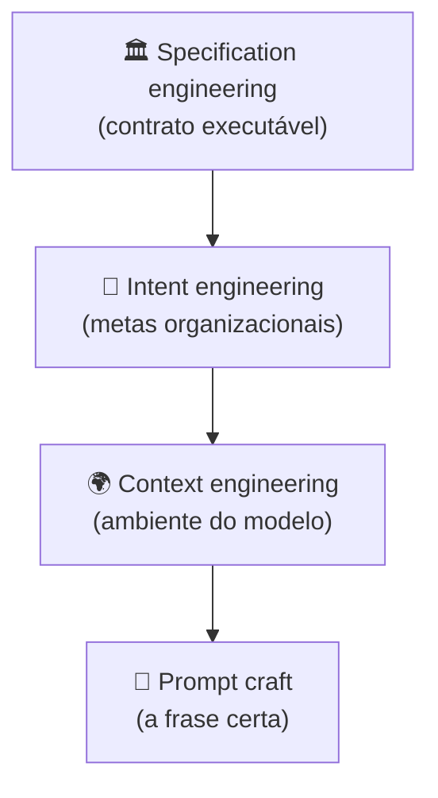

# Os quatro pilares — prompt, context, intent, specification

> [!abstract] TL;DR
> Engenharia de IA em 2026 não é um disciplina única — são quatro camadas hierárquicas: **prompt craft** (a frase), **context engineering** (o ambiente), **intent engineering** (o objetivo organizacional), e **specification engineering** (o contrato executável). Cada camada resolve um problema que a anterior não resolve. Ignorar a hierarquia é a razão mais comum de projetos AI travarem após o protótipo.

## A pirâmide

> [!info] Lê de baixo para cima
> Cada camada **superior** governa as camadas **inferiores**. Specification define quais intents são válidos; intent define qual contexto é montado; contexto define quais prompts fazem sentido.

## Camada 1 — Prompt craft

**Pergunta:** *"Como falar com o modelo nesta interação específica?"*

- Wording, exemplos few-shot, formatos de output, tokens de controle
- Técnicas: chain-of-thought, role-play, structured output (JSON mode)
- Escopo: uma chamada de API

**Quando basta:** chatbot simples, tarefas one-shot, exploração inicial.

**Quando não basta:** qualquer aplicação que mantenha estado, lide com múltiplas fontes, ou precise de garantias.

## Camada 2 — Context engineering

**Pergunta:** *"Que ambiente informacional o modelo vê neste step?"*

- Decide o que entra, o que é cacheado, o que é recuperado on-demand, o que é descartado
- Endereça [[03 - Context rot e atenção diluída|context rot]], custo de tokens, [[16 - O loop agentic — plan, act, observe|loops agentic]]
- Escopo: uma sessão de agente

**Adições sobre prompt craft:**

- [[04 - Context pipelines — montagem dinâmica|Pipelines]] que montam contexto antes de cada step
- [[05 - Camadas de contexto — persistente, temporal, transiente|Hierarquia de memória]]
- [[06 - Dynamic retrieval beyond RAG|Retrieval dinâmico]]
- [[07 - Compressão e pruning de informação|Compactação]]

**Quando basta:** aplicação single-purpose, time pequeno, domínio estável.

**Quando não basta:** quando há **vários stakeholders** querendo objetivos diferentes do mesmo agente.

## Camada 3 — Intent engineering

**Pergunta:** *"Que objetivos organizacionais o agente carrega?"*

- Encoda valores, prioridades, trade-offs do negócio na infra do agente
- Resolve conflitos: rapidez vs qualidade, custo vs UX, exploração vs segurança
- Escopo: o produto/agente como conjunto

**Exemplos concretos:**

- "Sempre prefira respostas curtas a longas" (UX)
- "Em caso de ambiguidade, escale para humano em vez de chutar" (segurança)
- "Priorize tempo-real sobre completude em queries do feed" (negócio)

**Por que vem acima de context:** o mesmo contexto pode levar a comportamentos diferentes dependendo do *intent*. Sem intent codificado, o agente faz o que o prompt do usuário quiser — mesmo que viole políticas.

**Implementações:**

- System prompts no nível organizacional
- Guardrails determinísticos ([[12 - Guardrails determinísticos]])
- Routing rules baseadas em intent classification

## Camada 4 — Specification engineering

**Pergunta:** *"Qual é o contrato executável que define sucesso?"*

- Specs versionadas, testáveis, auditáveis
- Testes de comportamento (BDD para AI)
- Output schemas estritos como contrato
- Escopo: o programa AI inteiro, ao longo do tempo

**Exemplos:**

- Spec: *"Para queries do tipo X, output deve ser JSON match schema Y"* — testável
- Spec: *"99% das respostas a queries de classe Z devem ser ≤500 tokens"* — auditável
- Spec: *"Mudança de prompt requer aprovação se afetar testes ouro"* — governável

**Conexão com [[Spec-Driven Development]]:** specification engineering é a versão da disciplina aplicada a sistemas AI — specs como source of truth para comportamento esperado, não só para código.

## Tabela comparativa

| Pilar | Pergunta | Artefato | Iteração | Stakeholder |
|---|---|---|---|---|
| Prompt craft | "Que palavra?" | String | Minutos | Engineer individual |
| Context engineering | "Que ambiente?" | Pipeline + memória | Horas | Time de produto |
| Intent engineering | "Que objetivo?" | System prompt + rules | Dias | Product manager |
| Specification engineering | "Que contrato?" | Specs + testes + governance | Sprints | Tech lead + Eng manager |

## Framing alternativo — as 4 ações sobre contexto (Karpathy/Anthropic)

Coexiste outro framing complementar, focado nas **ações** sobre o contexto em si:

- **Write** — persistir contexto importante em vector store ou DB
- **Select** — usar RAG para carregar só os tokens mais relevantes
- **Compress** — sumarizar, compactar
- **Isolate** — particionar contexto entre subsistemas em vez de empilhar tudo

Esse é um framing tático **dentro** do pilar 2 (context engineering). Os quatro pilares e as quatro ações **não se substituem** — operam em escalas diferentes.

## Anti-pattern: pular camadas

| Sintoma | Camada faltante |
|---|---|
| "Funcionou na demo, falha em produção" | Context engineering ausente |
| "Cada engenheiro fez do seu jeito" | Intent engineering ausente |
| "Não conseguimos validar mudanças" | Specification engineering ausente |
| "Funciona, mas ninguém entende por quê" | Todas — projeto vibe-coded |

## Veja também

- [[01 - De prompt engineering a context engineering]]
- [[Spec-Driven Development]]
- [[Agentes de Codificação]]
- [[03 - O comprehension gate]] (Trilha 2)

## Referências

- **Karpathy** — *Software Is Changing (Again)* (2025).
- **IntuitionLabs** — *What Is Context Engineering? A Guide for AI & LLMs* (2026).
- **Atlan** — *Context Engineering Framework for Enterprise AI* (2026).
- **intent-driven.dev** — *Intent Engineering and Spec-Driven Development* (2026).
