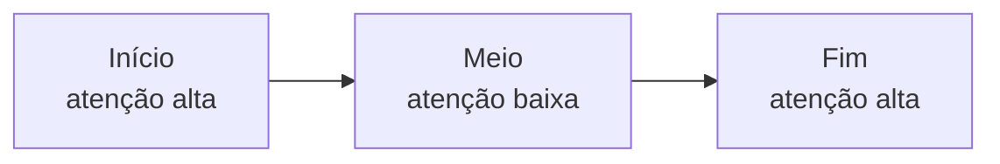

# Context rot e atenção diluída

> [!abstract] TL;DR
> Context rot é a degradação mensurável de qualidade quando o contexto cresce — **antes** de atingir o limite duro da janela. Pesquisa da Chroma (julho 2025) testou 18 modelos de fronteira: **todos** pioram com input maior. Em modelo de 200K tokens, degradação significativa começa a 50K. Três mecanismos compõem o problema: lost-in-the-middle, attention dilution, e distractor interference. Em 2025, **65% das falhas em IA enterprise** foram atribuídas a context drift — o problema não é teórico.

## O dado que mudou tudo

> [!quote] Chroma Research (jul 2025)
> *"Across all experiments, model performance consistently degrades with increasing input length."*

Chroma testou 18 modelos de fronteira (GPT-4.1, Claude Sonnet, Gemini, Llama, etc.) variando o tamanho do input em uma versão estendida do needle-in-a-haystack. **Todos os 18** mostraram queda de qualidade conforme o input crescia. Não é defeito de um provider — é propriedade da arquitetura transformer.

## Os três mecanismos

### 1. Lost in the middle

Liu et al. (Stanford/TACL 2024) mostrou que a curva de atenção forma um **U** ao longo da posição do input:



Modelos lembram bem o que está no início (system prompt) e no fim (última mensagem) — e mal de tudo no meio. **Implicação prática:** informação crítica no meio do contexto é frequentemente ignorada, mesmo estando lá.

### 2. Attention dilution

Atenção em transformers é **quadrática**: 100K tokens significam 10 bilhões de pares de relações para o modelo considerar. Não há como "atender bem" a tudo — o sinal se dilui.

```
Tokens   | Pares de atenção
1K       |       1M
10K      |     100M
100K     |      10B
1M       |       1T  (terabytes de relações)
```

Cada novo token rouba parcela de atenção dos outros. Em 1M tokens, cada token tem em média 1/1.000.000 da capacidade total — antes de qualquer otimização.

### 3. Distractor interference

Conteúdo **semanticamente similar mas irrelevante** ativa neurônios competindo pela resposta. O modelo é puxado para distractors plausíveis em vez do alvo real.

> [!example]
> Pergunta: *"Qual é a senha do usuário em [contexto com 50 referências a senhas de outros sistemas]?"* — modelo confunde sistemas e responde a errada com alta confiança.

## Rot vs overflow — não confundir

| | Context overflow | Context rot |
|---|---|---|
| Quando ocorre | Acima do limite hard (ex: 200K) | Bem antes — a partir de ~25% da janela |
| Sintoma | Erro: "context too long" | Resposta degrada silenciosamente |
| Causa | Limite arquitetural | Atenção quadrática + posição |
| Solução | Truncar, compactar | Selecionar, isolar, comprimir, mover para memória |
| Visibilidade | Explícita (erro) | Implícita (qualidade cai) |

> [!warning] Janela grande ≠ qualidade
> Modelos de 1M-2M tokens (Gemini 2.5, Claude com extended context) **não escapam do rot**. Eles deslocam o limiar para mais longe, mas a curva continua descendente. "Tem janela de 1M, então jogo tudo lá" é receita certa de rot.

## Onde context rot mais aparece

- **Sessões longas de agente** (200+ turnos): histórico inflado
- **RAG com top-k alto**: muitos documentos competem por atenção
- **Tool definitions infladas**: schemas detalhados consomem atenção
- **Logs concatenados**: stack traces e outputs verbosos
- **Multi-agent com contexto compartilhado**: cada agente vê o estado de todos

## Sintomas a observar

- Agente "esquece" instruções dadas no início da sessão
- Modelo erra fato que está no meio do contexto, mas acerta se você re-enviar
- Qualidade cai conforme a tarefa avança (não em uma chamada isolada)
- Modelo cita documento errado quando há vários similares
- Mesmo prompt funciona em sessão curta e falha em sessão longa

## Como medir

1. **Benchmark NIAH adaptado** — needle-in-haystack com seus dados, em diferentes tamanhos
2. **Eval com posição variável** — coloque o "needle" em início, meio e fim
3. **Distractor injection** — adicione documentos similares mas irrelevantes; mede se o modelo ainda acerta
4. **Curva de qualidade vs tokens** — plot de accuracy ao longo de inputs crescentes em produção

## Mitigações por mecanismo

| Mecanismo | Mitigações |
|---|---|
| Lost in the middle | Reposicionar info crítica no início ou fim do contexto |
| Attention dilution | Compressão ([[07 - Compressão e pruning de informação]]); JIT retrieval ([[06 - Dynamic retrieval beyond RAG]]) |
| Distractor interference | Filtragem agressiva no retrieval; pruning ativo |
| Todos | Sub-agentes com contexto isolado ([[Economia de Tokens|10 - Sub-agentes especializados]]); compactação automática ([[07 - Compressão e pruning de informação]]) |

## O dado de produção que importa

> [!info] CIO Magazine (2026)
> Aproximadamente **65% das falhas em IA enterprise** em 2025 foram atribuídas a *context drift* ou *memory loss* durante raciocínio multi-step. Não é "edge case" — é o problema central de produção.

## Veja também

- [[02 - Os quatro pilares — prompt, context, intent, specification]]
- [[06 - Dynamic retrieval beyond RAG]]
- [[07 - Compressão e pruning de informação]]
- [[13 - Entropia e qualidade de contexto]]
- [[03 - A janela de contexto]] (Trilha 1)

## Referências

- **Chroma Research** — *Context Rot: How Increasing Input Tokens Impacts LLM Performance* (jul 2025).
- **Liu et al.** — *Lost in the Middle: How Language Models Use Long Contexts* (TACL, 2024).
- **Adobe Research** — *Variants of Needle-in-a-Haystack* (fev 2025).
- **Understanding AI** — *Context rot: the emerging challenge that could hold back LLM progress* (2025).
