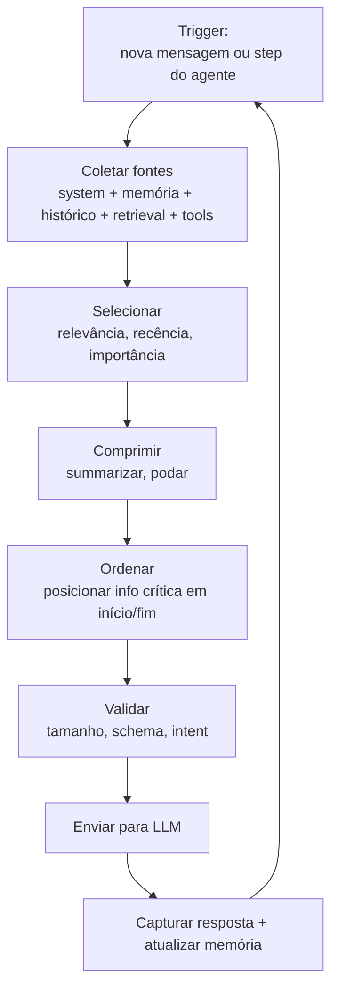

# Context pipelines — montagem dinâmica

> [!abstract] TL;DR
> Em produção, o contexto não é estático — é **montado** antes de cada step do agente. Context pipeline é o conjunto de regras e código que decide, em runtime, quais pedaços de informação entram na janela neste turno específico. A pipeline é o produto real do context engineering. Sem pipeline, você está concatenando prompts; com pipeline, você está engenhando o ambiente do modelo.

## O que é uma context pipeline



Cada caixa é decisão de engenharia, não wishful thinking. Frameworks comerciais (Zep, Graphlit, Letta) já entregam pipelines configuráveis; em projetos próprios, a pipeline é código que você mantém.

## Cinco fontes que toda pipeline precisa orquestrar

| Fonte | Origem | Volume típico | Como entra |
|---|---|---|---|
| **System / instructions** | `AGENTS.md`, system prompt | 1-5K tokens | Início, persistente |
| **Memória persistente** | Vector store, DB, file system | Variável | Selecionada por relevância |
| **Histórico da conversa** | Estado da sessão | Cresce ao longo do tempo | Compactado se necessário |
| **Retrieval dinâmico** | Tools, MCP servers, APIs | Sob demanda | Just-in-time |
| **Tool definitions** | Schemas de funções disponíveis | 2-15K tokens | Cacheável |

A pipeline decide para cada turno: *quanto* de cada fonte entra, *em que posição*, *com que compressão*.

## Spectrum de retrieval

A pipeline opera entre dois extremos:

```
Pre-indexed retrieval ←——————————————→ Just-in-time retrieval
(tudo em vector store antes)         (busca durante a tarefa)
```

| Extremo | Vantagem | Custo |
|---|---|---|
| **Pre-indexed** | Latência baixa, pesquisa rápida | Stale data, manutenção do índice |
| **Just-in-time** | Sempre atualizado, simples | Latência por chamada de tool |
| **Híbrido** | Melhor dos dois | Mais código |

> [!example] Claude Code (híbrido)
> `CLAUDE.md` é carregado **uma vez no início** (pre-indexed). Mas `glob`/`grep`/`read_file` recuperam código **sob demanda durante a sessão** (JIT). Resultado: regras estáveis sempre presentes; código sempre atualizado.

## Anatomia de uma pipeline mínima

```python
def build_context(turn_state):
    layers = []

    # 1. Fontes estáticas (cacheáveis)
    layers.append(load_system_prompt())
    layers.append(load_agents_md(working_dir=turn_state.cwd))

    # 2. Memória relevante (dinâmica)
    relevant_facts = vector_store.search(
        query=turn_state.user_message,
        top_k=5
    )
    layers.append(format_facts(relevant_facts))

    # 3. Histórico compactado
    history = compact_if_needed(
        turn_state.history,
        budget=50_000
    )
    layers.append(history)

    # 4. Tool definitions (cacheáveis)
    layers.append(turn_state.available_tools)

    # 5. Mensagem atual
    layers.append(turn_state.user_message)

    return assemble(layers)
```

## Engines de contexto comerciais

| Produto | Foco | Modelo de uso |
|---|---|---|
| **Zep** | Agent memory + context engine | Dual-layer: episodic + semantic |
| **Graphlit** | Knowledge graph + retrieval | Entity resolution |
| **Letta (MemGPT)** | Self-editing memory | OS-inspired core/recall/archival |
| **Mem0** | Long-term agent memory | API simples para fact storage |
| **LangChain ContextEngine** | Composable | Building blocks |

Quando faz sentido construir vs comprar: protótipos e produtos pequenos → construir; aplicação enterprise com múltiplos agentes → considerar comprar.

## O critério de qualidade

Uma boa pipeline é **observável** e **versionada**:

- **Observável** — você sabe, para cada turno, quais fontes contribuíram quanto
- **Versionada** — mudança de pipeline é deploy, não edição ad-hoc
- **Testável** — você roda a mesma pipeline contra inputs gold e checa output

> [!tip] Métrica essencial
> *"Para esta classe de query, qual fração do contexto enviado foi efetivamente útil?"* — se >50% do contexto não influenciou a resposta, a pipeline está mal calibrada.

## Anti-patterns

- **Pipeline ad-hoc** — concatenar strings em Python sem abstração; impossível medir
- **Pipeline gulosa** — sempre carrega tudo "por garantia"; produz rot ([[03 - Context rot e atenção diluída]])
- **Pipeline cega** — sem logs do que entrou em cada turno
- **Pipeline imutável** — não evolui com o produto
- **Pipeline sem fallback** — quando uma fonte falha (API down), tudo quebra

## Veja também

- [[05 - Camadas de contexto — persistente, temporal, transiente]]
- [[06 - Dynamic retrieval beyond RAG]]
- [[07 - Compressão e pruning de informação]]
- [[14 - Context engineering na prática — setup completo]]
- [[Memória de Agentes]]

## Referências

- **Anthropic** — *Effective context engineering for AI agents* (2025).
- **Zep** — *Automated Context Assembly for Reliable Agents* (2026).
- **Zylos Research** — *Dynamic Context Assembly and Projection Patterns for LLM Agent Runtimes* (mar 2026).
- **Weaviate** — *Context Engineering: LLM Memory and Retrieval* (2025).
