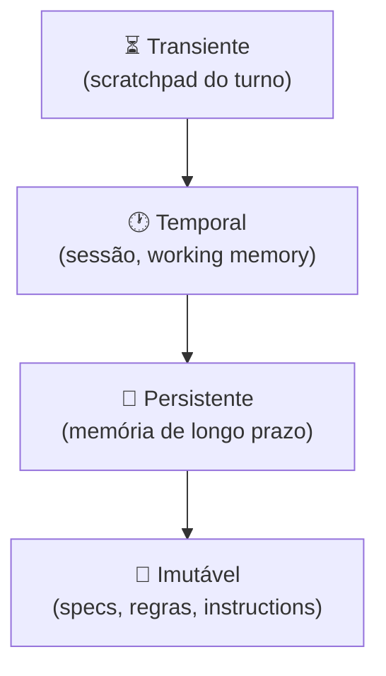

# Camadas de contexto — persistente, temporal, transiente

> [!abstract] TL;DR
> Nem todo contexto vive no mesmo lugar nem tem o mesmo tempo de vida. Arquiteturas modernas (Letta, Zep, Claude Code) separam contexto em camadas com escopos distintos: **persistente** (vale para sempre), **temporal** (vale para esta sessão), **transiente** (vale para este turno). Misturar tudo numa pilha única é a causa raiz de [[03 - Context rot e atenção diluída|context rot]] em projetos amadores.

## A hierarquia



Quanto mais alto na pirâmide, **mais volátil**. Quanto mais baixo, **mais estável e custoso de mudar**.

## Camada 1 — Imutável (specs, regras, identidade)

**Vida útil:** dias a meses. Mudança = deploy.

**Conteúdo:**

- System prompt do agente ("você é um assistente de…")
- `AGENTS.md` / `CLAUDE.md` ([[11 - Skills e instructions como contexto]])
- Specs executáveis ([[Spec-Driven Development]])
- Regras de negócio, políticas, compliance

**Onde mora:** repositório de código, versionado em git.

**Inserção no contexto:** **sempre no início**, todos os turnos. Excelente candidato a [[Economia de Tokens|prompt caching]].

## Camada 2 — Persistente (memória de longo prazo)

**Vida útil:** semanas a anos. Cresce com uso.

**Conteúdo:**

- Fatos sobre o usuário ("trabalha em Python", "prefere respostas curtas")
- Preferências aprendidas
- Histórico cumulativo de interações importantes
- Knowledge base do domínio

**Onde mora:** vector store, banco de dados, arquivos `.md` indexados.

**Inserção no contexto:** **selecionada por relevância**. Vector search + filtros temporais. Top-k pequeno (3-10 itens).

**Exemplos de implementação:**

| Sistema | Camada persistente |
|---|---|
| **Letta** | `archival_memory` (vector store) |
| **Mem0** | Long-term facts (vector + graph) |
| **Zep** | Episodic + semantic memory |
| **Claude.ai** | Memory feature ("Claude lembra que…") |
| **Self-hosted** | Markdown + embeddings + retrieval |

## Camada 3 — Temporal (working memory / sessão)

**Vida útil:** horas a dias. Resetada quando a sessão termina (ou compactada).

**Conteúdo:**

- Histórico de mensagens da sessão atual
- Estado intermediário do agente (tarefas iniciadas, decisões tomadas)
- Notas estruturadas que o próprio agente escreve ([[10 - Structured state tracking]])
- Resultados de tools recentes

**Onde mora:** estado do runtime (memória ou DB de sessão), arquivos temporários (`NOTES.md`, `TODO.md`).

**Inserção no contexto:** maior parte direto, mas **compactada quando passa de threshold** ([[07 - Compressão e pruning de informação]]).

> [!tip] Working memory ≠ histórico bruto
> O melhor design não envia o histórico bruto turno após turno — mantém uma **versão destilada** (decisões + estado atual + 5-10 últimas mensagens) e descarta o resto.

## Camada 4 — Transiente (scratchpad)

**Vida útil:** segundos a minutos. Vive um único turno (ou poucos).

**Conteúdo:**

- Chain-of-thought interno
- Resultados de tools que foram úteis para uma decisão e perdem valor depois
- Reasoning passo-a-passo
- Hipóteses que o agente testou

**Onde mora:** dentro do próprio prompt, ou em buffer separado descartado após uso.

**Inserção no contexto:** **temporária**. Modelos com extended thinking (Claude, o1) têm scratchpad separado que **não vai para o histórico**.

## Tabela de decisão — onde guardar?

> [!question] "Onde guardo essa informação?"
>
> | Pergunta | Resposta | Camada |
> |---|---|---|
> | "Vale para todos os usuários, sempre?" | Sim | **Imutável** |
> | "Vale para este usuário, por muito tempo?" | Sim | **Persistente** |
> | "Vale só nesta sessão / projeto?" | Sim | **Temporal** |
> | "Vale só pra resolver este turno?" | Sim | **Transiente** |

## Exemplo concreto — agente de coding

```
Imutável:    AGENTS.md + identidade do agente (system prompt)
             "Você é um agente de coding em Python, sempre rode testes
              após editar..."

Persistente: Memória do projeto + preferências do dev
             "Este projeto usa pytest, não unittest"
             "O usuário prefere type hints em vez de docstrings"

Temporal:    Histórico desta sessão
             "Editei arquivos X e Y, commit ainda não feito"
             "Tarefa atual: refatorar módulo Z"

Transiente:  Reasoning do turno atual
             "Vou primeiro ler X.py para entender deps, depois decidir
              se edito Y ou crio Z..."
```

## Anti-patterns

- **Achatar tudo em uma pilha** — a causa #1 de rot
- **Persistir o transiente** — encher a memória de longo prazo com chain-of-thoughts irrelevantes
- **Tornar persistente o que é imutável** — colocar specs no vector store em vez de no `AGENTS.md`
- **Não compactar o temporal** — sessão de 8h envia 800K tokens em cada turno
- **Sem TTL no persistente** — fato de 2024 ainda servido em 2026

## Veja também

- [[04 - Context pipelines — montagem dinâmica]]
- [[07 - Compressão e pruning de informação]]
- [[08 - Memória agentica — self-editing memory]]
- [[10 - Structured state tracking]]
- [[Memória de Agentes]]

## Referências

- **Letta** — *Memory Blocks: The Key to Agentic Context Management* (2025).
- **Hermes OS** — *AI agent memory systems in 2026: Zep, Mem0, Letta, and dual-layer architectures* (2026).
- **Anthropic** — *Effective context engineering for AI agents* (2025).
- **Towards Data Science** — *A Practical Guide to Memory for Autonomous LLM Agents* (2025).
