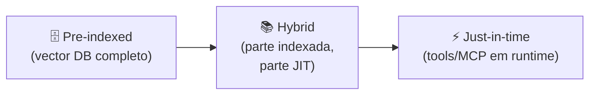

# Dynamic retrieval beyond RAG

> [!abstract] TL;DR
> RAG clássico (recuperar top-k docs antes do prompt) virou o **andar térreo** do retrieval moderno. Em 2026, agentes operam num espectro: de **pre-indexed** (vector DB pronto) até **just-in-time** (chamar API/tool durante a tarefa). O agente carrega *identifiers* leves (paths, queries, links) e **decide em runtime** o que buscar. Bypass de stale indexing, contexto mais limpo, mais alinhado com o estado real do mundo. Claude Code é o exemplo de referência: `glob`/`grep`/`read_file` substituem indexar o código inteiro.

## O espectro



| Modo | Latência | Frescor | Custo de manter |
|---|---|---|---|
| Pre-indexed | <100ms | Stale (depende de sync) | Alto (pipeline + recompute) |
| Hybrid | 100-500ms | Misto | Médio |
| Just-in-time | 500ms-3s | Sempre fresco | Baixo |

## Pre-indexed RAG — quando ainda faz sentido

Bom para:

- Knowledge bases **estáveis** (docs do produto, FAQs, manuais)
- Volume alto de queries similares (semantic cache + RAG)
- Quando latência <500ms é requisito

Limitação fundamental: **stale data**. Se o índice é re-construído a cada hora, os deltas dessa hora são invisíveis.

## Just-in-time retrieval — o padrão emergente

> [!quote] Anthropic — Effective Context Engineering (2025)
> *"Agents built with the 'just in time' approach maintain lightweight identifiers (file paths, stored queries, web links) and use these references to dynamically load data into context at runtime using tools."*

Em vez de carregar 50 documentos "que talvez sejam relevantes" antes da query, o agente:

1. Recebe a query do usuário
2. Decide qual ferramenta chama (`grep`, API call, MCP tool)
3. Chama em runtime
4. Recebe resposta atualizada
5. Compõe resposta com **só o que foi necessário**

**Vantagens:**

- Sempre fresco (lê do source, não do índice)
- Contexto enxuto (só o que foi efetivamente necessário)
- Sem indexação a manter

**Custo:**

- Latência por tool call
- Tokens da chamada de tool no contexto
- Maior dependência de tool design

## O caso Claude Code (referência)

```
Estático (carregado na sessão):
└── CLAUDE.md / AGENTS.md     ← regras estáveis

Dinâmico (sob demanda):
├── glob "**/*.py"            ← descobrir arquivos
├── grep "fetchUser"          ← achar referências
├── read_file "src/api.py"    ← ler conteúdo específico
└── bash "git log --oneline"  ← consultar histórico
```

Sem indexação. Sem vector DB. Sem AST. O modelo navega o ambiente como um humano navegaria — usando ferramentas. Resultado: zero stale data, zero overhead de pipeline.

## MCP como camada universal de JIT

[[15 - MCP — o protocolo universal|MCP]] (Model Context Protocol) padroniza fontes de retrieval JIT:

- `mcp-server-filesystem` — JIT em arquivos
- `mcp-server-git` — JIT em repos
- `mcp-server-postgres` — JIT em DBs
- `mcp-server-sentry` — JIT em logs/erros
- (centenas de outros)

O agente recebe *tool descriptions* de cada server e decide em runtime qual chamar. Não é "RAG configurado" — é **arquitetura de ferramentas** consultáveis.

## Padrões de design

### 1. Identifier-first

Memorize **referências** (paths, IDs, slugs), não conteúdo.

```python
# Errado: pré-carregar 200 documentos
context = load_all_docs()

# Certo: memorize 200 paths, leia 3 quando precisar
context = load_doc_index()  # só nomes
relevant_docs = [read_file(p) for p in retrieve_paths(query)]
```

### 2. Two-stage retrieval

Stage 1: search **estrutural** (paths, IDs, metadata).
Stage 2: load **conteúdo** apenas dos top-N.

### 3. Lazy expansion

Comece minimalista, expanda quando o agente sinalizar que precisa.

```
Turno 1: retorna apenas filenames
Turno 2: agente pede um arquivo específico → ler completo
Turno 3: agente pede outro arquivo → ler completo
```

### 4. Hybrid index + tool

Pre-indexed para o que é estável (docs, FAQs); JIT para o que muda (código, dados ao vivo).

## Quando NÃO usar JIT

- Latência crítica (<200ms): JIT adiciona round-trips
- Tool ausente para a fonte (PDFs antigos, sistemas legados sem API)
- Volume de queries muito alto (cada query = N tool calls = $$$)

## Armadilhas

- **JIT sem cache** — agente lê o mesmo arquivo 5 vezes na sessão
- **Tools muito granulares** — cada turno faz 20 tool calls em vez de 2
- **Tools muito grossos** — `read_file` que retorna 50K tokens anula o ganho
- **Sem fallback** — quando o tool falha, o agente trava
- **Misturar com indexação stale** — pior dos dois mundos

## Métricas para acompanhar

| Métrica | Alvo |
|---|---|
| **Tool calls por turno** | 1-3 (mais que 5 vira ruído) |
| **Tokens recuperados / tokens usados** | >70% (resto é ruído) |
| **Cache hit rate em re-leituras** | >80% |
| **Latência total da sessão** | Comparável ou melhor que pre-indexed |

## Veja também

- [[04 - Context pipelines — montagem dinâmica]]
- [[07 - Compressão e pruning de informação]]
- [[15 - MCP — o protocolo universal]] (Trilha 2)
- [[RAG e Vector Databases]]
- [[Economia de Tokens|11 - Semantic caching]]

## Referências

- **Anthropic** — *Effective context engineering for AI agents* (2025).
- **Airbyte** — *What Is Dynamic Context Retrieval?* (2026).
- **Zylos Research** — *Dynamic Context Assembly* (mar 2026).
- **MachineLearningMastery** — *Effective Context Engineering for AI Agents: A Developer's Guide* (2026).
