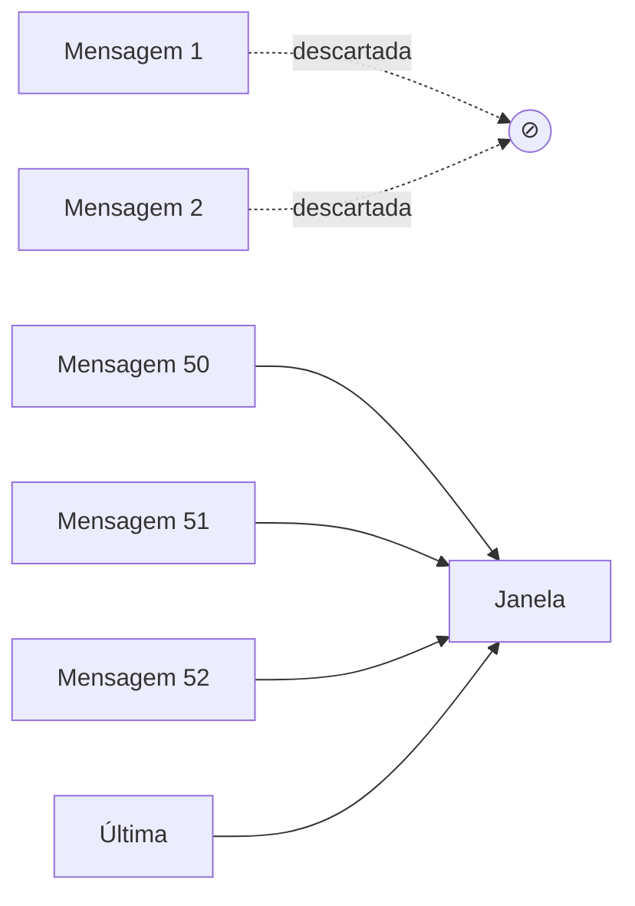

# Compressão e pruning de informação

> [!abstract] TL;DR
> Em sessões longas, a janela de contexto satura — não pelo limite hard, mas pela [[03 - Context rot e atenção diluída|atenção diluída]]. As duas técnicas centrais para combater isso: **compressão** (resumir o que ainda é relevante) e **pruning** (remover ativamente o que não é mais). Anthropic implementou *compaction* nativa no Claude Code — ela preserva decisões arquiteturais e bugs em aberto, e descarta tool outputs redundantes. A boa notícia: as técnicas são as mesmas que [[Economia de Tokens|reduzem custo]]. Você ganha qualidade *e* dinheiro.

## Compressão vs pruning vs eviction

| Técnica | O que faz | Quando ativa |
|---|---|---|
| **Compressão** | Mantém a informação, em forma reduzida | Threshold de tokens |
| **Pruning** | Remove informação considerada irrelevante | Filtro contínuo ou pré-LLM |
| **Eviction** | Remove a informação mais antiga (FIFO ou LRU) | Limite hard |

A maioria dos sistemas robustos combina os três.

## Compressão (compaction)

> [!quote] Anthropic — Effective Context Engineering (2025)
> *"Compaction is the practice of taking a conversation nearing the context window limit, summarizing its contents, and reinitiating a new context window with the summary."*

### Como Claude Code implementa

1. Quando a janela aproxima do limite, dispara compactação
2. Envia o histórico para o próprio modelo com prompt de sumarização
3. Modelo gera resumo preservando:
   - Decisões arquiteturais
   - Bugs em aberto
   - Detalhes de implementação importantes
4. Modelo descarta:
   - Tool outputs redundantes
   - Mensagens já resolvidas
5. Continua a sessão com **resumo + 5 arquivos mais recentemente acessados**

### Tipos de compressão

| Tipo | Como funciona | Trade-off |
|---|---|---|
| **Sumarização auto-LLM** | Modelo resume o próprio histórico | Perda fina + custo de inferência |
| **Sumarização extractiva** | Seleciona spans importantes do histórico | Sem perda, mas menos compacto |
| **Compactação estrutural** | Converte para formato denso (tabela, JSON) | Preciso, mas exige schema |
| **Hierarchical** | Resumo de resumos | Bom para muito longo prazo |

### Quando comprimir

- **Threshold absoluto** — ao atingir 70-80% da janela
- **Threshold de turno** — a cada N turnos (ex: 50)
- **Trigger explícito** — usuário ou agente pede `/compact`
- **Mudança de fase** — ao terminar uma sub-tarefa

> [!warning] Compactação custa tokens
> Compactar 100K tokens tipicamente envia 100K input + recebe 5-10K output. Não é grátis — mas o ganho de qualidade e o custo evitado nos turnos seguintes superam.

## Pruning (poda ativa)

Diferente de compressão (que **mantém** em forma reduzida), pruning **remove** informação julgada irrelevante.

### Critérios comuns

- **Idade** — descartar mensagens com mais de N turnos
- **Relevância** — TF-IDF, embeddings: remover o que não combina com a tarefa atual
- **Marcação explícita** — agente decide "isso já não importa"
- **Estática** — `.cursorignore`, `.claudeignore`, regex de paths

### Pruning de tool outputs

Pattern essencial em agentes:

```
Turno 1: read_file("src/api.py")  → 12K tokens de output
Turno 2: read_file("src/db.py")   → 8K tokens de output
Turno 3: read_file("src/api.py")  → MESMO conteúdo

Sem pruning: histórico contém 32K tokens de file contents
Com pruning: substitui leituras antigas por referência ("já lido no turno 1")
```

### Pruning de imagens / outputs grandes

Imagens consomem 1-2K tokens cada. Após o agente descrever ou usar, **substitua a imagem pela descrição** no histórico. Mesmo padrão para PDFs, planilhas grandes, screenshots.

## Sliding window — o caso especial



Mantém os **últimos N turnos** + system prompt + memória persistente. Simples, eficiente, mas perde contexto antigo. Bom para chats casuais; **insuficiente** para agentes que precisam recordar decisões iniciais.

## Padrão híbrido recomendado

```python
def compact_history(history, budget=50_000):
    static = history[:2]              # primeiros 2 turnos = "setup"
    recent = history[-10:]            # últimos 10 = "memória curta"
    middle = history[2:-10]           # tudo entre = candidato a compactar

    if total_tokens(static + recent) > budget:
        recent = sliding_window(recent, max_tokens=budget * 0.6)

    middle_summary = summarize_with_llm(middle, target=2_000)

    return static + [middle_summary] + recent
```

## Métricas para acompanhar

| Métrica | Alvo |
|---|---|
| **Compactação rate** | 5-10x (100K → 10-20K) |
| **Loss em testes gold** | <5% (medido com benchmark NIAH na sessão) |
| **Custo de compactação / mês** | <10% do custo total |
| **Frequência de compactação** | A cada 30-50 turnos em sessões longas |

## Armadilhas

- **Compactar cedo demais** — perde nuance que ainda seria útil
- **Compactar tarde demais** — já entrou em [[03 - Context rot e atenção diluída|context rot]]
- **Não preservar decisões críticas** — modelo "esquece" arquitetura combinada
- **Compactar tool outputs ativos** — agente perde resultado que ainda usa
- **Sem teste contra gold** — qualidade da compressão degrada silenciosa

## Veja também

- [[03 - Context rot e atenção diluída]]
- [[05 - Camadas de contexto — persistente, temporal, transiente]]
- [[Economia de Tokens|08 - Compactação de histórico em agentes]]
- [[Economia de Tokens|06 - Context pruning — o que remover do prompt]]
- [[10 - Structured state tracking]]

## Referências

- **Anthropic** — *Effective context engineering for AI agents* (2025).
- **Claude Cookbook** — *Context engineering: memory, compaction, and tool clearing* (2026).
- **Bojie Li** — *Claude's Context Engineering Secrets* (dez 2025).
- **Sebastian Raschka** — *Components of A Coding Agent* (2025).
