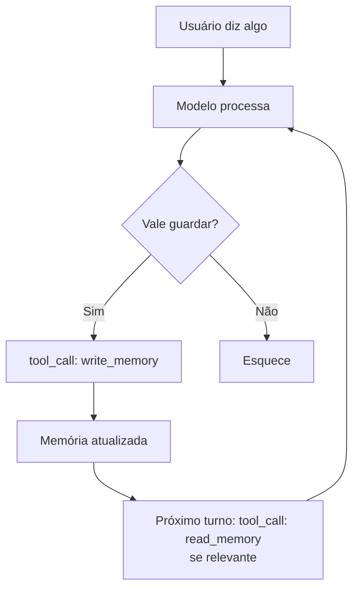

# Memória agentica — self-editing memory

> [!abstract] TL;DR
> O agente não recebe memória — ele **escolhe** o que lembrar. Self-editing memory é o padrão onde o LLM tem ferramentas explícitas para escrever, ler e podar a própria memória durante o reasoning. O paper MemGPT (2023) inaugurou o campo; em 2026, Letta (sua evolução) virou referência, junto com Mem0 e Zep. O modelo arquitetural: **LLM como sistema operacional** que gerencia uma hierarquia de memórias (core/recall/archival) via tool calls.

## A premissa

Em arquiteturas tradicionais, a aplicação decide o que enviar ao modelo. Em self-editing memory, o **modelo** decide o que persistir, o que recordar, o que arquivar. Memória vira uma estrutura editável — não um pipe que entra antes do prompt.



## A hierarquia OS-inspired (MemGPT/Letta)

| Camada | Análogo | Conteúdo | Acesso |
|---|---|---|---|
| **Core memory** | RAM | Fatos críticos sempre presentes | Sempre no prompt |
| **Recall memory** | Cache | Histórico de conversas indexado | Tool: search_recall |
| **Archival memory** | Disco | Knowledge base de longo prazo | Tool: search_archival |

> [!quote] MemGPT paper (2023)
> *"We propose treating context windows as a constrained memory resource and design a system inspired by traditional OS hierarchies."*

O modelo invoca tool calls como `core_memory_replace`, `archival_memory_insert`, `archival_memory_search` durante o reasoning loop — exatamente como um OS faria operações de RAM/disk.

## Letta — a evolução

Letta (formalmente MemGPT) é a plataforma de produção desse paradigma:

- **Memory blocks** — unidades nomeadas de memória (ex: `human`, `persona`, `project`)
- **Self-editing** — o modelo edita os blocks via tool calls
- **Persistência** — blocks vivem em DB, sobrevivem a reinícios
- **APIs** — REST + SDKs para Python/TypeScript

```python
# Pseudo-API Letta
agent = letta.create_agent(
    memory_blocks=[
        Block(name="human", value="Nome: Maria, dev backend Python"),
        Block(name="project", value="API REST de pagamentos, FastAPI")
    ]
)

# Durante a conversa, agente pode chamar:
# - core_memory_replace(block="human", value="Maria, dev fullstack Python+TS")
# - archival_memory_insert(content="Maria mencionou dor com latência em endpoint /pay")
# - archival_memory_search(query="endpoint /pay")
```

## Comparativo dos players

| Sistema | Modelo de memória | Forte em |
|---|---|---|
| **Letta** | OS-inspired (core/recall/archival) | Auto-edit via tool calls, framework completo |
| **Mem0** | Fact storage + vector | API simples, integração rápida |
| **Zep** | Episodic + semantic + graph | Knowledge graph, temporal awareness |
| **LangGraph** | State graph customizável | Controle fino, multi-agent |
| **Claude.ai memory** | Auto-summary opaque | UX consumer, sem self-edit explícito |

## Padrão de prompt

O modelo só escreve memória se for **instruído** a fazê-lo. Padrão típico:

```
You have access to memory tools. Use them to:
- Save important user facts (core_memory_replace)
- Save observations from this session (archival_memory_insert)
- Search past sessions when relevant (archival_memory_search)

Save things that:
- The user explicitly asks to remember
- Are recurring patterns or preferences
- Could be useful in future sessions

Do NOT save:
- One-off chitchat
- Sensitive info (use redaction)
- Hallucinations
```

## Quando usar self-editing memory

**Compensa quando:**

- Sessões cruzam múltiplos dias / semanas
- Mesmo usuário interage várias vezes
- Domínio tem fatos cumulativos relevantes (ex: assistente pessoal, suporte)
- Personalização é diferencial competitivo

**Não compensa quando:**

- Cada sessão é stateless (chatbot anônimo)
- Aplicação é one-shot (geração de código pontual)
- Compliance exige zero retenção
- Time pequeno sem orçamento para manter memória

## Riscos específicos

- **Memory poisoning** — atacante injeta fatos falsos via prompt; modelo persiste e usa em sessões futuras de outros usuários
- **PII leak** — modelo persiste dado sensível sem perceber; aparece em outra sessão
- **Identity drift** — memórias acumuladas mudam o comportamento do agente de formas inesperadas
- **Cold start** — primeiras sessões parecem "burras" porque ainda não há memória

> [!warning] Memória precisa de governança
> Self-editing memory dá poder ao modelo. Sem [[12 - Guardrails determinísticos]] (validação, sanitization, audit log), isso vira vetor de ataque ou compliance liability.

## Métricas

| Métrica | Alvo |
|---|---|
| **Hit rate de archival_search** | >40% (busca útil) |
| **Memória útil / total** | >60% (resto vira ruído) |
| **Crescimento de archival** | Linear, não exponencial |
| **Latência de search** | <200ms |
| **PII em memória persistida** | 0 (medido com PII detector) |

## Anti-patterns

- **Auto-save tudo** — memória cresce explosivamente, search degrada
- **Sem TTL** — fato de 2024 ainda servido em 2026
- **Sem deduplicação** — mesma observação salva 50 vezes
- **Memória como buffer de session** — confunde transiente com persistente ([[05 - Camadas de contexto — persistente, temporal, transiente]])
- **Modelo sem prompt explícito** — não sabe quando usar tools de memória

## Veja também

- [[05 - Camadas de contexto — persistente, temporal, transiente]]
- [[09 - Shared memory em multi-agent]]
- [[10 - Structured state tracking]]
- [[12 - Guardrails determinísticos]]
- [[Memória de Agentes]]

## Referências

- **Packer et al.** — *MemGPT: Towards LLMs as Operating Systems* (2023, arxiv:2310.08560).
- **Letta** — *Memory Blocks: The Key to Agentic Context Management* (2025).
- **Letta** — *github.com/letta-ai/letta* (open source, 2026).
- **Vectorize** — *Mem0 vs Letta (MemGPT): AI Agent Memory Compared* (2026).
