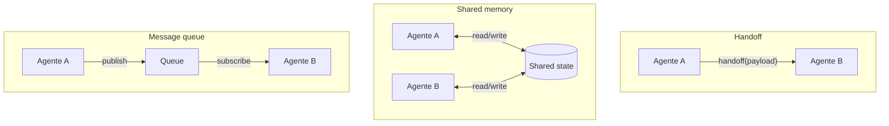

# Shared memory em multi-agent

> [!abstract] TL;DR
> Quando múltiplos agentes colaboram, o estado precisa **viajar** entre eles — sem inflar o contexto de cada um. Três padrões dominam em 2026: **handoff** (passa contexto serializado, modelo OpenAI Swarm), **shared memory** (estrutura mutável compartilhada, modelo LangGraph), e **message queue** (eventos publicados, modelo enterprise). Cada um faz trade-off diferente entre coordenação, latência e fidelidade. A regra que une todos: **resumir** o estado no handoff, não passar histórico bruto.

## O problema

Single-agent: contexto cresce dentro de uma sessão.
**Multi-agent:** contexto precisa cruzar fronteiras de agentes — cada um com sua janela, suas tools, seus prompts.

Sem boa engenharia de shared memory:

- Agente B não sabe o que A já decidiu → repetição
- Agente B vê o histórico inteiro de A → context rot ([[03 - Context rot e atenção diluída]])
- Agente B perde nuance → resultado pior que single-agent

## Os três padrões dominantes



### Padrão 1 — Handoff (OpenAI Swarm, Anthropic patterns)

Um agente termina sua parte e **transfere** explicitamente para outro com payload bem definido.

```python
# OpenAI Swarm — handoff = tool call que retorna outro agent
def transfer_to_billing():
    return billing_agent  # runner switches active agent

triage_agent = Agent(
    name="Triage",
    instructions="...",
    functions=[transfer_to_billing, transfer_to_support]
)
```

**Vantagens:**

- Simples mentalmente (linear)
- Cada agente tem contexto enxuto
- Fácil debug (handoff é um evento)

**Limitações:**

- Estado não-trivial precisa ser serializado
- Agentes não "conversam" — apenas se sucedem
- Cadeia de N agentes acumula latência

### Padrão 2 — Shared memory (LangGraph, CrewAI)

Os agentes compartilham uma estrutura mutável (state graph, dict, key-value store).

```python
# LangGraph — state como TypedDict atualizado por cada nó
class AgentState(TypedDict):
    user_query: str
    research_findings: list[str]
    draft: str
    review_notes: str

graph = StateGraph(AgentState)
graph.add_node("researcher", researcher_fn)   # escreve research_findings
graph.add_node("writer", writer_fn)           # lê findings, escreve draft
graph.add_node("reviewer", reviewer_fn)       # lê draft, escreve review_notes
```

**Vantagens:**

- Coordenação natural (todos veem o mesmo estado)
- Suporta loops (reviewer envia de volta para writer)
- Fácil snapshot/replay

**Limitações:**

- Estado pode crescer e virar problema próprio
- Cada agente potencialmente vê *demais*
- Concurrency: race conditions se não-imutável

### Padrão 3 — Message queue (enterprise, distributed)

Agentes publicam eventos numa queue; outros se inscrevem.

```python
# Pseudocode com pubsub
agent_a.publish("research.complete", {"findings": [...]})
agent_b.subscribe("research.complete", lambda evt: process(evt))
```

**Vantagens:**

- Desacoplamento total
- Escala horizontal (múltiplas instâncias)
- Audit trail natural (eventos persistidos)

**Limitações:**

- Complexidade operacional alta
- Latência maior
- Garantias de entrega exigem infra (Kafka, NATS)

## A regra de ouro: handoff com resumo

Independente do padrão, **passar histórico bruto é anti-pattern**. Padrão recomendado:

```python
def handoff_to_next_agent(current_state):
    # Não: passar todo o histórico
    # next_agent.run(history=current_state.full_history)

    # Sim: resumir + intent + dados estruturados
    return next_agent.run(
        summary=summarize(current_state.full_history),
        intent="Validar compliance da proposta",
        structured_data={
            "decision": current_state.decision,
            "open_questions": current_state.open_questions,
            "constraints": current_state.constraints,
        }
    )
```

OpenAI Swarm permite **override do default handoff** justamente para inserir essa lógica de resumo.

## Comparativo de frameworks (2026)

| Framework | Padrão | Estado | Comunicação | Forte em |
|---|---|---|---|---|
| **OpenAI Swarm** | Handoff | Ephemeral | Tool calls | Rapidez de prototipagem |
| **LangGraph** | Shared graph | Checkpointed | Mutable dict | Workflows complexos, loops |
| **CrewAI** | Role-based | Shared task ctx | Crew context | Mental model de "equipe" |
| **AutoGen** | Conversational | Persistent | Messages | Conversação multi-agente |
| **Strands Agents** | Swarm pattern | Shared context | Multi-mode | AWS-native, enterprise |

## Quando NÃO usar multi-agent

> [!warning] Single-agent costuma vencer
> Multi-agent **só compensa** quando os ganhos arquiteturais (especialização, paralelismo, isolamento de contexto) superam o overhead de coordenação. Se um único agente bem-prompteado resolve, **use o single**. Coordenação é caro e debug é dor.

Sinais de que multi-agent vale:

- Tarefa tem fases claras com skills muito diferentes (research → write → fact-check)
- Paralelismo acelera (3 agentes verificando aspectos distintos)
- Isolamento de contexto é requisito (cada agente sem ver dados sensíveis dos outros)

Sinais de que **não** vale:

- "Vou dividir em vários agentes pra ficar mais robusto" (sem evidência)
- Tarefa é fluida, decompor adiciona artifíficios
- Time não tem expertise para debugar pipelines distribuídos

## Métricas

| Métrica | Alvo |
|---|---|
| **Tokens / turno em handoff** | <2K (resumo, não bruto) |
| **Latência total vs single-agent** | <2x (senão é barato demais) |
| **Loop count em coordenação** | <3 (mais que isso vira rabbit hole) |
| **State size growth** | Sublinear no nº de agentes |

## Armadilhas

- **Handoff de histórico bruto** — context rot multiplicado pelo nº de agentes
- **Sem resumo no payload** — agente B re-faz trabalho de A
- **Estado mutável sem locking** — race conditions em frameworks concorrentes
- **Acoplamento via shared state** — agentes que dependem implicitamente da estrutura
- **Sem audit trail** — debug de handoffs vira tragédia

## Veja também

- [[08 - Memória agentica — self-editing memory]]
- [[10 - Structured state tracking]]
- [[Economia de Tokens|10 - Sub-agentes especializados]]
- [[Agentes de Codificação|12 - Multi-agent — workflows com múltiplos agentes]]

## Referências

- **OpenAI** — *github.com/openai/swarm* (2024+, educational framework).
- **LangChain** — *LangGraph Multi-Agent Swarm* (2025).
- **AWS Strands Agents** — *Swarm Multi-Agent Pattern* (2026).
- **GuruSup** — *Best Multi-Agent Frameworks in 2026* (2026).
- **Galileo** — *OpenAI Swarm Framework Guide for Reliable Multi-Agents* (2026).
