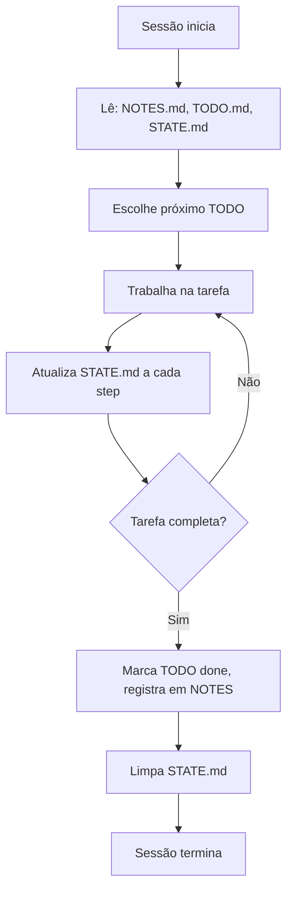

# Structured state tracking

> [!abstract] TL;DR
> Antes de comprar Letta ou Zep, considere arquivos `.md`. Para muitos agentes, o estado de trabalho cabe em **três a cinco arquivos versionáveis**: `NOTES.md` (decisões), `TODO.md` (próximos passos), `SYSTEM-DESIGN.md` (arquitetura), `STATE.md` (estado atual). O agente **edita** esses arquivos durante a sessão como um humano editaria. Diff legível, git-friendly, debug trivial. Funciona surpreendentemente bem em codebases já que arquivos são o ambiente nativo do agente.

## A premissa

Memory layer não precisa ser banco de dados. Pode ser **arquivos em disco** que o agente lê e escreve via tools normais (`read_file`, `write_file`).

```
projeto/
├── src/
├── tests/
└── .agent/
    ├── NOTES.md          ← decisões e observações
    ├── TODO.md           ← próximos passos
    ├── SYSTEM-DESIGN.md  ← arquitetura
    ├── STATE.md          ← estado atual da tarefa
    └── DECISIONS.md      ← log de decisões com data e razão
```

> [!quote] Sebastian Raschka — Components of A Coding Agent (2025)
> *"The runtime keeps a fuller transcript as a durable state, alongside a lighter memory layer that is smaller and gets modified and compacted rather than just appended to."*

## Quatro arquivos canônicos

### `NOTES.md` — observações vivas

```markdown
## 2026-05-02 — investigação de latência

- Endpoint /pay tem p95 de 2.3s
- Causa parece ser o N+1 query em fetch de transactions
- Alternativa A: eager loading
- Alternativa B: cache em Redis
- Decisão: tentar A primeiro, B se A não resolver
```

Append-only. Cada entrada datada. O agente lê para se "atualizar" no início da sessão.

### `TODO.md` — próximos passos

```markdown
## In progress
- [ ] Implementar eager loading no fetch_transactions

## Up next
- [ ] Adicionar teste de regressão de latência
- [ ] Atualizar README com novas dependências

## Done (recent)
- [x] Investigar causa do p95 (concluído 2026-05-02)
- [x] Comparar alternativas A vs B
```

O agente edita ao iniciar e completar tarefas. Estado da execução **explícito**.

### `SYSTEM-DESIGN.md` — arquitetura

```markdown
## Componentes
- API (FastAPI) → DB (Postgres) → Cache (Redis)

## Fluxos críticos
- Pagamento: API → validate → debit → publish event → respond

## Constraints
- p95 latência < 1s
- 0 perda de event
```

Quase imutável. Atualizado quando há mudança arquitetural real. Funciona como anchor de contexto.

### `STATE.md` — onde estamos agora

```markdown
## Tarefa atual
Refatorar fetch_transactions para eager loading

## Arquivos modificados nesta sessão
- src/transactions.py (eager loading aplicado, sem teste ainda)

## Próximo step
Rodar pytest tests/test_transactions.py

## Bloqueios
- Nenhum
```

**Curto.** Re-escrito a cada turno (não append). Espelho do contexto de trabalho.

## Por que markdown e não JSON/DB?

| Critério | Markdown | JSON | DB |
|---|---|---|---|
| Diff legível | ✅ | ⚠️ | ❌ |
| Git-friendly | ✅ | ✅ | ❌ |
| LLM lê bem | ✅ | ✅ | ❌ |
| LLM escreve bem | ✅ | ⚠️ (escapes) | ❌ |
| Custo de setup | 0 | 0 | Alto |
| Debug humano | ✅ | ⚠️ | ❌ |
| Schema rígido | ❌ | ✅ | ✅ |

Para a maioria dos agentes de coding, **markdown ganha**. JSON/DB faz sentido para agentes de produção com volume alto e validação estrita.

## Padrão de uso em agente de coding



Esse padrão é **idêntico** ao que um humano faria. O agente não precisa de framework de memória — precisa de tools de filesystem (que já tem) e de prompt que oriente o uso.

## Skills + structured state — o combo do Codex

Convenção popular em 2026 (incluindo este Codex):

```
.agent/
├── skills/                 ← reutilizáveis (cross-projeto)
│   ├── debugging.md
│   └── refactoring.md
├── NOTES.md                ← deste projeto
├── TODO.md                 ← deste projeto
└── STATE.md                ← desta sessão
```

Skills são **conhecimento reusável**; structured state é **memória de execução**.

## Patterns de governança

- **Append vs replace** — NOTES é append, STATE é replace, TODO é diff
- **Tamanho máximo** — STATE <2KB, NOTES <50KB (compactar acima disso)
- **Versionamento** — git tracking de tudo em `.agent/`, exceto STATE.md (volátil)
- **Read order** — agente lê na ordem: SYSTEM-DESIGN → STATE → TODO → NOTES (mais imutável → mais volátil)

## Quando isso é insuficiente

- **Múltiplos usuários compartilhando o mesmo agente** — precisa de DB
- **Escala alta de queries** — leitura sequencial de arquivos é lenta
- **Search semântico** — vector store necessário
- **Compliance/auditoria** — DB com log estruturado é mais defensável

## Anti-patterns

- **Estado em comentários no código** — git history vai sumir, código vira ruído
- **Um único `MEMORY.md` para tudo** — confunde camadas, vira lixão
- **State.md crescendo** — deve ser snapshot, não log
- **Sem rotina de compactação de NOTES** — depois de meses fica intratável
- **Confiar no agente para limpar** — defina rotina externa

## Veja também

- [[05 - Camadas de contexto — persistente, temporal, transiente]]
- [[07 - Compressão e pruning de informação]]
- [[11 - Skills e instructions como contexto]]
- [[14 - Context engineering na prática — setup completo]]
- [[Memória de Agentes]]

## Referências

- **Sebastian Raschka** — *Components of A Coding Agent* (2025).
- **DEV Community** — *AI Agent Memory Management - When Markdown Files Are All You Need?* (2026).
- **Fountain City** — *Agent Memory Architecture: 5 Layers From Scratch Pad to Shared Knowledge* (2026).
- **MachineLearningMastery** — *7 Steps to Mastering Memory in Agentic AI Systems* (2026).
