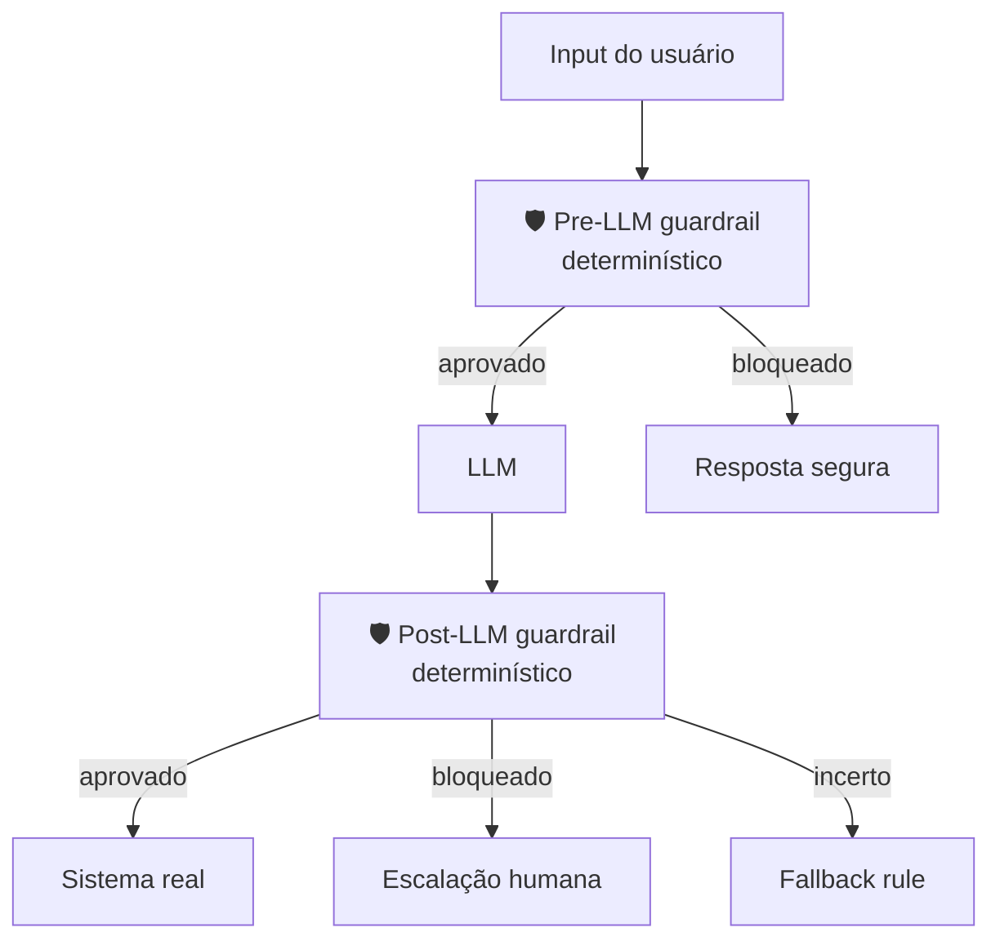

# Guardrails determinísticos

> [!abstract] TL;DR
> O grande shift de 2026: **substituir LLMs julgando LLMs por código determinístico**. Filtros de entrada por regex, validadores de saída por schema, kill paths por exception, escalações por threshold numérico. Salesforce, Anthropic, players enterprise convergiram: probabilístico onde precisa, determinístico onde dá. O agente vive dentro de uma **control plane** — uma camada rígida que intercepta inputs e outputs antes de tocar sistemas reais. A regra: se você consegue escrever uma regra, escreva uma regra; LLM julgando vira incidente.

## A virada de 2026

Até 2024, guardrails comuns usavam outro LLM para validar saídas ("este texto é seguro? sim/não"). Em 2026, o consenso mudou:

> [!quote] Salesforce — 2026
> *"Replaced LLM-based input safety checks with deterministic rule filters."*

> [!quote] CIO Magazine — 2026
> *"Many of enterprise AI's biggest recent breakthroughs in 2026 revolved around a common theme: getting agents to run more reliably in production through new layers of deterministic control."*

Razão: LLM-validating-LLM é caro, lento e probabilístico. Determinístico é grátis em runtime e auditável.

## A control plane



A control plane define:

- **Permission boundaries** — que tools/dados/credenciais o agente alcança
- **Interruption points** — quando deve parar e pedir aprovação
- **Routing logic** — humano vs regra vs fallback

## Pre-LLM guardrails

Filtragem de entrada **antes** do prompt chegar ao modelo:

| Tipo | Implementação | Exemplo |
|---|---|---|
| **PII detection** | Regex + ML model | Bloquear input com CPF, email, cartão |
| **Topic filtering** | Classificador determinístico | Blacklist de domínios fora do escopo |
| **Length caps** | `len(input) > N` | Recusar inputs absurdamente longos |
| **Rate limiting** | Token bucket por usuário | Bloquear flood |
| **Prompt injection signatures** | Regex + ML model | Detectar "ignore previous instructions" |
| **Allowlist de tools** | Lookup table | Só certas tools por tipo de usuário |

## Post-LLM guardrails

Validação de saída **antes** dela acionar sistema real:

| Tipo | Implementação | Exemplo |
|---|---|---|
| **Schema validation** | JSON schema, Pydantic | Output deve match schema X |
| **Range checks** | `if value > MAX:` | Pagamento > R$ 10K → human review |
| **Tool whitelist** | Lookup | Só `read_file`, nunca `rm -rf` |
| **Citation requirement** | Regex match em docs | Resposta precisa citar source |
| **Hallucination detection** | Cross-check com KB | Função citada existe no codebase? |
| **Numerical sanity** | Asserts | Soma deve dar 100% |

## Kill paths e escalações

```python
def execute_action(action, context):
    # Tier 1: hard rules (block)
    if violates_security_policy(action):
        raise SecurityViolation(action)

    # Tier 2: confidence threshold (escalate)
    if action.confidence < 0.7 or action.amount > THRESHOLD:
        return route_to_human(action)

    # Tier 3: deterministic fallback
    if action_is_uncertain(action):
        return apply_business_rule_fallback(action)

    # Caminho feliz
    return action.execute()
```

Princípio: **review fatigue mata**. Se tudo escalava, ninguém revisa nada. Escalada deve ser **rara e significativa**.

## Three-tier control (padrão emergente)

| Tier | Decisão | Velocidade | Risco |
|---|---|---|---|
| **Tier 1 — Determinístico** | Regra rígida (regex, schema, threshold) | <1ms | Zero (regra é código) |
| **Tier 2 — Heurística + LLM** | LLM julgando, mas com rule fallback | 100-500ms | Baixo (LLM como advisory) |
| **Tier 3 — Humano** | Escalação para revisão | minutos a horas | Zero (humano valida) |

Volume típico: 95% Tier 1, 4% Tier 2, 1% Tier 3.

## Lean 4 e formal verification

> [!info] State of the art
> Em 2026, sistemas regulados (financeiro, médico) começaram a usar **Lean 4 theorem proving** para guardrails formalmente verificados. O *Lean-Agent Protocol* satisfaz mandatos como SEC Rule 15c3-5 com prova matemática de compliance.
>
> Não é mainstream para todo projeto — mas é o teto da disciplina.

## Frameworks de produção

| Framework | Forte em | Quando usar |
|---|---|---|
| **NeMo Guardrails (NVIDIA)** | DSL declarativa, integração LangChain | Projetos NVIDIA-stack |
| **Llama Guard (Meta)** | LLM-based input/output classification | Quando dá pra rodar +1 LLM |
| **Guardrails AI** | Validação por specs (RAIL) | Output schema-driven |
| **LangChain Guardrails** | Middleware de validation | Já usa LangChain |
| **Custom (regex + Pydantic)** | Tudo abaixo de "enterprise" | A maioria dos casos |

> [!tip] Bata simples primeiro
> Antes de adotar framework, escreva 5 regras determinísticas em Python puro. Em 80% dos casos resolve. Framework vem quando regras passam de 50.

## Anti-patterns

- **LLM julgando LLM como única defesa** — caro, lento, probabilístico
- **Sem audit trail** — você não sabe o que foi bloqueado nem por quê
- **Guardrails só pré, não pós** — output ruim ainda chega ao sistema
- **Regras hardcoded sem versionamento** — debug e auditoria sofrem
- **Sem test suite de guardrails** — uma regra mudou e você não percebeu
- **Escalada de tudo** — humanos fadigam, viram clicadores de "approve"

## Métricas

| Métrica | Alvo |
|---|---|
| **% bloqueado em pre-LLM** | 1-5% (acima vira fricção, abaixo vira shadow risk) |
| **% bloqueado em post-LLM** | 0.5-2% |
| **% escalado para humano** | <1% |
| **Latência adicionada por guardrails** | <100ms |
| **Cobertura de testes em regras** | >80% |

## Veja também

- [[03 - O comprehension gate]] (Trilha 2)
- [[Economia de Tokens|15 - Orçamento e hard limits]]
- [[Segurança e Guardrails]] (Trilha 6)
- [[14 - Context engineering na prática — setup completo]]

## Referências

- **CIO Magazine** — *The agent control plane: Architecting guardrails for a new digital workforce* (2026).
- **Arthur AI** — *AI Agent Guardrails: Pre-LLM & Post-LLM Best Practices* (2026).
- **Codebridge** — *AI Agent Guardrails: Kill Switches, Escalation Paths, and Recovery* (2026).
- **arxiv:2604.01483** — *Type-Checked Compliance: Deterministic Guardrails for Agentic Financial Systems Using Lean 4 Theorem Proving* (2026).
- **arxiv:2604.15579** — *Symbolic Guardrails for Domain-Specific Agents* (2026).
