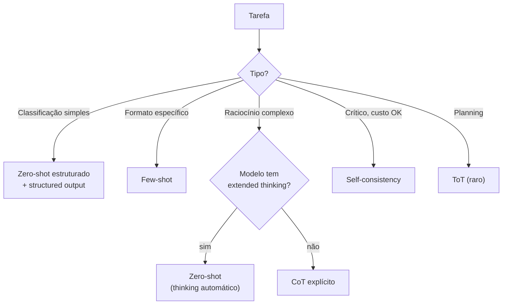

# Técnicas de prompting — zero-shot, few-shot, CoT, ToT

> [!abstract] TL;DR
> Prompt engineering virou subset de context engineering em 2026, mas as **técnicas básicas continuam fundamentais**: **zero-shot** (instrução direta sem exemplos), **few-shot** (instrução + 2-5 exemplos), **chain-of-thought** (CoT — peça raciocínio passo-a-passo), **self-consistency** (gera N respostas, vota), **tree of thoughts** (ToT — explora múltiplos caminhos), **role prompting** (você é X). Cada técnica tem caso de uso específico. **Default sensato em 2026:** zero-shot estruturado para tarefas simples; few-shot quando formato importa; CoT quando precisa raciocínio complexo (em modelos sem extended thinking).

## Zero-shot — direto ao ponto

```
Classifique este ticket como bug, feature ou question:
"App crashou ao abrir."
```

- **Default** para tarefas simples
- Modelos modernos (Sonnet 4.6, GPT-5) já são fortes em zero-shot
- Funciona quando: tarefa comum + descrição clara

## Few-shot — exemplos no prompt

```
Classifique tickets:

"App crashou ao abrir." → bug
"Pode adicionar dark mode?" → feature
"Como faço backup?" → question

Classifique:
"Não consigo logar com Google" →
```

- Use quando: formato específico, tarefa nicho, modelo precisa "calibrar"
- 2-5 exemplos é sweet spot (mais não ajuda)
- Diversidade > quantidade
- Custo: tokens extras em todo prompt → caro em volume

## Chain-of-Thought (CoT) — pense antes de responder

```
Pergunta: João tem 5 maçãs. Comeu 2 e comprou mais 3. Quantas tem agora?

Pense passo a passo antes de responder.
```

LLM gera raciocínio explícito antes da resposta. Resultados em problemas matemáticos/lógicos sobem 20-50%.

**Variantes:**

- **Zero-shot CoT:** *"Let's think step by step"* (Kojima et al., 2022 — descoberta acidental que CoT funciona sem exemplos)
- **Few-shot CoT:** mostra exemplos com raciocínio explícito
- **Auto-CoT:** modelo escolhe quando precisa de CoT

> [!tip] CoT em 2026
> Modelos com **extended thinking** (Claude 4+, o1) fazem CoT internamente, sem você pedir. Output não inclui o reasoning. Mais barato e cleaner. CoT explícito ainda útil em modelos sem thinking.

## Self-consistency — vote em N respostas

```
def self_consistent(prompt, n=5):
    responses = [llm.generate(prompt, temp=0.7) for _ in range(n)]
    return majority_vote(responses)
```

Gera N respostas com temperature alta, escolhe a mais comum. Útil quando:

- Tarefa é factual/objetiva (uma resposta certa)
- Custo ×N é aceitável

Não vale para tarefas criativas (não há "correta").

## Tree of Thoughts (ToT)

LLM explora múltiplos caminhos de raciocínio, voltando atrás se chegou em dead end.

```
Branch A: "Se eu tentar X..."     → avalia
Branch B: "Mas se eu tentar Y..." → avalia
Best so far: B
Continue B → "Sub-branch B1..." → ...
```

Resultados em problemas tipo "Game of 24", planning. Custo alto (LLM × 10-20 calls). Em produção, raro — geralmente não vale.

## Role prompting

```
Você é um senior backend engineer reviewing Java code.
Foque em: concurrency bugs, resource leaks, security issues.
```

Define **persona + skills**. Modelo "se comporta" como o role.

**Padrões:**

- *"You are an expert {domain} {role}"*
- *"Act as a {role} for {audience}"*
- *"You are a {role} reviewing {artifact}"*

Funciona bem em todos os modelos. Combina com tudo.

## Structured output — formato como contrato

```
Responda em JSON:
{
  "category": "bug" | "feature" | "question",
  "confidence": 0-1,
  "reasoning": "..."
}
```

Em 2026, prefira **structured outputs nativos**:

```python
# OpenAI / Anthropic structured outputs
response = client.chat.completions.create(
    response_format={"type": "json_schema", "json_schema": {...}}
)
```

Garantia de formato válido sem retry parsing.

## Comparação rápida

| Técnica | Quando usar | Custo | Ganho típico |
|---|---|---|---|
| **Zero-shot** | Tarefa comum | $ | Baseline |
| **Few-shot** | Formato/estilo nicho | $$ | +5-15% |
| **CoT** | Raciocínio complexo | $$ | +10-30% (em problemas hard) |
| **Self-consistency** | Resposta objetiva, custo permite | $$$$$ | +5-15% |
| **ToT** | Planning/games | $$$$$$$$ | Variável |
| **Role prompting** | Sempre (combina com tudo) | $ | Modulação útil |
| **Structured output** | JSON, classificação | $ | Garantia de formato |

## Heurística para escolher



## System prompt — onde a mágica acontece

System prompt é a alavanca **mais poderosa**. Persistente, peso desproporcional.

### Estrutura típica

```
[Role + persona]
You are a senior backend engineer.

[Behavior rules]
- Focus on: concurrency bugs, security issues
- Be direct; skip pleasantries
- Cite line numbers in feedback

[Output format]
- Markdown with ## sections
- One issue per section
- Confidence rating

[Constraints]
- If code is good, say so briefly
- Don't suggest stylistic changes unless asked
```

### Boas práticas

- **Específico sobre formato** > vago
- **Listas** > parágrafos
- **Diga o que fazer** + **o que NÃO fazer**
- **Restrições críticas** no início e no fim (attention favorece bordas)

## Anti-patterns de prompting

- **"Be concise"** sem dizer **quão** conciso
- **Few-shot com 1 exemplo** — muito poucos
- **Few-shot com 20 exemplos** — context rot
- **CoT em tarefa simples** — desperdício
- **Self-consistency em tarefa criativa** — não há "majority"
- **Role muito vago** ("você é útil")
- **System prompt de 2K linhas** — atenção dilui

## Métricas

| Métrica | Alvo |
|---|---|
| **Accuracy em golden set (zero-shot)** | Baseline |
| **Accuracy ganho com few-shot** | +5-15% |
| **% prompts com structured output** | >80% em produção |
| **Tokens médios por prompt (system + user)** | <2K para tarefas simples |
| **Eval coverage** (% prompts com golden set) | >80% |

## Veja também

- [[01 - De prompt engineering a context engineering]]
- [[02 - Os quatro pilares — prompt, context, intent, specification]]
- [[11 - Skills e instructions como contexto]]
- [[16 - Agent skills marketplace e SKILL.md]]
- [[Anatomia dos LLMs|17 - Evaluation de LLMs em produção]]
- [[Anatomia dos LLMs|13 - Reasoning models e chain-of-thought]]

## Referências

- **Wei et al.** — *Chain-of-Thought Prompting* (paper, 2022)
- **Kojima et al.** — *Large Language Models are Zero-Shot Reasoners* (CoT zero-shot, 2022)
- **Wang et al.** — *Self-Consistency Improves Chain of Thought Reasoning* (2022)
- **Yao et al.** — *Tree of Thoughts* (paper, 2023)
- **Anthropic** — *Prompt Engineering Guide* (docs)
- **promptingguide.ai** — community guide
