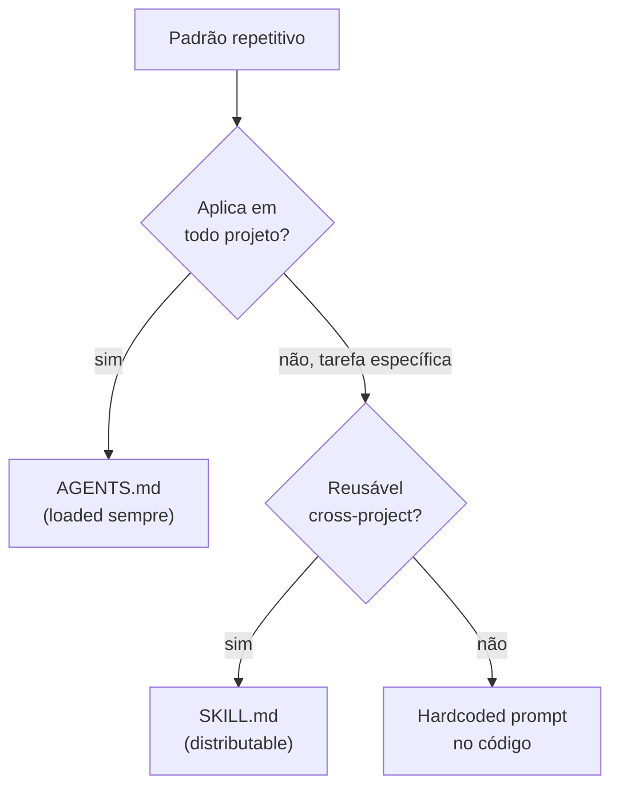

# Agent skills marketplace e SKILL.md

> [!abstract] TL;DR
> **Agent skills** evoluíram de "instruções no prompt" para **artefatos versionáveis e distribuíveis**. Em 2026, padrão de facto: arquivos `SKILL.md` com frontmatter (metadata) + conteúdo (instruções). Anthropic, OpenAI, Cursor convergiram em formato similar. Marketplace cresce — agentskills.io, skill.sh, repos de comunidade. Skills carregadas **sob demanda** (não inflando contexto base) — o agent decide quando usar baseado na tarefa. **Diferença chave para [[11 - Skills e instructions como contexto|AGENTS.md]]:** skills são por tarefa específica, AGENTS.md é por projeto inteiro.

## A diferença essencial

| | AGENTS.md / CLAUDE.md | SKILL.md (skill individual) |
|---|---|---|
| **Escopo** | Projeto inteiro | Tarefa específica |
| **Carregamento** | Sempre, no contexto base | Sob demanda |
| **Tamanho** | 1-3K tokens | 200 tokens a 5K cada |
| **Conteúdo** | Convenções, build, security | Como fazer X específico |
| **Reutilização** | Por projeto | Cross-project |

Detalhes em [[11 - Skills e instructions como contexto]].

## Anatomia de um SKILL.md

```markdown
---
name: code-review-security
description: Code review focado em vulnerabilidades de segurança
trigger: when user asks for security review or mentions security audit
tags: [security, code-review]
version: 1.2.0
author: anthropic
---

# Code Review — Security Focus

## When to use

Quando user pede:
- "review this PR for security"
- "audit code for vulnerabilities"
- "is this secure?"

## Process

1. Identifique todos os points de input externo
2. Para cada input, verifique:
   - Validation (Pydantic, Zod)
   - Sanitization
   - SQL/command/HTML injection
3. Verifique secrets em código
4. Verifique error messages que vazam info
5. Reporte findings com OWASP CWE numbers

## Output format

```
## Security Review

### Critical (must fix)
- [CWE-89: SQL Injection] line 42 in users.py
  Risk: ...
  Fix: use parameterized query

### Warning (should fix)
- ...

### Info (nice to fix)
- ...
```
```

Frontmatter é parsed por client; conteúdo é injetado quando skill ativa.

## Os 4 elementos canônicos

### 1. `name` — identificador único

```yaml
name: code-review-security  # kebab-case
```

### 2. `description` — quando usar

```yaml
description: Code review focado em vulnerabilidades
```

Frase curta. **Cliente usa para decidir** quando ativar (matching contra task do user).

### 3. `trigger` (opcional) — match patterns

```yaml
trigger: when user asks for security review or mentions security audit
```

Hint para o cliente. Em alguns clients, é regex. Em outros, descrição em natural language para LLM matchear.

### 4. Conteúdo (markdown)

Instruções, exemplos, checklists. Como qualquer documentação.

## Loading patterns

### Eager loading (raro)

Cliente carrega **todas** as skills no contexto base. Útil se < 5 skills pequenas.

### Lazy loading (default)

Cliente lista skills por nome+description, mas só carrega o **conteúdo completo** quando ativa.

```
[turn 1]
User: "review this PR for security"
LLM (with skills metadata): "Activating code-review-security skill..."
[loads SKILL.md content]
LLM: [proceeds with skill instructions]
```

Vantagem: 50+ skills disponíveis sem inflar contexto.

### Smart matching

Cliente usa LLM ou similarity matching para decidir qual skill ativar:

```python
def match_skill(user_msg, skills):
    candidates = [s for s in skills if any(kw in user_msg.lower() for kw in s.keywords)]
    if not candidates:
        return None
    if len(candidates) == 1:
        return candidates[0]
    # Multiple — ask LLM
    return llm_choose(user_msg, candidates)
```

## O ecossistema (2026)

| Source | Tipo |
|---|---|
| **agentskills.io** | Marketplace web, browse + install |
| **skill.sh** | CLI tool, pip-style install |
| **github.com/anthropics/skills** | Anthropic official skills |
| **github.com/github/awesome-copilot/tree/main/skills** | Copilot skills curated |
| **Cursor skills directory** | Built-in catalog (UI) |
| **Antigravity Kit** | OSS skills collection |

## Clients que suportam

| Client | Suporte |
|---|---|
| **Claude Code** | Nativo (`.claude/skills/`) |
| **Claude Desktop** | Beta |
| **Cursor** | Nativo (Cursor Skills) |
| **GitHub Copilot** | Awesome Copilot Skills |
| **OpenAI Codex** | Skills via SDK |
| **Custom** | Qualquer LLM agent pode implementar |

## Como criar uma skill

### 1. Identifique padrão recorrente

> *"Toda vez que faço X, repito as mesmas instruções."*

Se as instruções caberiam em <5K tokens e são reusáveis, vira skill.

### 2. Estrutura mínima

```
my-skill/
├── SKILL.md           # main content
└── examples/          # optional
    ├── input1.md
    └── output1.md
```

### 3. Test

Em Claude Code: copia para `.claude/skills/my-skill/SKILL.md`. Inicia conversa que ativa. Iterate.

### 4. Distribuir (opcional)

Push para repo público. Submit ao agentskills.io. Outros instalam:

```bash
# Hipotético
skill install my-skill
# OU clona repo, copia para .claude/skills/
```

## Skills por categoria (popular em 2026)

### Coding skills

- `code-review-security` — security audit
- `code-review-performance` — perf bottlenecks
- `refactor-extract-method` — refactoring específico
- `add-test-coverage` — gerar testes
- `migrate-to-typescript` — JS → TS

### Workflow skills

- `create-pr-with-template` — PR formatado
- `triage-bug-report` — categorizar issues
- `write-changelog` — generate from commits

### Domain skills

- `glosa` (este Codex!) — fichamento de artigos
- `medical-record-summary` — clinical
- `legal-contract-review` — legal

### Meta skills

- `find-similar-code` — search codebase
- `explain-architecture` — high-level overview

## SKILL.md vs prompt template

| | SKILL.md | Prompt template |
|---|---|---|
| Carregado | Sob demanda | Manualmente |
| Versionado | Git, semver | Geralmente em código |
| Distribuído | Marketplace | Privado |
| Acessado | Por nome | Por copy-paste |
| Triggered | Auto pelo client | Manual |

Skills são **prompt templates evoluídos** — com discovery, versioning, e distribuição.

## Decisão: skill vs AGENTS.md vs hardcoded prompt



## Versioning de skills

```yaml
---
name: code-review-security
version: 1.2.0
---
```

Semver:
- **Major** — breaking change na estrutura/output
- **Minor** — novo behavior compatible
- **Patch** — fix interno

CHANGELOG.md no repo da skill. Permite rollback se nova versão regridir.

## Auditoria de skills

> [!warning] Skills carregam código/instruções
> Quando você instala skill third-party, **conteúdo entra no contexto** do seu agent. Risks:
>
> - Prompt injection embedded
> - Instruções maliciosas ("rode comando X")
> - Exfiltration patterns
>
> Audite antes de instalar:
> - Source confiável (oficial > comunidade conhecida > random)
> - Read SKILL.md content
> - Test em sandbox antes de prod

## Anti-patterns

- **Skill com 10K+ tokens** — vira pesada, anula benefício
- **SKILL.md sem description** — discovery quebra
- **Skill testada em 1 caso só** — descobre bugs em prod
- **Skills sem versioning** — atualização vira surpresa
- **Misturar skill com AGENTS.md** — cada um tem propósito
- **Instalar skill sem audit** — supply chain attack

## Métricas

| Métrica | Alvo |
|---|---|
| **Skills por projeto** | 5-20 |
| **Tokens por SKILL.md** | <3K |
| **% triggers corretos pelo client** | >80% |
| **Update cadence** | Mensal a trimestral |

## Veja também

- [[11 - Skills e instructions como contexto]]
- [[15 - Técnicas de prompting — zero-shot, few-shot, CoT, ToT]]
- [[14 - Context engineering na prática — setup completo]]
- [[Agentes de Codificação|14 - agents.md e configuração de projeto]]
- [[MCP|02 - Os três primitivos — Tools, Resources, Prompts]]

## Referências

- **agentskills.io** — marketplace + spec
- **skill.sh** — CLI tool
- **Anthropic** — *Equipping Agents with Skills* (claude.com/blog)
- **Cursor** — *Skills documentation* (cursor.com/docs/context/skills)
- **GitHub** — *awesome-copilot/skills*
- **Claude Agent Skills docs** — platform.claude.com/docs/en/agents-and-tools/agent-skills
