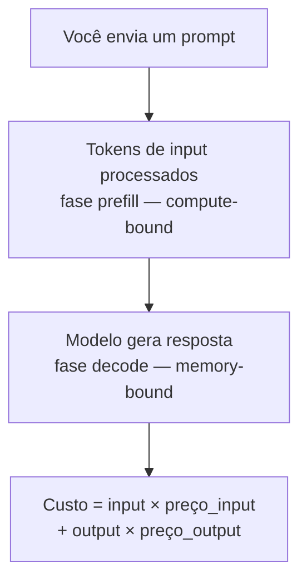

# O problema — por que tokens custam dinheiro

> [!abstract] TL;DR
> Cada token que um LLM processa custa dinheiro porque consome GPU: compute na fase prefill (input) e bandwidth de memória na fase decode (output). Output é 3-6x mais caro que input porque é sequencial e compute-intensivo. Em 2026, um engenheiro usando agentes AI full-time pode gastar $50-200/mês em tokens — equivalente a uma assinatura de SaaS premium. Sem entender essa economia, é impossível otimizar, e sem otimizar, o custo escala sem controle.

## O que é

A **economia de tokens** é a disciplina de entender, medir, prever e otimizar o gasto de tokens em workflows com LLMs. É a interseção de três áreas:

1. **Engenharia** — como a arquitetura do prompt/contexto afeta consumo
2. **Finanças** — como tokens se traduzem em custo real
3. **Performance** — como o consumo de tokens afeta velocidade e qualidade

## Por que importa

Sem controle de tokens:

- Uma sessão de 1h com um agente pode custar $5-25 sem que você perceba
- Um agente rodando em CI/CD 24/7 pode gerar faturas de $1000+/mês
- 70% dos tokens gastos podem ser desperdício (contexto irrelevante, retries, verbosidade)

## Como funciona

### De onde vem o custo

| Fase                     | Recurso consumido    | Por que custa                                                 |
| ------------------------ | -------------------- | ------------------------------------------------------------- |
| **Input (prefill)**      | GPU compute (FLOPs)  | Processar N tokens pela rede neural inteira                   |
| **Output (decode)**      | GPU memory bandwidth | Cada token é gerado sequencialmente, 1 forward pass por token |
| **Reasoning (thinking)** | GPU memory bandwidth | Tokens internos de raciocínio, cobrados como output           |

### A assimetria input/output

Output é 3-6x mais caro que input porque:

- Cada token de output requer um forward pass completo pelo modelo
- A geração é **sequencial** (autoregressive) — não pode ser paralelizada
- O KV cache cresce com cada token gerado, consumindo mais memória

| Provider/Modelo   | Input $/MTok | Output $/MTok | Ratio |
| ----------------- | ------------ | ------------- | ----- |
| Claude Sonnet 4.6 | $3.00        | $15.00        | 5x    |
| GPT-5.4           | $2.50        | $15.00        | 6x    |
| Claude Opus 4.6   | $5.00        | $25.00        | 5x    |
| Gemini Flash      | $0.50        | $3.00         | 6x    |
| GPT-4.1 Nano      | $0.10        | $0.40         | 4x    |

### Os cinco vilões do consumo de tokens

| Vilão                    | % típico do gasto | Descrição                                              |
| ------------------------ | ----------------- | ------------------------------------------------------ |
| **Contexto acumulado**   | 30-40%            | Histórico que cresce a cada turn do agente             |
| **Tool definitions**     | 5-15%             | Schemas JSON de ferramentas reenviados em cada chamada |
| **Respostas verbosas**   | 10-20%            | Modelo gera mais texto do que necessário               |
| **Retries e erros**      | 10-25%            | Agente erra, tenta de novo, paga dobrado               |
| **Contexto irrelevante** | 10-20%            | Arquivos inteiros no prompt quando 20 linhas bastavam  |

### Cenário real: custo de um dia de trabalho

Engenheiro usando Claude Sonnet 4.6 com agente de coding (8h):

| Fase do dia              | Calls  | Input médio | Output médio | Custo      |
| ------------------------ | ------ | ----------- | ------------ | ---------- |
| Manhã: 3 features        | 30     | 50k         | 15k          | $11.25     |
| Tarde: debugging         | 20     | 30k         | 5k           | $3.30      |
| Tarde: refactoring       | 15     | 80k         | 20k          | $8.10      |
| Code review              | 5      | 100k        | 10k          | $2.25      |
| **Total sem otimização** | **70** | —           | —            | **$24.90** |
| **Total com otimização** | **70** | —           | —            | **~$8-12** |

A diferença de 2-3x vem de: prompt caching, context pruning, model routing, e respostas concisas.

## A regra de Pareto dos tokens

> **80% da economia vem de 3 técnicas:**
>
> 1. Prompt caching (tokens estáticos não reprocessados)
> 2. Context pruning (remover o irrelevante)
> 3. Model routing (usar budget model quando possível)

## Armadilhas

- **"Tokens são baratos"** — individualmente sim. Em volume de agente, somam rápido.
- **"Otimizar tokens degrada qualidade"** — falso. Remover contexto irrelevante MELHORA qualidade e reduz custo.
- **"Não preciso monitorar"** — sem métricas, otimização é adivinhação.
- **Focar só em input** — output é 5x mais caro. Um modelo verboso que gera 10k tokens quando 2k bastam está desperdiçando 5x mais no output.

## Veja também

- [[02 - Anatomia do gasto — input, output e reasoning]] — decomposição detalhada
- [[04 - Monitoramento — ccusage, Langfuse, dashboards]] — como medir
- [[05 - Prompt caching na prática]] — a primeira otimização a implementar

## Referências

- **Anthropic** — *API Pricing* (2026). Tabela de preços.
- **Artificial Analysis** — *Cost Comparison* (2026). Comparativo independente.
