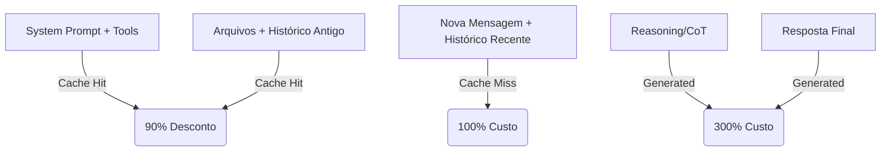

# Anatomia do gasto — input, output e reasoning

> [!abstract] TL;DR
> Uma chamada de LLM tem três faturas distintas: **input** (processado no prefill, parcialmente cacheável), **output** (gerado token a token, 3–10× mais caro) e **reasoning** (tokens invisíveis cobrados como output). A maior alavanca de custo raramente está onde o desenvolvedor procura primeiro.

Cada categoria tem preço, comportamento de cache e armadilha próprios. Ignorar essa anatomia é o caminho mais curto para otimizar o lugar errado — comprimir o prompt quando o problema real está no reasoning, ou tentar reduzir output quando 94% do input já está sendo servido do cache por 10% do preço.

## As Três Dimensões do Custo

### 1. Input Tokens: O "Prefill"
Input é cobrado pelo processamento inicial de todos os tokens enviados. Em 2026, o custo de input é altamente dependente da **[[Dicionário de IA#Prompt caching|estratégia de caching]]**.

- **Static Input (Cache Hit):** Instruções de sistema, schemas de tools e documentação de referência. Custam ~10% do preço base se estiverem no início do prompt.
- **Dynamic Input (Cache Miss):** Histórico de conversa recente e arquivos recém-modificados. Custam 100% do preço e "esquentam" o cache para a próxima chamada.
- **A Ordem Importa:** O cache de prefixo funciona em cascata. Qualquer mudança no meio do prompt invalida todos os tokens que vêm *depois* dele no cache.

### 2. Output Tokens: O "Decode"
Output é o custo de geração token-a-token. É a parte mais cara (3-10x o input) porque exige passagens sequenciais pela GPU e consome banda de memória ([[Dicionário de IA#memory bandwidth bottleneck|memory bandwidth bottleneck]]).

- **Texto Visível:** A resposta final que o usuário lê.
- **Tool Calls:** Estruturas JSON invisíveis para o usuário mas processadas como output.

### 3. Reasoning Tokens: O "Pensamento Invisível"
Introduzidos em modelos como o1, o3, o4 e Claude 4 "Thinking", são tokens gerados internamente para [[Dicionário de IA#Chain-of-Thought (CoT)|Chain-of-Thought (CoT)]], auto-correção e planejamento.

- **Faturamento:** Quase todos os provedores cobram [[Dicionário de IA#Reasoning tokens|reasoning tokens]] pelo **preço de output**, mesmo que eles não apareçam na resposta final.
- **Amplificação:** Um modelo pode gerar 50k reasoning tokens para produzir uma resposta de 200 tokens. Sem um [[Dicionário de IA#Thinking budget|`thinking_budget`]] configurado, uma tarefa simples pode custar $2.00 em vez de $0.02.
- **Dedução de Limites:** Reasoning tokens contam para o seu `max_completion_tokens`. Se o modelo "pensar" demais, ele pode ficar sem espaço para a resposta final (o erro de "Thinking limit reached").
- **Risco em Agentes:** Em fluxos multi-turno, reasoning ocorre em *cada* iteração do loop. Com 10 turnos e 50k tokens de reasoning por turno, o custo de reasoning sozinho pode ultrapassar 500k tokens — mais do que o contexto inteiro de um modelo de geração anterior.

---

## Métricas de Eficiência (2026 Standard)

Para uma engenharia de custos madura, não basta olhar o total. Use estas métricas:

| Métrica                         | Fórmula                                     | Meta (Target)              |
| :------------------------------ | :------------------------------------------ | :------------------------- |
| **Cache Hit Ratio (CHR)**       | `cache_read_tokens / total_input_tokens`    | > 85%                      |
| **Signal-to-Noise Ratio (SNR)** | `final_output / (reasoning + tool_calls)`   | > 0.2 (Depende da tarefa)  |
| **Token-to-Action (TTA)**       | `total_tokens / número_de_tasks_concluídas` | Diminuir ao longo do tempo |
| **Reasoning Overhead**          | `reasoning_tokens / final_output_tokens`    | < 10x para tarefas simples |

---

## Anatomia de uma Chamada Moderna (Exemplo)

```json
{
  "usage": {
    "prompt_tokens": 125000,           // Total de input
    "prompt_cache_hit_tokens": 118000, // 94% de economia no input!
    "completion_tokens": 15000,        // Total gerado
    "completion_tokens_details": {
       "reasoning_tokens": 14200,      // O modelo pensou MUITO
       "accepted_prediction_tokens": 0 // Speculative decoding (se usado)
    }
  }
}
```

Neste cenário:
- O **Input** foi quase grátis devido ao cache.
- O **Custo Real** foi dominado pelo **Reasoning**.
- **Ação:** Otimizar o sistema de "Thinking" (ex: reduzir `/effort`) traria mais ROI do que diminuir o prompt.

---

## Estrutura de Gasto em Agentes (Ciclo de Vida)



## Armadilhas Técnicas

1. **A Maldição do Histórico:** Em sessões longas, o custo de *prefill* (input) do histórico cresce de forma quadrática se não for compactado. O cache mitiga o preço, mas não a latência.
2. **Context Density vs Retrieval:** Encher o contexto de arquivos "só por garantia" degrada o SNR. O modelo gera mais tokens de reasoning tentando separar o sinal do ruído.
3. **[[Dicionário de IA#Speculative decoding|Speculative Decoding]]:** Alguns provedores usam modelos menores para prever tokens comuns (como `if`, `else`). Isso acelera a resposta, mas nem sempre reduz o custo (verifique a política do provedor).
4. **Tool Definition Inflation:** Schemas JSON verbosos são "veneno" de contexto. Cada campo desnecessário é cobrado em cada turno da conversa.

## Veja também

- [[05 - Prompt caching na prática]] — detalhamento técnico do prefill caching
- [[13 - Respostas concisas — controlar output tokens]] — estratégias para SNR alto
- [[14 - Thinking budget — controlar reasoning tokens]] — como domar o custo de CoT

