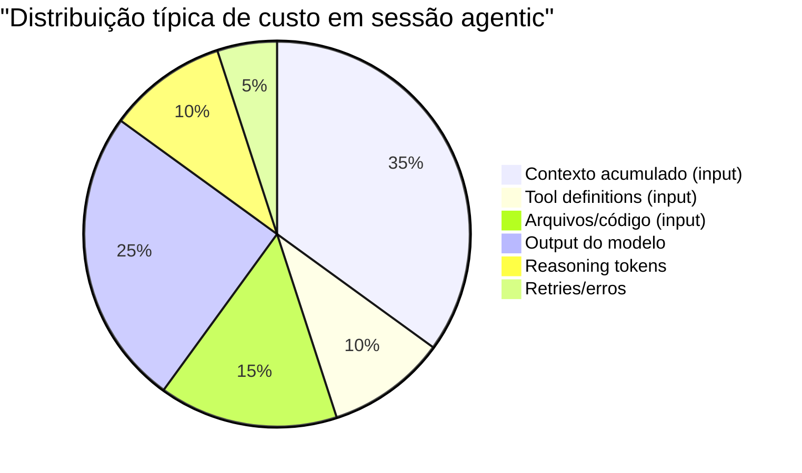

# Anatomia do gasto — input, output e reasoning

> [!abstract] TL;DR
> O custo de uma chamada de LLM se decompõe em três categorias: input tokens (prompt, histórico, tools — mais baratos), output tokens (resposta gerada — 3-6x mais caros), e reasoning tokens (pensamento interno em modelos de reasoning — cobrados como output mas invisíveis). Para controlar custos, é preciso monitorar cada categoria separadamente. A maioria dos desperdícios está em input inflado (contexto desnecessário) e output desnecessariamente verboso.

## O que é

Cada chamada de API retorna metadados de uso que decompõem o consumo:

```json
{
  "usage": {
    "input_tokens": 45000,
    "output_tokens": 3200,
    "cache_read_input_tokens": 30000,
    "cache_creation_input_tokens": 0
  }
}
```

Em modelos de reasoning (o4, Claude Thinking):

```json
{
  "usage": {
    "input_tokens": 12000,
    "output_tokens": 2000,
    "reasoning_tokens": 18000
  }
}
```

## Como funciona

### O que conta como input tokens

| Componente                              | Tokens típicos | Cacheable?       |
| --------------------------------------- | -------------- | ---------------- |
| System prompt                           | 500-3000       | ✅ Sim            |
| CLAUDE.md / .cursorrules                | 500-2000       | ✅ Sim            |
| Tool definitions (schemas)              | 1000-5000      | ✅ Sim            |
| Histórico de conversa                   | 5000-200000+   | ⚠️ Parcial        |
| Arquivos inseridos                      | 1000-50000     | ⚠️ Parcial        |
| Tool results (respostas de ferramentas) | 500-10000/tool | ❌ Geralmente não |

### O que conta como output tokens

| Componente           | Tokens típicos | Controlável?                  |
| -------------------- | -------------- | ----------------------------- |
| Resposta de texto    | 500-5000       | ✅ Via max_tokens e instruções |
| Tool calls (JSON)    | 100-500/call   | ⚠️ Parcial                     |
| Reasoning/thinking   | 1000-100000    | ✅ Via thinking budget         |
| Explicações verbosas | 500-3000       | ✅ Via instruções concisas     |

### Mapa de custos por componente



### Exemplo real: decomposição de uma sessão

Claude Sonnet 4.6, sessão de 30 turns para implementar uma feature:

| Turn      | Input                            | Output | Custo acumulado   |
| --------- | -------------------------------- | ------ | ----------------- |
| 1         | 5k (system + tools + task)       | 2k     | $0.045            |
| 5         | 25k (+ histórico + tool results) | 3k     | $0.12             |
| 10        | 60k                              | 4k     | $0.24             |
| 20        | 140k                             | 5k     | $0.50             |
| 30        | 200k+                            | 6k     | $0.69 (esta turn) |
| **Total** | —                                | —      | **~$6.50**        |

Note que o turn 30 custa 15x mais que o turn 1 — mesmo que a tarefa seja simples — porque o contexto acumulado infla o input.

### Fórmula de custo

```
Custo_total = Σ(turn_n):
  (input_tokens_n × preço_input / 1M)
  + (output_tokens_n × preço_output / 1M)
  + (reasoning_tokens_n × preço_output / 1M)
  - (cache_read_tokens_n × desconto_cache × preço_input / 1M)
```

## Armadilhas

- **Ignorar reasoning tokens** — em modelos o4/Claude Thinking, os reasoning tokens podem ser 5-50x o output visível. Se você monitora só `output_tokens`, perde a maior parte do custo.
- **"Input é barato, não preciso otimizar"** — $3/MTok × 200k tokens = $0.60 por chamada. Em 100 chamadas/dia = $60/dia só de input.
- **Não decompor o gasto** — sem saber QUAL componente do input está consumindo mais, otimização é às cegas.
- **Confundir cache read com economia** — cache_read_input_tokens custam ~10% do preço normal. Se o cache miss rate é alto, a economia é menor que esperado.

## Veja também

- [[01 - O problema — por que tokens custam dinheiro]] — contexto geral
- [[04 - Monitoramento — ccusage, Langfuse, dashboards]] — como medir cada componente
- [[06 - Context pruning — o que remover do prompt]] — como reduzir input

## Referências

- **Anthropic** — *Usage API Documentation* (2026). Campos de resposta.
- **OpenAI** — *Token Usage Guide* (2026). Decomposição de uso.
