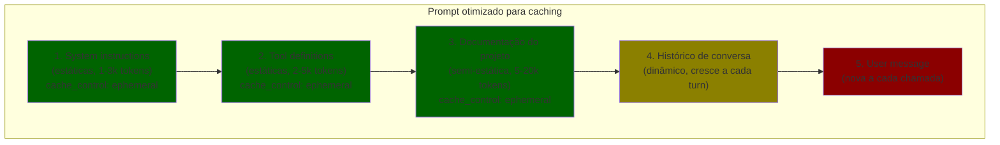

# Prompt caching na prática

> [!abstract] TL;DR
> Prompt caching armazena a computação (KV cache) de partes estáticas do prompt (system, docs, tools) entre chamadas, cobrando 10-50% do preço normal na releitura. É a otimização com melhor retorno por esforço — desconto de 50-90% na parte estática do input com mudança mínima de código. Para maximizar: mova conteúdo estático para o início do prompt, use `cache_control` (Anthropic), e monitore o cache hit rate.

## O que é

Quando você envia um prompt para a API, o modelo precisa processar cada token do input (fase prefill). Prompt caching permite pular essa computação para tokens que já foram processados em chamadas anteriores — desde que o prefixo seja idêntico.

## Como funciona

### Regra fundamental: prefixo idêntico

```
Chamada 1: [system prompt + tools + docs] + [user message A]
Chamada 2: [system prompt + tools + docs] + [user message B]
                    ↑ PREFIXO IDÊNTICO ↑        ↑ DIFERENTE ↑
                    Cacheado na chamada 2         Processado normalmente
```

O caching funciona por **prefixo**: tudo que for idêntico desde o início do prompt é cacheável. Se qualquer coisa muda no meio, o cache é invalidado daquele ponto em diante.

### Implementação por provider

#### Anthropic (controle explícito)

```json
{
  "model": "claude-sonnet-4.6",
  "system": [
    {
      "type": "text",
      "text": "Instruções de sistema extensas... (2000 tokens)",
      "cache_control": {"type": "ephemeral"}
    }
  ],
  "messages": [
    {
      "role": "user",
      "content": [
        {
          "type": "text",
          "text": "Documentação do projeto... (10000 tokens)",
          "cache_control": {"type": "ephemeral"}
        },
        {
          "type": "text",
          "text": "Minha pergunta nova"
        }
      ]
    }
  ]
}
```

| Aspecto             | Valor                                   |
| ------------------- | --------------------------------------- |
| Desconto de leitura | ~90% (Sonnet: $0.30/MTok vs $3.00/MTok) |
| Custo de escrita    | 25% a mais que normal (1ª vez)          |
| TTL                 | 5 min (renova com cada uso)             |
| Mínimo cacheável    | 1.024 tokens (Sonnet/Opus)              |

#### OpenAI (automático)

OpenAI cacheia automaticamente prefixos comuns — sem `cache_control`.

| Aspecto             | Valor                 |
| ------------------- | --------------------- |
| Desconto de leitura | ~50%                  |
| Custo de escrita    | Nenhum (transparente) |
| TTL                 | Automático            |
| Mínimo cacheável    | ~128 tokens           |

#### Google Gemini (Context Caching API)

```python
cached = genai.caching.create(
    model='gemini-3-flash',
    contents=[large_document],
    ttl=datetime.timedelta(hours=1)
)
# Chamadas subsequentes usam cached.name como referência
```

| Aspecto             | Valor                 |
| ------------------- | --------------------- |
| Desconto de leitura | ~75%                  |
| TTL                 | Configurável (1h-24h) |
| Custo adicional     | Storage por hora      |

### Estratégia de organização do prompt



**Princípio:** conteúdo mais estático no início → conteúdo mais dinâmico no final.

### Cálculo de economia

Cenário: 100 chamadas/dia, system prompt 3k tokens, tools 4k tokens, docs 10k tokens.

| Sem caching                         | Com caching                                                  |
| ----------------------------------- | ------------------------------------------------------------ |
| 100 × 17k × $3/MTok = **$5.10/dia** | 1 × 17k × $3.75/MTok + 99 × 17k × $0.30/MTok = **$0.57/dia** |
|                                     | **Economia: 89%**                                            |

## Checklist

- [ ] Conteúdo estático movido para o início do prompt
- [ ] `cache_control: ephemeral` nos blocos estáticos (Anthropic)
- [ ] Monitorar `cache_read_input_tokens` no response
- [ ] Cache hit rate > 60%
- [ ] TTL alinhado com frequência de uso (intervalo < 5 min)

## Armadilhas

- **Ordem errada no prompt** — conteúdo dinâmico no início invalida o cache de tudo que vem depois.
- **TTL de 5 min** — pausas > 5 min invalidam o cache. Em workflows com espera (CI, review), o cache esfria.
- **Mínimo de 1024 tokens** — blocos menores que 1024 tokens não são cacheados na Anthropic. Agrupe conteúdo pequeno.
- **Não monitorar** — implementar caching sem verificar `cache_read_input_tokens` é otimizar às cegas.

## Veja também

- [[01 - O problema — por que tokens custam dinheiro]] — o problema que caching resolve
- [[06 - Context pruning — o que remover do prompt]] — reduzir antes de cachear
- [[07 - Compressão de tool definitions]] — otimizar as tools que são cacheadas

## Referências

- **Anthropic** — *Prompt Caching* (2026). Documentação oficial.
- **OpenAI** — *Prompt Caching* (2026). Caching automático.
- **Google** — *Context Caching* (2026). API separada.
