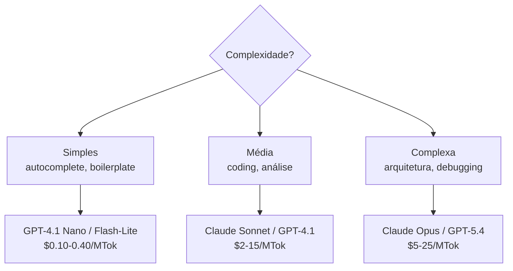

# Model routing — modelo certo para a tarefa

> [!abstract] TL;DR
> Model routing direciona cada tarefa para o modelo com melhor custo-benefício: budget para autocomplete, mid-tier para coding diário, flagship para raciocínio complexo. Isso reduz custos em 30-70% sem degradar qualidade perceptível. A implementação mais simples é manual (escolher modelo por tarefa). A mais sofisticada usa classificadores que avaliam complexidade em tempo real.

## Como funciona

### A pirâmide de routing

### Economia real

| Cenário                              | Sem routing (tudo Sonnet) | Com routing | Economia |
| ------------------------------------ | ------------------------- | ----------- | -------- |
| 60% simples, 30% médio, 10% complexo | $100/mês                  | $35/mês     | **65%**  |
| 30% simples, 50% médio, 20% complexo | $100/mês                  | $55/mês     | **45%**  |

### Model cascading

Enviar primeiro para modelo barato; se a confiança é baixa, escalar para flagship:

1. Enviar para Nano → resposta com score de confiança
2. Se confiança > 80% → aceitar
3. Se confiança < 80% → reenviar para Sonnet
4. Se ainda baixa → escalar para Opus

### Implementação prática

**Manual (recomendado para início):**

- Configure modelo default como Sonnet no Cursor
- Mude para Opus quando a tarefa exigir raciocínio profundo
- Use Nano/Flash para geração de testes, boilerplate

**Automática (para sistemas):**

- Classifier baseado em comprimento/complexidade do prompt
- Rules engine: "se contém 'refactor' → Sonnet; se contém 'architecture' → Opus"

## Armadilhas

- **Routing errado degrada qualidade** — enviar tarefa complexa para modelo budget resulta em código ruim que gera retries.
- **Overhead do router** — classificação adiciona 5-20ms de latência. Para interativo, pode ser perceptível.
- **Não monitorar qualidade por modelo** — sem métricas, você não sabe se o routing está funcionando.

## Veja também

- [[01 - O problema — por que tokens custam dinheiro]]
- [[12 - Batch API — economia em volume]]
- [[11 - Comparativo — qual ferramenta para qual tarefa]] (Trilha 2)

## Referências

- **Redis** — *Intelligent Model Routing for LLMs* (2026).
- **Prem AI** — *Model Cascading Patterns* (2026).
