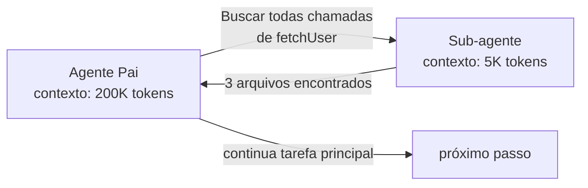

# Sub-agentes especializados

> [!abstract] TL;DR
> Sub-agente é um agente filho invocado pelo agente pai com **contexto limpo e foco estreito**. O ganho não está em rodar mais barato — está em isolar contexto: o filho não carrega o histórico inflado do pai, faz seu trabalho com 5-20K tokens, e devolve só o resultado relevante. Diferente de [[09 - Model routing — modelo certo para a tarefa|model routing]] (que escolhe modelo por tarefa), sub-agentes existem mesmo com o mesmo modelo — o ganho vem da **arquitetura de contexto**.

## Sub-agente vs model routing — não confundir

| Padrão | Decisão | Onde economiza |
|---|---|---|
| **Model routing** | "Qual modelo para esta tarefa?" | Preço por token (Haiku < Opus) |
| **Sub-agente** | "Esta sub-tarefa precisa do meu contexto?" | Tokens de contexto (filho começa do zero) |

Os dois se combinam: pai delega para sub-agente Haiku com contexto limpo. Ganho cumulativo.

## Como funciona



O pai instrui: *"Encontre todas as chamadas de `fetchUser` e liste os arquivos."* O filho recebe **só essa instrução** — não vê o histórico, não vê o plano global, não vê os 50 turnos anteriores. Faz a busca, devolve "3 arquivos: `a.ts:14`, `b.ts:42`, `c.ts:8`". O pai incorpora **só essa linha** no seu próprio histórico.

Sem sub-agente: o pai faria a busca diretamente, e o output completo do `grep` (talvez 5K tokens de matches) entraria no histórico — e seria re-enviado em todos os turnos seguintes.

## Casos de uso de alto ROI

| Caso | Por que sub-agente compensa |
|---|---|
| **Pesquisa em codebase** | Output bruto é grande, resultado útil é pequeno | Use sub-agente **Explore** |
| **Análise de logs longos** | Logs são one-shot; não precisam ficar no histórico | Use sub-agente **Explore** |
| **Escrita de código** | Exige raciocínio e ferramentas de escrita | Use sub-agente **General-purpose** |
| **Validação em paralelo** | 3 sub-agentes verificam aspectos diferentes simultaneamente | Misture conforme a necessidade |

## Estratégia de Custo: Explore vs General-purpose

Em ferramentas como Claude Code, a escolha do tipo de sub-agente (através do parâmetro `subagent_type`) tem impacto direto no billing:

1.  **Explore (O Olheiro):** É configurado como read-only e otimizado para navegação. Use-o para vasculhar a codebase, ler documentação extensiva ou analisar logs. Por não ter permissão de escrita e possuir um conjunto menor de ferramentas, ele tende a ser mais rápido e barato.
2.  **General-purpose (O Arquiteto):** Possui o conjunto completo de ferramentas (incluindo escrita e bash). Deve ser reservado para quando você precisa que o sub-agente de fato resolva um problema, implemente uma lógica ou corrija um bug em isolamento.

**Regra de Ouro:** Se a tarefa começa com "Encontre...", "Leia...", ou "Onde está...", delegue para um sub-agente do tipo **Explore**.

## Casos onde NÃO compensa

- **Tarefa pequena** (< 5K tokens) — overhead de invocação supera ganho
- **Sub-tarefa precisa do histórico do pai** — passar o histórico anula o benefício
- **Latência crítica** — sub-agente adiciona ~2-10s

## Implementações em ferramentas

| Ferramenta | Mecanismo |
|---|---|
| **Claude Code** | `Task` tool + `subagent_type` (general-purpose, explore, plan) |
| **OpenCode** | `agents` config com prompts e tools restritos |
| **LangGraph** | Subgraph nodes com state isolado |
| **CrewAI** | Crew com agents tendo `tools` e `goal` próprios |

## Padrão recomendado

```python
# Pseudocode de delegação
def parent_agent_step():
    if task_is_high_volume_search():
        result = invoke_subagent(
            type="explore",
            prompt="Encontre uses de fetchUser",
            return_format="lista de file:line"
        )
        # apenas `result` entra no histórico do pai
    else:
        result = direct_tool_call(...)
```

> [!tip] Regra prática
> Se a tool output esperado for >5K tokens E você não precisa do detalhe completo nos turnos seguintes, delegue para sub-agente.

## Armadilhas

- **Sub-agente fica com mesmo prompt do pai** — anula o ganho. O prompt do filho deve ser focado.
- **Sub-agente devolvendo o histórico inteiro** — restritor o `return_format` no instructions.
- **Cascata excessiva** (sub-agente invocando sub-agente invocando…) — latência cresce e debugging fica impossível.
- **Não medir** — sem comparar com baseline, "sub-agentes" pode virar overhead sem ganho.

## Veja também

- [[03 - Por que agentes gastam tanto]]
- [[08 - Compactação de histórico em agentes]]
- [[09 - Model routing — modelo certo para a tarefa]]

## Referências

- **Anthropic** — *Claude Code: Subagents and Tasks* (2025).
- **LangChain Blog** — *Agent supervisor patterns* (2025).
