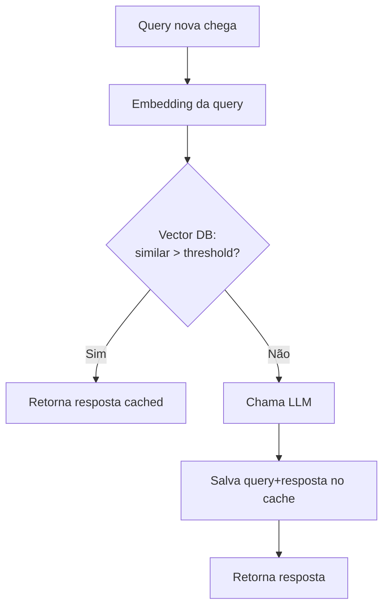

# Semantic caching

> [!abstract] TL;DR
> Semantic caching reaproveita **respostas inteiras** quando uma query nova é semanticamente similar a uma query passada. Diferente de [[05 - Prompt caching na prática|prompt caching]] (que reaproveita KV cache do prefixo do prompt), semantic caching mata a chamada antes dela acontecer. Funciona bem para Q&A repetitivo (chatbot, FAQ, dúvidas comuns); funciona mal quando precisão e atualização constante importam. Stack típica: vector DB + threshold de similaridade.

## Prompt caching vs semantic caching

| Aspecto | Prompt caching | Semantic caching |
|---|---|---|
| O que cacheia | KV cache do prefixo | Resposta final |
| Onde mora | Provider (Anthropic, OpenAI) | Sua infra (Redis, vector DB) |
| Hit | Mesmo prefixo, query nova | Query similar, resposta reusada |
| Custo eliminado | 90% do input do prefixo | 100% da chamada |
| Risco | Nenhum (cache = mesmo prompt) | False positives |

São **complementares**: semantic cache evita a chamada; se ela acontecer, prompt cache barateia.

## Como funciona



### Componentes

1. **Embedding model** — converte query em vetor (ex: `text-embedding-3-small`, $0.02/M tokens)
2. **Vector DB** — armazena pares `(embedding, resposta)` (Redis Stack, Pinecone, Weaviate, Qdrant)
3. **Threshold de similaridade** — cosine similarity típico: 0.92-0.98 (mais alto = menos hits, menos falsos positivos)
4. **TTL** — expiração para invalidar respostas estaladas

## Casos de uso de alto ROI

| Caso | Por que funciona |
|---|---|
| **Chatbot de suporte** | 80% das perguntas são variações de 50 perguntas frequentes |
| **Documentation Q&A** | Mesmas dúvidas recorrentes ("como configurar X?") |
| **Análise de logs/erros** | Stack traces idênticos aparecem milhares de vezes |
| **Classificação repetitiva** | Mesmas labels em entradas similares |

> [!example] Caso real
> Empresa B2B SaaS: chatbot de suporte interno. Sem semantic cache: $4K/mês de tokens. Com semantic cache (threshold 0.95, TTL 7 dias): $700/mês. Hit rate: 78%. Investimento: 2 dias de implementação + ~$30/mês de Redis Stack.

## Casos onde NÃO usar

- **Geração de código** — variações sutis na query produzem código diferente
- **Conteúdo time-sensitive** — preços, status, dados ao vivo
- **Tarefas determinísticas que precisam ser exatas** — cálculos, validações
- **Compliance/auditoria** — respostas precisam ter audit trail individual
- **Personalização forte** — cada usuário precisa de resposta única

## Stack de implementação

### Opção 1 — GPTCache (open source)

```python
from gptcache import cache
from gptcache.adapter.langchain_models import LangChainLLMs
from gptcache.embedding import OpenAI as CacheEmbedding

cache.init(embedding_func=CacheEmbedding().to_embeddings)
cache.set_openai_key()
```

Curva de aprendizado baixa, integração com LangChain.

### Opção 2 — Redis Stack + custom

Mais controle, melhor para produção em escala. Redis 7+ tem `FT.SEARCH` com vector similarity nativo.

### Opção 3 — Provider-managed

Alguns providers começam a oferecer semantic cache nativo (em beta em 2026). Verifique pricing — pode não compensar vs implementação própria.

## Métricas para acompanhar

| Métrica | Alvo |
|---|---|
| **Hit rate** | >50% para compensar |
| **False positive rate** | <2% (medido com user feedback) |
| **Latência de lookup** | <50ms (p95) |
| **Custo de embedding** | <5% da economia |

## Armadilhas

- **Threshold baixo demais** — false positives ("como instalar X?" servindo resposta de "como desinstalar X?")
- **TTL infinito** — resposta sobre preço de 2024 servida em 2026
- **Não medir false positives** — sem feedback loop, qualidade degrada silenciosamente
- **Cachear queries personalizadas** — incluir user_id na chave ou não cachear
- **Embedding diferente dev vs prod** — cache fica inconsistente se trocar o modelo

## Veja também

- [[05 - Prompt caching na prática]]
- [[09 - Model routing — modelo certo para a tarefa]]
- [[12 - Batch API — economia em volume]]
- [[RAG e Vector Databases]]

## Referências

- **GPTCache** — *github.com/zilliztech/GPTCache* (open source).
- **Redis** — *Vector similarity search docs* (2026).
- **Eugene Yan** — *Patterns for Building LLM-based Systems* (2024).
